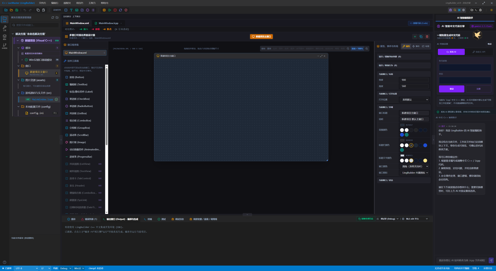
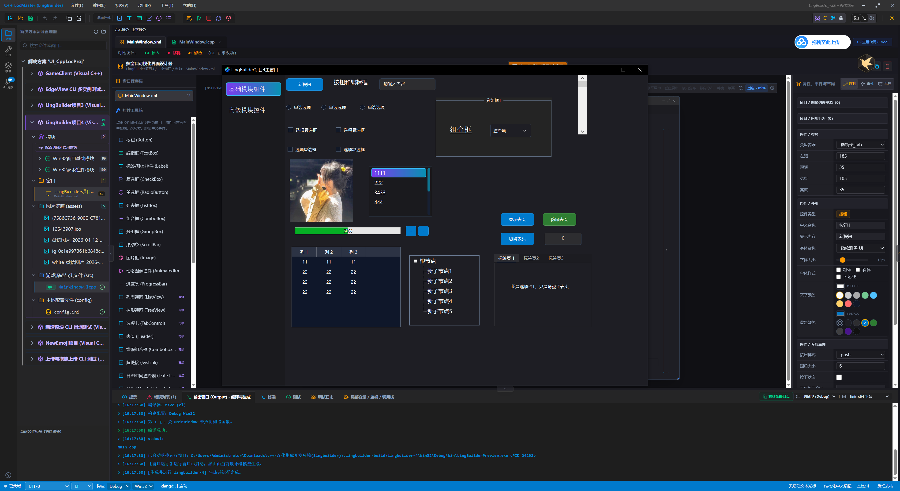
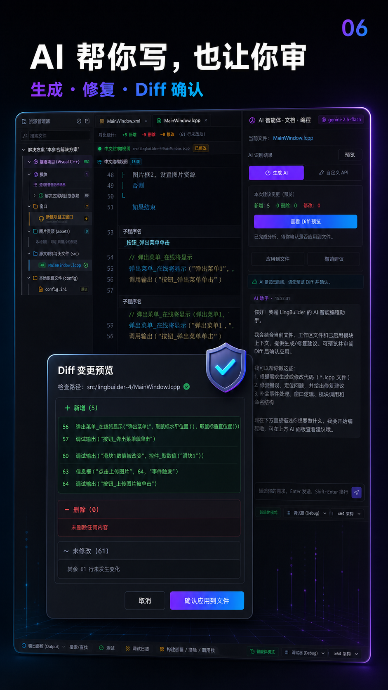

# LingBuilder 中文集成开发环境

LingBuilder 是面向中文用户的中文 C++ / `.lcpp` 集成开发环境：用中文写代码，确定性生成真实可编译的 C++ 工程。仓库同时包含 Electron 桌面 IDE、本地 AI Bridge、系统 AI 云端 API、AI 点数计费服务和独立管理后台。

> 当前处于积极开发阶段，以 **Windows** 为主要开发、构建与运行平台（macOS 适配在路线图中）。

## ✨ 核心特性

- **中文编程体验**：`.lcpp` 中文语法、中文命令 / 补全 / 诊断；新手模式与专业 Monaco 编辑器双形态。
- **确定性生成真实 C++**：窗口设计器模型 + `.lcpp` 源码确定性翻译为可编译的 C++/Win32 与 Visual Studio 工程；IDE 内运行结果与导出工程行为一致。
- **窗口设计器**：拖拽布局、属性/事件面板、`Ctrl+点击` 控件跳转、类型化 `controlRef` 控件引用语义。
- **模块生态**：`.lbmod` v2 模块标准（清单 / binding / 文档 / 市场索引），内置 Win32 控件、网络（HTTP/WebSocket/CDP）、多线程等官方模块。
- **AI 辅助**：系统 AI（账号 + 点数计费）或自带 API Key（BYOK）双通道；代码生成、错误解释与修复建议；本地 AI Bridge 通过 MCP 接入 Codex CLI、Claude Code、Gemini CLI。
- **专业工作台**：活动栏 / 多编辑器组 / 面板 / 状态栏、命令面板、快捷键体系、Git 源代码管理、调试适配器（DAP）、PTY 终端。
- **云端能力（可选自建）**：账号体系、AI 点数计费、模型路由、系统 AI Gateway 与运营管理后台。

## 📸 界面预览

| 工作台 | 设计器与预览 | AI 编程 |
|---|---|---|
|  |  |  |

## 🚀 快速开始

### 环境要求

| 用途 | 要求 |
|---|---|
| 运行 / 开发 IDE | Windows 10/11 x64、Node.js 20+ |
| 构建生成的 C++ 工程 | MSVC（Visual Studio 2022 或 Build Tools + Windows SDK） |
| 完整平台开发（云端部分） | Docker（PostgreSQL 17、Redis 7、Mailpit） |

### 方式一：只运行桌面 IDE（最小路径）

IDE 的编辑、设计器、模块、构建等本地能力不依赖云端服务：

```powershell
git clone <本仓库>
cd electron
npm install
npm run dev
```

### 方式二：完整平台开发（IDE + 云端 + 管理后台）

LingBuilder 解决方案使用工作区根目录下的 `.lbsln` 文件作为可见入口。双击、拖入或在 IDE 中选择该文件即可打开解决方案；`.lingbuilder/solution.json` 保存内部完整状态，二者由解决方案服务自动同步。导出目录中的 `.sln` 仍是供 Visual Studio 使用的标准 C++ 解决方案，不能与 `.lbsln` 混用。

```powershell
docker compose up -d postgres redis mailpit
Copy-Item .env.example .env
npm install
npm run db:generate
npm run db:migrate
npm run dev
```

默认地址：

- 云端 API：`http://127.0.0.1:17900`
- Swagger：`http://127.0.0.1:17900/docs`
- 管理后台：`http://127.0.0.1:17901`
- Mailpit：`http://127.0.0.1:8029`

首次管理员：

```powershell
npm run admin:bootstrap -w @lingbuilder/cloud-api -- admin@example.com StrongPassword123
```

首次登录必须绑定 TOTP MFA。生产环境必须替换 `.env.example` 中全部密钥，并通过部署 Secret 注入。

### 打包 Windows 安装包

```powershell
cd electron
npm run package:win
```

> ⚠️ 安装包打包需要仓库之外的本地资产：`electron/third_party/aria2/aria2c.exe`（GPLv2，含 COPYING/NOTICE）以及 `../.lingbuilder/modules` 下的官方模块目录。CEF3 / FBro / new_emoji 为第三方组件，精简安装包不包含其模块目录、SDK 或运行时，需按各自许可另行获取后放入本地模块目录。

## 📤 LCPP 源码分享

- 文件菜单、命令面板或解决方案资源管理器项目右键菜单可执行"一键导出 LCPP 源码包"，生成单文件 `.lcpppkg`。
- 源码包会携带所选项目及其项目引用、`.lcpp`、配置、窗口设计器模型、`assets` 资源、模块锁定信息、已启用第三方模块和离线资产模块。
- 接收者可双击、拖入或通过"打开 LCPP 源码包"选择该文件。LingBuilder 会校验 SHA-256 完整性并导入到"文档/LingBuilder/已导入源码"的独立工作区，然后直接打开。
- `.env`、私钥、证书和常见凭据 JSON 默认不会进入源码包；导出结果会给出排除提示。导入不会覆盖当前项目，也不会把第三方模块安装到其他工作区。

## 🧭 工程目录

- `electron/`：桌面 IDE、本地工作区服务、CLI 和 AI Bridge。
- `cloud/api/`：NestJS 云端账号、计费、促销、模型路由和系统 AI Gateway。
- `cloud/admin/`：React/Vite AI 运营管理后台（含 VitePress 用户文档站源码 `cloud/admin/docs/`）。
- `packages/contracts/`：IDE、CLI、云端和后台共享的公开协议。
- `examples/`：官方示例项目（多线程组件、控件 Demo 等）。
- `modules/`：社区/扩展模块源码（如 `lingbuilder.wxhook.manager`）。
- `tools/`、`scripts/`：开发者工具与文档构建脚本。
- `image/`：图标等品牌资产。

> `src/` 为早期 Web 原型与历史项目数据，正在整理中，暂不作为入口使用。

云端服务不会替代本地确定性规则。系统 AI 只能返回文本或完整文件编辑草稿，最终诊断、Diff、确认和写入仍由本地 IDE 完成。

## 🤖 系统 AI 与 BYOK

IDE 的 AI 面板提供两种互相隔离的模式：

- 系统 AI：登录 LingBuilder 账号，使用管理员发布的逻辑模型和 AI 点数。
- 自定义 API：继续使用用户自己的 API Key、Base URL 和模型。

系统 AI 默认零保留：源码和提示词只在请求内存中处理，不进入数据库、用量表或日志。云端只记录模型别名、Token、点数、成本、状态和错误码。

OpenAI-compatible 思考模型会分别解析推理增量和最终回答；聊天可流式显示推理内容，编辑草稿只解析最终回答。重复幂等键在 SSE 建连前返回 HTTP 409；取消请求按包含规则手册的完整上下文估算 Token、点数和供应商成本，中文/CJK 与 ASCII 使用不同的保守估算比例。

## ⌨️ CLI

Windows 安装向导默认将 LingBuilder 安装目录加入当前用户 PATH；安装后重新打开终端即可使用，无需另外安装 Node.js。安装时可取消该选项，卸载时会清理 LingBuilder 的 PATH 项。

安装版 IDE 可从"帮助 → AI Bridge 连接中心"直接启动本机 Bridge。连接中心提供 Bridge 状态、权限与生命周期设置、共享 MCP/HTTP 地址、客户端与工具调用活动，并检测 Codex CLI、Claude Code、Gemini CLI；点击"连接并打开"即可在 IDE 集成终端接入当前工作区。临时 Token 只注入该终端进程，不写入用户或项目配置。CLI 自检、命令示例和完整手册也保留在连接中心的"CLI 工具"页。

```powershell
lingbuilder doctor --json
lingbuilder auth login
lingbuilder ai models
lingbuilder ai balance
lingbuilder ai chat --model standard --prompt "解释当前错误"
lingbuilder workspace inspect --workspace . --json
lingbuilder project export --request project-request.json
lingbuilder project build --request project-request.json --yes
lingbuilder ai-server --workspace . --permission preview
```

CLI 刷新令牌使用 Windows DPAPI 保护，不以明文保存。AI Bridge 默认同时开放 REST API 与共享 Streamable HTTP MCP；`--mcp` 仅用于额外启用传统 stdio MCP。Bridge 强制只监听回环地址，外部 AI 通过 Bearer Token 接入，远程 AI 使用云端账号 API。

## ✅ 质量门禁

LingCpp 的设计器对象参数使用统一 `controlRef` 语义：源码写裸控件名，编辑器提供类型化补全、诊断、重命名和"跳转到控件"，C++ 生成阶段再转换为后端需要的名称、稳定 ID 或句柄。模块作者与维护者可运行 `cd electron && npm run module:control-ref-audit` 做逐方法/逐参数审计；`npm run module:control-ref-migrate` 只迁移可唯一解析的旧引号写法。

```powershell
npm run lint
npm run test
npm run build
```

## 📚 文档索引

| 文档 | 内容 |
|---|---|
| [AGENTS.md](AGENTS.md) | 架构约定、编码规范与贡献者工作方式（提交 PR 前必读） |
| [模块开发手册.md](模块开发手册.md) | `.lbmod` v2 模块标准：manifest、binding、发布与迁移 |
| [KEYBOARD_SHORTCUTS.md](KEYBOARD_SHORTCUTS.md) | 全部快捷键及适用范围 |
| [AI_BRIDGE_CLI_USAGE.md](AI_BRIDGE_CLI_USAGE.md) | AI Bridge 与 CLI 完整手册 |
| [MODULE_ECOSYSTEM_IMPLEMENTATION.md](MODULE_ECOSYSTEM_IMPLEMENTATION.md) | 模块生态实现细节与验收基线 |
| [electron/README.md](electron/README.md) | Electron 端详细说明与更新记录 |
| [FUTURE_OPTIMIZATIONS.md](FUTURE_OPTIMIZATIONS.md) | 后期优化事项与技术债记录 |
| [cloud/admin/docs/](cloud/admin/docs/index.md) | 用户文档站（VitePress）源码 |

## 🗺️ 路线图

1. ✅ 可用 Web IDE 原型 → 工作台布局稳定、命令系统、设置与主题
2. ✅ VS Code 式服务化 → 核心服务拆分、任务/输出/问题面板打通
3. 🚧 桌面化与原生能力 → Electron 宿主、工作区持久化、Windows 打包闭环（进行中）
4. ⬜ 插件与语言生态 → extension host 隔离、插件市场、语言插件
5. ⬜ AI IDE → 工作区索引、上下文问答、可审查批量重构、本地规则 + 云端双层降级

## 🤝 参与贡献

欢迎 Issue 与 Pull Request：

1. 提交前阅读 [AGENTS.md](AGENTS.md) 的架构约定与代码组织要求；
2. 新增功能需满足：有可触发入口、有明确状态反馈、有中文文案；
3. 确保 `npm run lint`、`npm run test`、`npm run build` 通过；
4. 涉及 UI 改动请在桌面与窄屏视口下检查布局。

## 🔒 安全

如发现安全漏洞（尤其是涉及云端账号、支付计费、AI Bridge 权限的部分），请勿公开提交 Issue，请通过 Gitee/GitHub 私信仓库维护者私下报告。

## 📄 许可证

本项目基于 [MIT License](LICENSE) 开源。

第三方组件说明：

- Electron、React、Monaco Editor、xterm 等 Node/前端依赖遵循其各自的开源许可证（多为 MIT 类）；
- aria2（GPLv2）：不随仓库分发；打包 Windows 安装包时需自行放置于 `electron/third_party/aria2/` 并随安装包含有其 COPYING/NOTICE；
- CEF3、FBro SDK、new_emoji 等浏览器/UI 组件为第三方商业组件，不在本仓库内，也不受本许可证约束，需按其各自许可另行获取。
