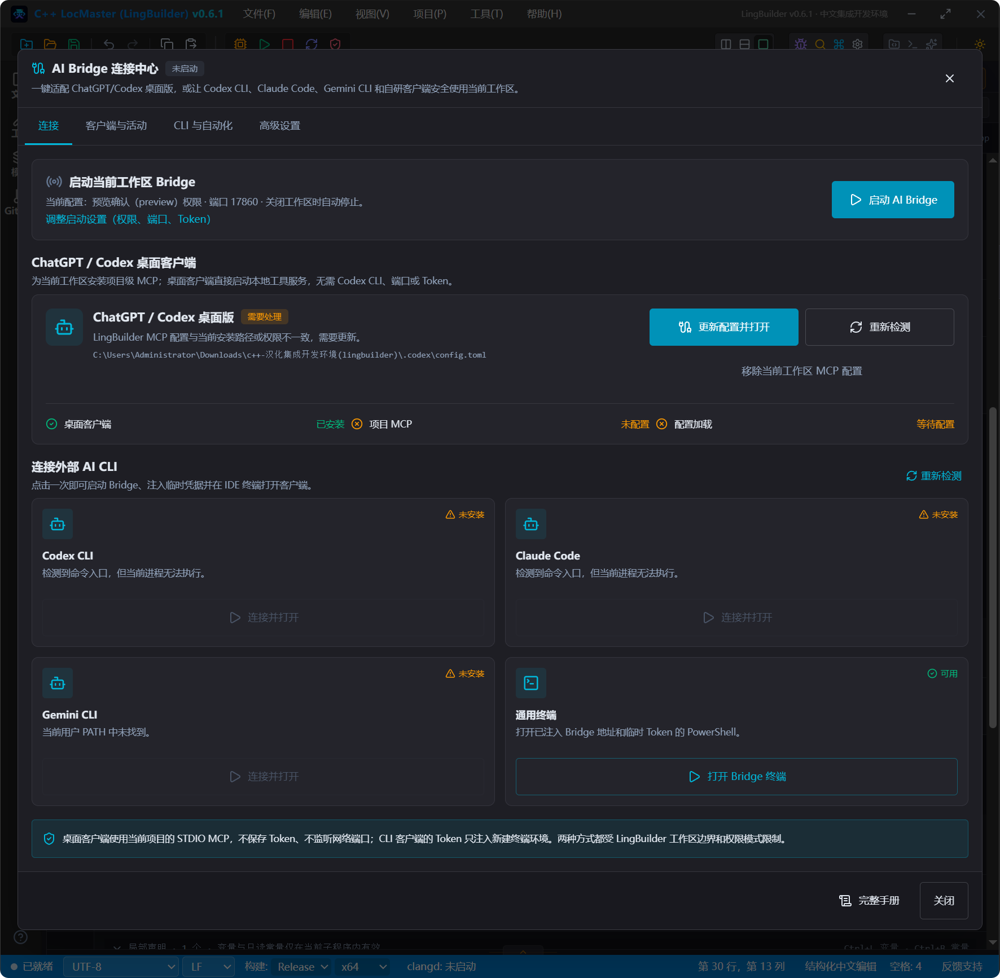
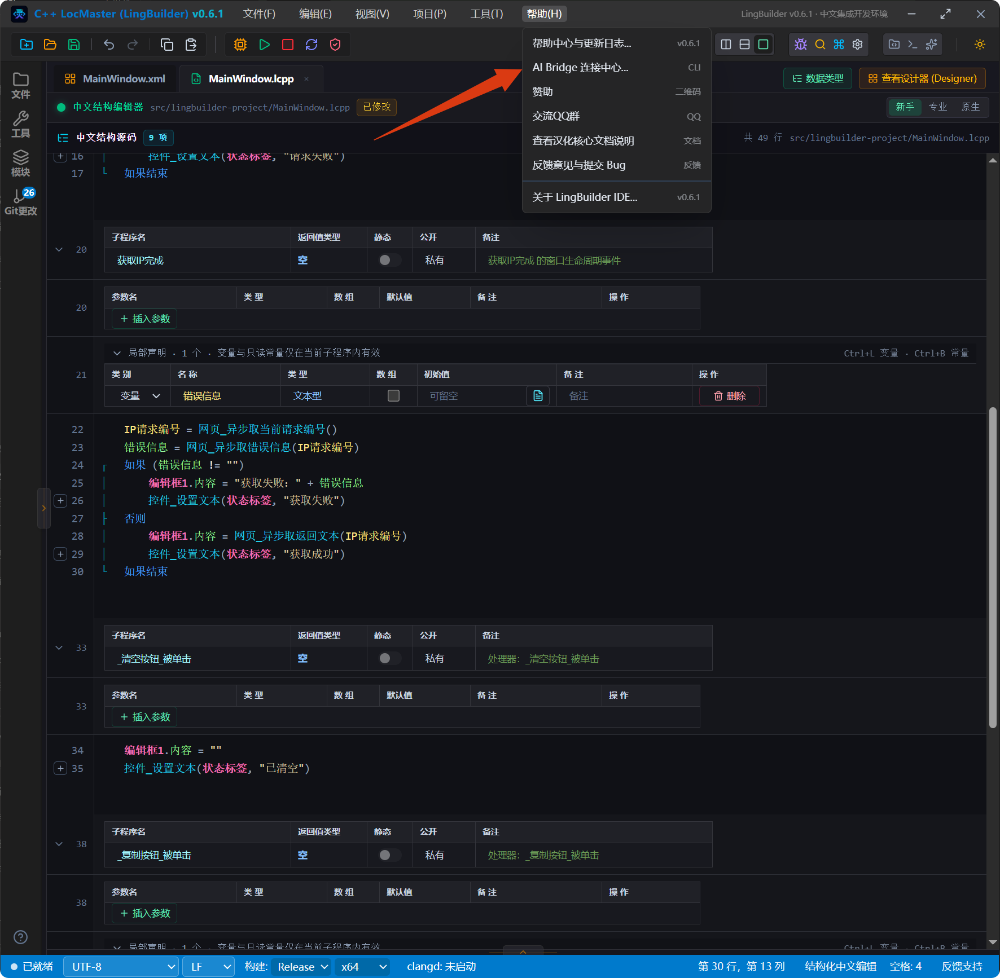

# AI Bridge 连接配置

> [🕒 预计 20 分钟] | 难度：入门 | 关联功能：AI 聊天助手、MCP 工具、外部 AI 客户端



## 1. 什么是 AI Bridge

**AI Bridge** 是 LingBuilder 内置的模型服务连接中心，用于统一管理多个 AI 模型服务商的连接配置。通过 AI Bridge，用户可以：

- 添加多个模型供应商（DeepSeek、OpenAI、Anthropic、本地 Ollama 等）
- 在 **AI 聊天助手** 等 AI 功能中一键切换所使用的模型服务
- 精细化控制 AI 功能的权限范围（读文件、改文件、执行命令等)
- 支持 **MCP（Model Context Protocol）** 协议，让外部 AI 客户端（如 Claude Code、Codex CLI、Gemini CLI）连接 LingBuilder 工作区
- 同时支持 **STDIO** 和 **Streamable HTTP** 两种 MCP 传输方式

AI Bridge 默认监听 `127.0.0.1:17860`，仅限本机访问，确保工作区数据安全。

## 2. 打开 AI Bridge 连接中心

1. 在 LingBuilder 主窗口顶部菜单栏，点击 **帮助(H)** > **AI Bridge 连接中心...**。
2. 打开 **AI Bridge 连接中心** 窗口，界面分为以下区域：

| 区域 | 说明 |
|---|---|
| **服务列表** | 已添加的模型服务连接，可设为默认、编辑或删除 |
| **默认服务** | 当前 AI 功能默认使用的模型连接 |
| **权限模式** | AI 工具可执行操作的范围设定 |
| **MCP 设置** | 启用/配置 MCP 协议，支持外部 AI 客户端接入 |
| **Bridge 状态** | 显示当前 AI Bridge 运行状态、端口和 Token 信息 |

> [!TIP]
> AI Bridge 使用一次性 Token 进行身份验证，每次启动时自动生成。Token 仅保存在内存中，不会写入磁盘。

## 3. 配置模型服务连接

在 AI Bridge 连接中心中，点击 **添加服务** 来配置新的模型供应商：

### 供应商类型

| 类型 | 说明 |
|---|---|
| **DeepSeek** | 使用 DeepSeek 官方模型服务（v4-flash / v4-pro） |
| **OpenAI 兼容** | 支持 OpenAI 或任何 OpenAI 兼容接口的模型服务 |
| **Anthropic 风格** | 支持 Anthropic API 格式的模型服务 |
| **本地服务** | 连接本机启动的模型推理服务（如 Ollama、LM Studio） |

### 连接参数

| 字段 | 说明 |
|---|---|
| **名称** | 为此连接命名，如"生产环境 DeepSeek" |
| **Base URL** | 服务端点地址，如 `https://api.deepseek.com` |
| **API Key** | 供应商发放的访问密钥 |
| **模型名称** | 默认调用的模型标识，如 `deepseek-v4-pro` |

填写完成后，点击 **测试连接** 确认连接成功，然后点击 **保存**。

> [!TIP]
> DeepSeek 端点参考：OpenAI 格式 `https://api.deepseek.com`；Anthropic 格式 `https://api.deepseek.com/anthropic`。完整参数见 [DeepSeek 集成参考](/guide/ai/deepseek-integration)。

## 4. 设定默认服务

1. 在服务列表中找到需要设为默认的连接。
2. 点击该行右侧的 **设为默认** 按钮。
3. 列表顶部会显示 **默认** 标记，此后所有 AI 功能默认使用该连接。

## 5. 权限模式设定

AI Bridge 支持为 AI 工具调用设定 **权限模式**，控制 AI 可以执行的操作范围：

| 模式 | 说明 | 适合场景 |
|---|---|---|
| **只读模式（readonly）** | AI 仅可读取项目文件，不可修改 | 代码审查、问答 |
| **预览模式（preview）** | AI 可修改文件，但写入、构建和导出需要显式确认 | 日常辅助编程、安全检查 |
| **yolo 模式（yolo）** | AI 可读写项目文件、执行受控构建命令，但仍在受控工具范围内 | 高级自动化、批量重构 |

在 AI Bridge 连接中心底部的 **权限模式** 下拉框中选择所需模式，点击 **保存** 生效。

> [!WARNING]
> **yolo 模式** 下 AI 操作会直接作用于项目文件与系统命令。请仅在可信项目中开启 yolo 模式，并关注 AI 的每次文件修改提示。

## 6. MCP 协议配置

MCP（Model Context Protocol）是连接 AI 模型与外部工具的标准协议。LingBuilder 的 AI Bridge 支持两种 MCP 传输方式：

### 6.1 Streamable HTTP（默认）

AI Bridge 默认在 `/api/ai-bridge/mcp` 端点提供 Streamable HTTP MCP 服务。外部 AI 客户端只需配置该端点即可连接。

**端点地址**：`http://127.0.0.1:17860/api/ai-bridge/mcp`

**配置示例（Claude Code）**：

```json
{
  "mcpServers": {
    "lingbuilder": {
      "type": "http",
      "url": "http://127.0.0.1:17860/api/ai-bridge/mcp",
      "headers": {
        "Authorization": "Bearer <your-bridge-token>"
      }
    }
  }
}
```

### 6.2 STDIO 模式

如需传统 STDIO MCP，可在启动 AI Bridge 时附加 `--mcp` 参数：

```bash
lingbuilder ai-server --workspace . --port 17860 --mcp
```

STDIO 模式下，MCP 服务通过标准输入输出与 AI 客户端通信。

### 6.3 已暴露的 MCP 工具

| 工具名称 | 说明 |
|---|---|
| `lingbuilder.workspace.list` | 列出工作区文件结构 |
| `lingbuilder.file.read` | 读取项目文件内容 |
| `lingbuilder.file.search` | 在工作区中搜索文件内容 |
| `lingbuilder.lingcpp.diagnostics` | 获取 LingCpp 代码诊断信息 |
| `lingbuilder.edit.propose` | 提出文件编辑建议 |
| `lingbuilder.edit.apply` | 应用确认的编辑建议 |
| `lingbuilder.project.templates` | 列出项目模板 |
| `lingbuilder.project.create` | 创建新项目 |
| `lingbuilder.project.create.undo` | 撤销尚未被用户修改的 AI 项目创建事务 |
| `lingbuilder.build.run` | 构建并运行项目 |
| `lingbuilder.modules.list` | 列出已安装的模块 |
| `lingbuilder.native.preview` | 原生预览窗口 |
| `lingbuilder.native.export` | 导出 Visual Studio 工程 |

> [!NOTE]
> MCP 工具的具体可用范围受当前 **权限模式** 限制。例如，只读模式下写入和执行类工具不可用。

## 7. 外部 AI 客户端接入

AI Bridge 支持接入主流外部 AI 客户端，让它们通过 MCP 协议与 LingBuilder 工作区交互。

### 7.1 支持的客户端

| 客户端 | 接入方式 |
|---|---|
| **Claude Code** | 通过 MCP 配置连接，使用 Streamable HTTP |
| **Codex CLI** | 通过会话级配置覆盖，自动检测连接计划 |
| **Gemini CLI** | 通过 MCP 配置连接，使用托管环境变量 |

### 7.2 自动检测连接计划

LingBuilder 会自动检测已安装的 AI 客户端，并为每个客户端生成只对当前 IDE 终端会话有效的连接计划：

1. 打开 **AI Bridge 连接中心**。
2. 在 **外部客户端** 区域，查看已检测到的客户端列表。
3. 点击 **生成连接计划**，获取该客户端的连接配置命令。
4. 在对应的 AI 客户端终端中执行生成的命令即可完成连接。



> [!WARNING]
> Bridge Token 仅保存在主进程内存中，通过环境变量传递给受控终端。不会写入客户端的全局配置文件。

## 8. 测试 AI 功能

配置完成后，打开 **AI 聊天** 面板，输入一条测试指令验证：

> "用一段话说明当前窗口的功能"

如果返回了正常回答，说明 AI Bridge 配置已生效。

## 常见问题

### 连接测试失败

- 确认 **Base URL** 不含多余空格或尾部斜杠
- 确认 **API Key** 未过期，且当前网络可访问该服务端点
- 部分服务要求指定 **模型名称** 才能测试，请确认已填写正确模型标识
- 检查 AI Bridge 是否正在运行：访问 `http://127.0.0.1:17860/api/ai-bridge/health`

### MCP 连接失败

- 确认 AI Bridge 已启用 MCP 功能（默认启用）
- 确认 Token 已正确配置在请求头中
- 检查 `--mcp` 参数是否已启用（STDIO 模式需要）
- 确认外部 AI 客户端与 AI Bridge 版本兼容

### 外部 AI 客户端无法连接

- 确认 AI Bridge 正在运行且监听在 `127.0.0.1:17860`
- 确认客户端使用的 MCP 端点地址正确
- 重新生成连接计划，并确认 Token 未过期
- 切换工作区后需要重新连接

### 权限模式无法修改

- 确认当前用户具有管理员权限
- 某些安全策略可能限制了权限模式的更改范围
- 尝试重新启动 AI Bridge 后重试

### 需要删除连接

在 **AI Bridge 连接中心** 服务列表中点击目标连接右侧的 **删除** 按钮，确认后即可移除。

## 下一步

- 使用 AI Bridge 进行对话编程：[AI 对话式改代码](/guide/ai/chat)
- 了解 MCP 工具协议的详细用法：[MCP 工具协议](/guide/ai/mcp)
- 浏览 DeepSeek 模型接入说明：[DeepSeek 集成参考](/guide/ai/deepseek-integration)