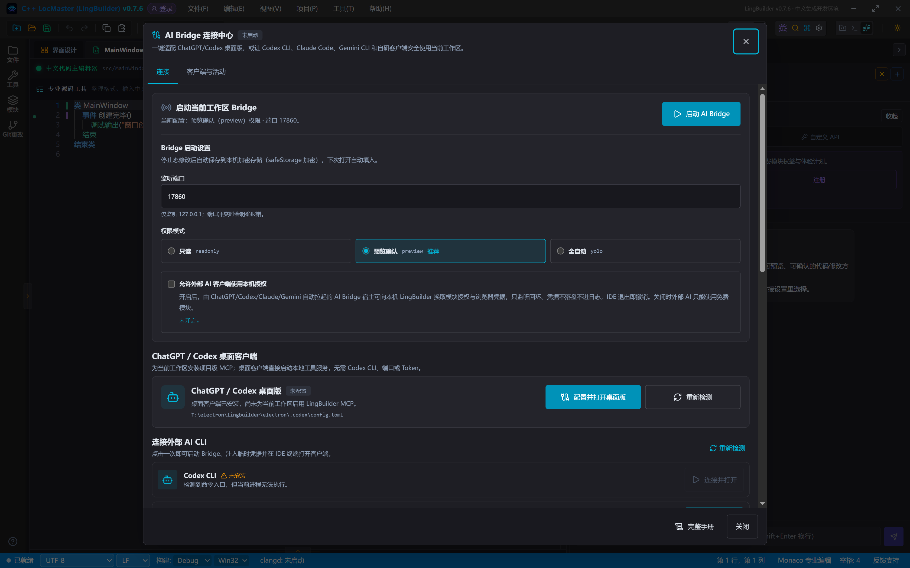
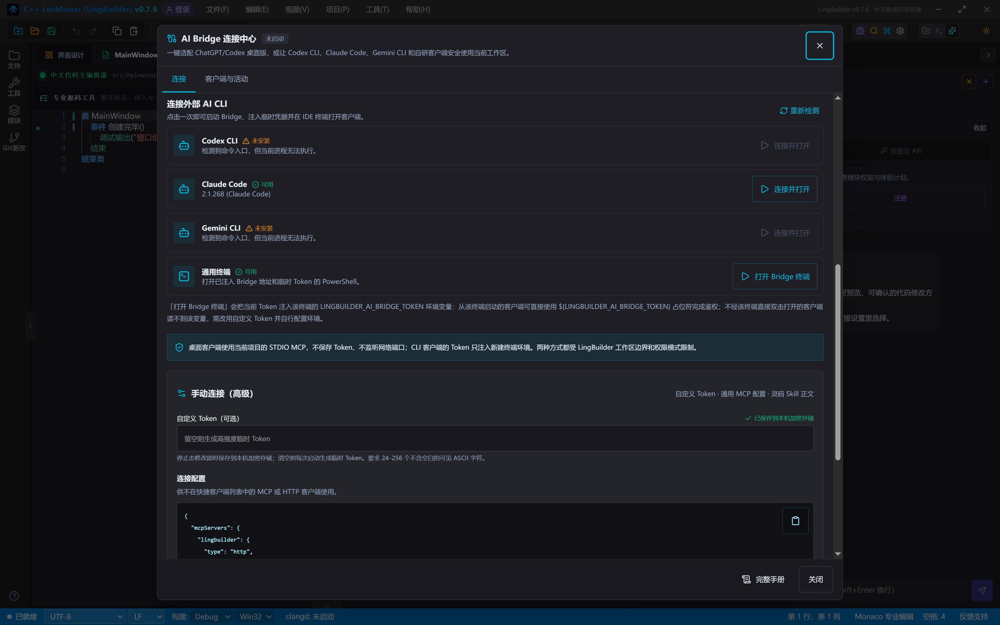
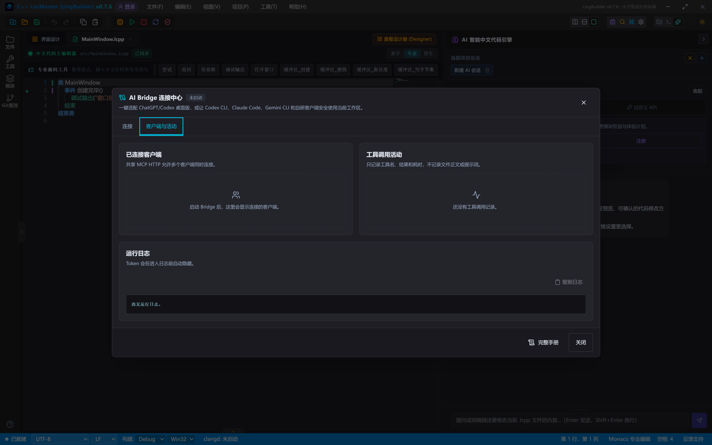

# AI Bridge 连接配置

> [🕒 预计 20 分钟] | 难度：入门 | 关联功能：AI 对话式改代码、MCP 工具协议、灵码 Skill



## 1. AI Bridge 是什么

**AI Bridge** 是 LingBuilder 内置的本地受控服务：把当前工作区的读取、编辑、构建、模块等能力，以 **MCP（Model Context Protocol）** 和 HTTP 接口安全地开放给外部 AI 客户端（ChatGPT/Codex 桌面版、Codex CLI、Claude Code、Gemini CLI 等），让 AI 直接在你的项目上干活。

- 仅监听 `127.0.0.1`，外网无法访问；
- 所有访问都受 **工作区边界**（只能访问当前工作区内的文件）和 **权限模式**（只读/预览确认/全自动）双重约束；
- Token 只保存在本机（运行时在内存、自定义 Token 经系统加密存储），绝不写入云端，也绝不写入外部客户端的全局配置文件。

> [!NOTE]
> 给 AI 助手配置模型供应商（DeepSeek、OpenAI、Anthropic 等 API Key）不在连接中心：请使用 AI 面板中的 **系统 AI**（登录 LingBuilder 账号，按点数计费）或 **自定义 API**（BYOK，自带 Key）入口。

## 2. 打开连接中心

主窗口顶部菜单栏点击 **帮助(H)** > **AI Bridge 连接中心...**。窗口分为两个页签：

| 页签 | 内容 |
|---|---|
| **连接** | Bridge 状态与启动、Bridge 启动设置、ChatGPT/Codex 桌面客户端、连接外部 AI CLI、手动连接（高级） |
| **客户端与活动** | 已连接客户端、工具调用活动、运行日志 |

工作台标题栏右侧有常驻的 **Bridge 徽标**，实时显示运行状态（端口与客户端数），点击即可打开连接中心，不必翻菜单。

## 3. 启动 Bridge 与启动设置

在「连接」页签顶部点击 **启动 AI Bridge** 即可启动。运行中会显示 MCP 与 HTTP API 端点、掩码后的 Token（可复制）和已连接客户端数，并提供 **重启 Bridge** / **停止 Bridge** 按钮。

启动前可在下方 **Bridge 启动设置** 中调整：

| 设置 | 说明 |
|---|---|
| **监听端口** | 默认 `17860`，仅监听 `127.0.0.1`；端口冲突时会明确报错，改一个空闲端口即可 |
| **权限模式** | 只读（readonly）/ 预览确认（preview，推荐）/ 全自动（yolo），见下表 |
| **允许外部 AI 客户端使用本机授权** | 默认关闭。开启后，由外部 AI 客户端自动拉起的 Bridge 宿主可向本机 LingBuilder 换取收费模块授权等凭据；只监听回环、凭据不落盘不进日志，IDE 退出即撤销 |

权限模式：

| 模式 | 文件工具 | 编辑/构建/导出 | 适合场景 |
|---|---|---|---|
| **只读（readonly）** | 仅可读 | 全部不可用 | 代码审查、问答 |
| **预览确认（preview）** | 可读 | 写操作生成预览提案，必须显式确认才落盘 | 日常辅助编程（推荐） |
| **全自动（yolo）** | 可读写 | 直接执行受控工具，仍不能运行任意系统命令 | 高级自动化、批量重构 |

> [!WARNING]
> yolo 模式下 AI 的写操作会直接作用于项目文件。请仅在受信任的项目中开启，并关注每次变更内容。

**启动设置会自动保存**：Bridge 停止时修改端口、权限或 Token，输入停顿约 1 秒后自动持久化到本机加密存储（系统级 safeStorage 加密，不落明文），下次打开连接中心自动填入。字段旁会实时显示保存状态——「正在保存…」转为绿勾「已保存到本机加密存储」；无效输入不会落盘，并有红字提示引导修正。

## 4. 连接外部 AI 客户端



### 4.1 快捷客户端（推荐）

连接中心会自动检测本机已安装的 **Claude Code**、**Codex CLI**、**Gemini CLI**。点击对应客户端的 **连接并打开**，一次完成：启动 Bridge → 注入本次会话凭据 → 在 IDE 终端中打开客户端。Token 只注入新建终端的环境变量，不修改这些工具的用户全局配置。

未安装的客户端会标注「未安装」；安装后点击 **重新检测** 即可识别。

### 4.2 通用终端与 Token 占位符

点击 **打开 Bridge 终端** 会打开一个已注入 Bridge 地址和当前 Token 的 PowerShell。LingBuilder 手动连接配置中的 `Bearer ${LINGBUILDER_AI_BRIDGE_TOKEN}` 是**环境变量占位符**，由客户端在启动时展开：

- **从 Bridge 终端（或快捷客户端终端）启动**的客户端进程带有 `LINGBUILDER_AI_BRIDGE_TOKEN` 变量，占位符自动展开为真实 Token，无需任何手工替换；
- **直接双击打开**的客户端进程读不到该变量，占位符展开为空，请求会返回 401。这类使用场景请改用自定义 Token（见下节），并把真实 Token 值写入客户端配置。

### 4.3 ChatGPT / Codex 桌面客户端

连接中心提供 **ChatGPT / Codex 桌面版** 专用接入：为当前工作区安装项目级 MCP 配置（写入工作区 `.codex/config.toml`，已有的同名配置会先备份保留），桌面客户端即可直接使用本地工具服务，无需 Codex CLI、端口或 Token。配置写入后需**完全退出并重新打开**桌面客户端（含后台进程）才能生效。

### 4.4 手动连接（其他 MCP / HTTP 客户端）


不在快捷客户端列表中的 MCP 或 HTTP 客户端，展开 **手动连接（高级）** 区域，复制 **连接配置** 中的 JSON 到客户端即可：

```json
{
  "mcpServers": {
    "lingbuilder": {
      "type": "http",
      "url": "http://127.0.0.1:17860/api/ai-bridge/mcp",
      "headers": {
        "Authorization": "Bearer ${LINGBUILDER_AI_BRIDGE_TOKEN}"
      }
    }
  }
}
```

JSON 中的 `${LINGBUILDER_AI_BRIDGE_TOKEN}` 占位符语义见 4.2 节。HTTP API（`/api/ai-bridge`）保留给自研客户端、脚本和 CI 使用；外部 AI CLI 优先使用共享 MCP Streamable HTTP。

## 5. Token：临时与自定义

「自定义 Token（可选）」留空或填写，行为如下：

| | 留空（默认） | 填写自定义 Token |
|---|---|---|
| Token 值 | 每次启动 Bridge 自动生成高强度临时 Token | 使用你填写的固定值 |
| 跨重启 | 每次都变，旧客户端需重新连接 | 保持不变 |
| 存储 | 仅主进程内存 | safeStorage 加密保存到本机，绝不落明文 |
| 适合场景 | 临时试用、一次性会话 | 固定客户端长期使用 |

自定义 Token 要求 24–256 个不含空白的可见 ASCII 字符。填写后同样自动保存（见第 3 节），无需保存按钮。

## 6. 灵码 Skill 正文

连接中心底部展示 **灵码 Skill 正文** 的分发状态（安装包内置离线快照、版本与 sequence、是否为最新），并提供 **刷新状态**、**检查更新** 与 **复制安装指令** 三个操作。灵码 Skill 是给外部 AI 客户端自动阅读的接入指引，详见 [灵码 Skill 使用](/guide/ai/skill)。

## 7. 客户端与活动页签



- **已连接客户端**：共享 MCP HTTP 允许多个客户端同时连接，这里列出每个客户端的标识与最后活动时间。
- **工具调用活动**：只记录工具名、结果和耗时，**不记录文件正文或提示词**，最多保留最近 30 条。
- **运行日志**：Bridge 运行日志，Token 在进入日志前自动隐藏，可一键复制用于排查。

## 常见问题

### 客户端连接返回 401

- Token 不匹配：临时 Token 每次启动都会更换，重启 Bridge 后需要重新打开 Bridge 终端或重连客户端；
- 直接双击打开的客户端读不到 `${LINGBUILDER_AI_BRIDGE_TOKEN}` 占位符（见 4.2 节）：改从 Bridge 终端启动，或填写自定义 Token 并把真实值写入客户端配置；
- Bridge 未启动或端口不一致。

### 端口冲突

启动时报端口占用，关闭占用该端口的进程，或在 Bridge 启动设置中改用其他端口（1024–65535）。

### 切换工作区后 AI 连不上

Bridge 绑定打开它时的工作区，切换工作区后受管 Bridge 会停止。重新在连接中心启动即可。

### 客户端一直显示「未安装」

确认对应 CLI 已安装并在 PATH 中；安装完成后点击连接中心的 **重新检测**。

## 下一步

- 了解 AI 能调用哪些工具：[MCP 工具协议](/guide/ai/mcp)
- 让 AI 编译并运行项目：[AI 构建与运行](/guide/ai/build-run)
- 给外部 AI 客户端安装灵码 Skill：[灵码 Skill 使用](/guide/ai/skill)
- 用 AI 对话式修改代码：[AI 对话式改代码](/guide/ai/chat)
