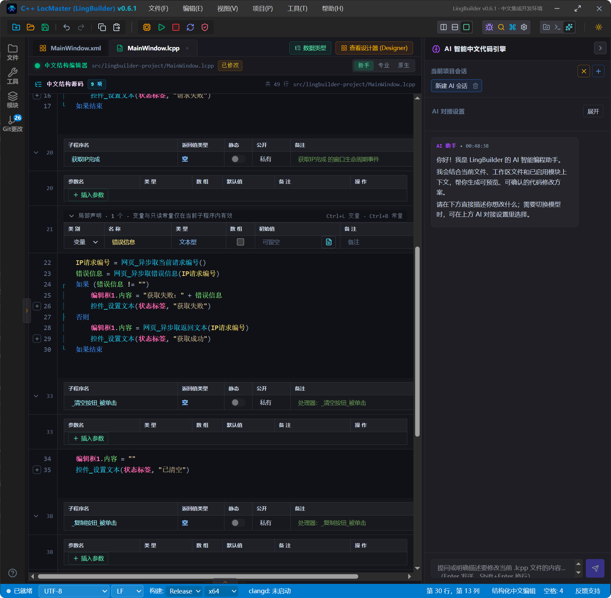

# AI 对话式改代码

> [🕒 预计 15 分钟] | 难度：入门 | 关联功能：AI 聊天助手、AI Bridge

## 🖥️ 界面概览

```
┌──────────────────────────────────────┐
│  LingBuilder IDE                      │
├──────────────────────────────────────┤
│  ┌───编辑器───┐  ┌────AI 聊天面板────┐ │
│  │            │  │  [💬 历史对话记录] │ │
│  │  main.lcpp │  ├──────────────────┤ │
│  │  代码内容  │  │  [📝 中文输入框] │ │
│  │            │  │  [⚡ 发送]       │ │
│  └───────────┘  └──────────────────┘ │
└──────────────────────────────────────┘
          ↑                    ↑
      编辑区              AI 对话框
```

**📸 AI 智能编程助手界面**（打开项目时自动显示在右侧）：



## 1. 打开 AI 聊天助手

1. 在主窗口右侧面板中找到 **AI 聊天** 标签页（若未显示，可通过 **视图** > **AI 聊天** 打开）。
2. 聊天面板包含两部分：
   - **对话区**：展示用户与 AI 的问答记录
   - **输入区**：在底部输入中文描述，按 `Enter` 发送

> [!NOTE]
> 首次使用前需要先完成配置。可在 [AI Bridge 配置](/guide/ai/bridge-config) 中绑定模型服务；也可以在 **工具** > **选项** > **AI 设置** 中选择内置云端服务。

## 2. 用中文描述需求

LingBuilder 的 AI 助手支持**中文对话式生成与修改代码**。直接在输入框中描述需求即可，例如：

- "创建一个登录窗口，包含用户名、密码输入框和登录按钮"
- "给按钮添加点击事件，点击后校验输入不为空"
- "把当前选中代码改成多线程版本"
- "为这段代码添加注释，并优化命名"

发送后，AI 会在对话区返回生成的代码片段或修改建议。

> [!TIP]
> 描述越具体，生成结果越接近预期。建议在描述中包含 **控件名称、目标行为、边界条件**。例如："点击按钮后，若文本框为空则弹出提示，否则关闭窗口。"

## 3. 将 AI 结果应用到编辑器

1. 在对话区中，点击 AI 返回代码块右上角的 **插入** 按钮，代码将自动插入到当前光标位置。
2. 或点击 **复制** 按钮，手动粘贴到编辑器中。
3. 使用 **应用到选区** 按钮，可以用 AI 生成的代码 **替换编辑器当前选中的代码段**。

> [!WARNING]
> 应用 AI 生成代码前，请先阅读代码逻辑，确认其符合项目需求。AI 可能对特定库接口或模块版本的细节理解不准确，建议应用后立即 **构建**（`Ctrl+B`）验证。

## 4. 成本配额管理

AI 对话服务按请求消耗 **配额**（credits）。在聊天面板底部可查看当前剩余额度。

| 操作 | 路径 |
|---|---|
| 查看剩余配额 | **AI 聊天** 面板底部额度显示 |
| 充值 / 购买套餐 | **工具** > **账户** > **配额充值** |
| 查看用量明细 | **工具** > **账户** > **用量记录** |

> [!NOTE]
> 配额仅在使用内置云端模型服务时消耗。配置自己的 API Key（BYOK）后，请求费用由模型服务商另行结算，与 LingBuilder 内置配额无关。

## 5. BYOK 模式开启

**BYOK（Bring Your Own Key，自带密钥）** 允许用户直接使用自己的模型服务商 API Key，而不再依赖内置云端额度。

1. 打开 **工具** > **选项** > **AI 设置**。
2. 在 **模型服务** 区域选择 **使用自有 API Key（BYOK）**。
3. 点击 **配置**，填入服务商地址与密钥（详见 [AI Bridge 配置](/guide/ai/bridge-config)）。
4. 点击 **测试连接**，验证通过后点击 **保存**。

> [!TIP]
> BYOK 模式下生成的代码同样支持插入编辑器与应用到选区，功能与内置模式一致。切换模式后，新的对话会立即生效。

## 6. 常见问题

### 6.1 一直提示"等待 AI 响应"

- 检查本机网络是否可访问配置的模型服务端点
- 若使用 BYOK，请确认 API Key 未过期、未超出速率限制
- 等待超过 60 秒无响应，可点击 **停止** 中断本次请求

### 6.2 AI 返回的代码构建报错

- 检查返回代码中引用的控件名、模块是否存在于当前项目
- 将报错信息粘贴回对话框，AI 会结合上下文给出修正建议

## 下一步

- 配置自己的模型服务：[AI Bridge 配置](/guide/ai/bridge-config)
- 了解 MCP 工具协议：[MCP 工具接入](/guide/ai/mcp)
- 浏览 DeepSeek 接入说明：[DeepSeek 集成参考](/guide/ai/deepseek-integration)