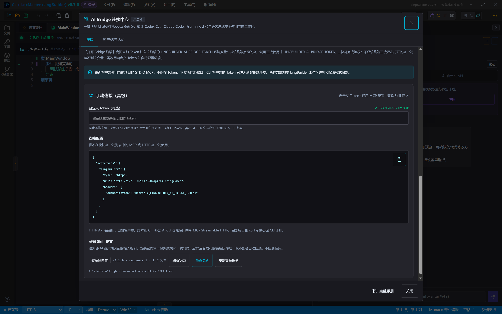

# 灵码 Skill 使用

> [🕒 预计 10 分钟] | 难度：入门 | 关联功能：AI Bridge 连接配置、MCP 工具协议

## 1. 灵码 Skill 是什么

**灵码 Skill** 是一份给外部 AI 客户端**自动阅读**的接入指引（`SKILL.md`）。它教支持 Skill 机制的 AI 编码客户端如何安装并连接 LingBuilder 的 AI Bridge——包括标准工作流、工具用法、`.lcpp` 中文语法要点、模块调用规范和常见红线。

装好之后，外部 AI 不需要你手工粘贴任何说明文档，就能按 LingBuilder 的正确姿势在当前工作区干活：读代码、提修改提案、创建项目、编译运行。

## 2. 分发形态与更新机制

灵码 Skill 采用「内置快照 + 官网最新版」双通道分发：

- **安装包内置离线快照**：随 IDE 附带（`resources/skill-kit/`），不联网也能用；
- **联网时以官网后台发布的最新版为准**：取不到最新版会自动回退到内置快照，不阻断使用；
- 发布版本用 `sequence` 单调递增做**防回滚**校验，每个文件带字节数与 SHA-256 校验，全部通过才会整体落盘；
- 发现文件损坏或签名校验失败时，连接中心会显示中文问题提示，并继续使用最近可用的版本。

## 3. 查看状态与检查更新

入口：**帮助(H)** > **AI Bridge 连接中心**，展开 **手动连接（高级）**，底部的 **灵码 Skill 正文** 区展示当前状态：

| 元素 | 说明 |
|---|---|
| 来源徽标 | 「安装包内置」表示当前使用随包快照；已同步官网最新版时显示对应来源 |
| 版本 · sequence · 文件数 | 当前生效版本号、发布序号与文件数量 |
| **刷新状态** | 重新读取本机当前生效的 Skill 快照 |
| **检查更新** | 联网拉取官网后台最新发布版本，成功后自动替换本机快照 |
| **复制安装指令** | 复制面向 AI 客户端的自安装指令，成功后按钮短暂显示「已复制」 |

## 4. 安装到 AI 客户端

1. 点击 **复制安装指令**。
2. 把指令粘贴给支持 Skill 安装机制的 AI 客户端并执行，客户端会按指引把 `SKILL.md` 安装到自己的技能目录，重启或新建会话后生效。
3. 之后在该客户端里直接用自然语言描述需求即可，AI 会按 Skill 指引通过 AI Bridge 连接当前工作区、提出可预览的修改提案并执行受控构建。

> [!NOTE]
> Skill 只是指引正文。AI 对工作区的任何实际访问仍然要走 AI Bridge——Token 鉴权、权限模式与工作区边界约束全部生效，Skill 不会绕过任何安全机制。

客户端不支持 Skill 机制时也有兜底：在连接中心找到本机快照路径（Skill 区下方显示 `SKILL.md` 的完整路径），把文件内容直接作为参考资料发给 AI，效果等同手工粘贴开发规范。

## 5. 指引正文包含哪些关键步骤（2026-09-21 版）

最新版 `SKILL.md` 在「定位 IDE → 写配置 → 确认连通」之外，强化了四处首次接入最容易踩坑的环节，AI 客户端被要求在**第一次创建项目之前**逐项自检：

| 环节 | 指引要求 AI 客户端做的事 |
|---|---|
| 收费模块与本机授权 | 用到 new_emoji 等收费模块时，先请用户在「AI Bridge 连接中心 → Bridge 启动设置」勾选**允许外部 AI 客户端使用本机授权**；报「宿主启动时未取得授权」时引导用户勾选后重启 AI 客户端或重连 MCP，而不是误判为未购买 |
| 目标构建架构 | 含浏览器内核 / new_emoji 的项目通常需要 x64；架构与模式只认 `.lingbuilder/build-configuration.json` 顶层的 `architecture` 与 `mode` 字段 |
| 全局 vs 工作区安装 | 默认写当前工作区的客户端配置；用户要求全局时才写用户级文件（如 `%USERPROFILE%\.codex\config.toml`），并先向用户复述落点 |
| 工作区自检 | 连通后第一件事调 `lingbuilder.workspace.list`：返回首项 `type="workspace"` 的条目带 `workspaceRoot`（工作区根绝对路径），与用户项目目录不符就停止并让客户端切目录重启 MCP 宿主 |

指引还明确了：MCP 的 `project.create` 会做收费模块权益门禁，而 CLI 的 `project build/run` 路径不挂该门禁（两条入口权限不一致属产品现状）；接入产生的工作区文件（`solution.json`、`build-configuration.json`、`project-modules.json`、模块目录、设计器模型等）是项目工件，收尾时不应清理。

## 常见问题

### 检查更新一直失败

官网不可达或网络受限时会自动回退内置快照，功能不受影响；恢复联网后再次点击「检查更新」即可。

### 复制安装指令后粘贴出来是空的

正常情况下按钮会显示「已复制」反馈；若剪贴板被其他程序占用可能导致写入失败，重新点击一次即可。

### AI 客户端装了 Skill 但连不上工作区

Skill 只负责「怎么用」，「连得上」要靠 AI Bridge：确认 LingBuilder 已打开且 Bridge 处于启动状态（或客户端按指引自行启动），连接参数见 [AI Bridge 连接配置](/guide/ai/bridge-config)。

## 下一步

- 配置 Bridge 连接与权限：[AI Bridge 连接配置](/guide/ai/bridge-config)
- 了解 AI 能调用哪些工具：[MCP 工具协议](/guide/ai/mcp)
- 让 AI 编译并运行项目：[AI 构建与运行](/guide/ai/build-run)
