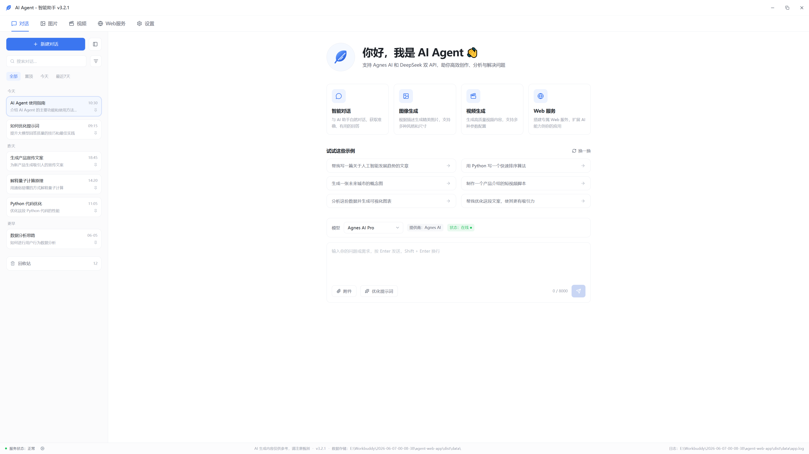
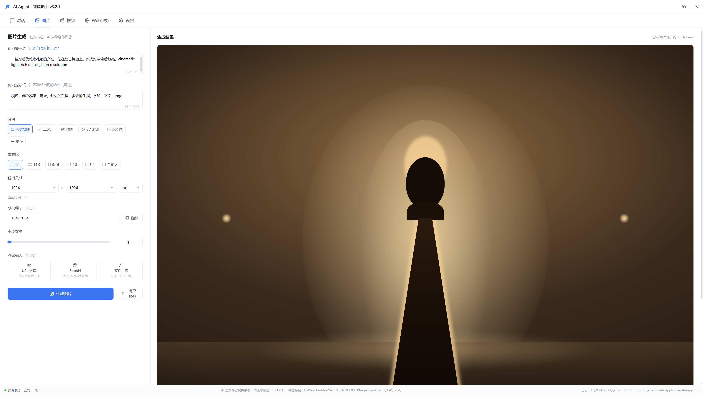
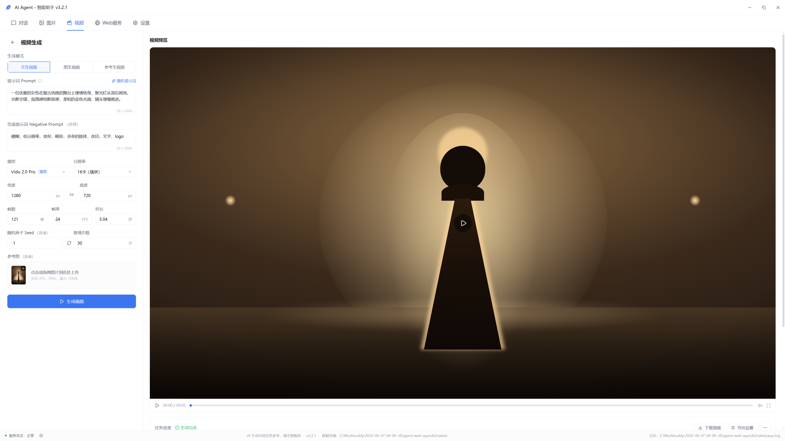
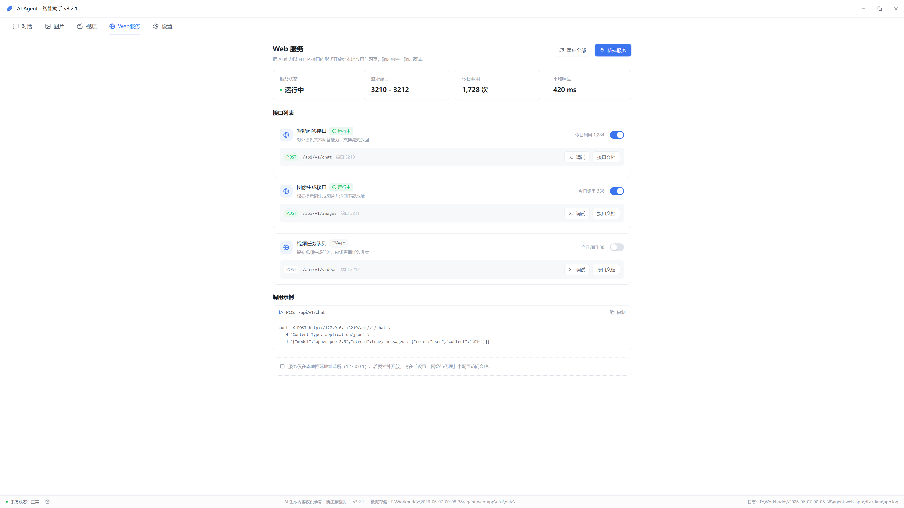
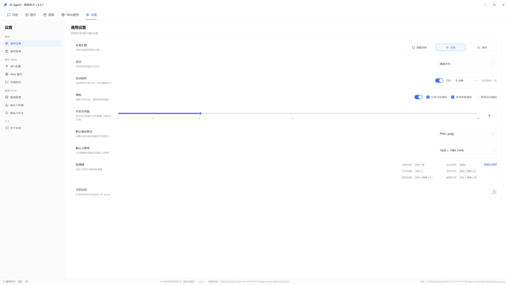

# AI Agent 智能助手

> 优秀案例 · [🕒 阅读约 3 分钟]

> [!NOTE]
> 本文为真实项目案例展示，仅公开功能亮点与效果截图，不包含源码与工程下载。

**一句话介绍**：无边框网页壳桌面 AI 助手——对话、图片生成、视频生成、Web 服务、设置五大工作区，整套界面是跑在 EdgeView 里的网页 UI。

## 核心亮点

- **无边框网页壳**：1280×800 无边框窗口，自绘标题栏（最小化 / 最大化 / 关闭），拖动与八方向拉伸经网页消息桥翻译成原生命令——原生侧只有一个浏览器控件。
- **对话工作区**：会话管理（历史 / 置顶 / 回收站）、提示词优化、附件上传、模型切换。
- **图片生成**：正负向提示词、风格预设、宽高比、输出尺寸、随机种子与批量数量。
- **视频生成**：文生视频 / 图生视频 / 参考生视频三模式，参数面板（模型 / 分辨率 / 帧率 / 时长 / 种子）+ 任务队列与视频预览。
- **Web 服务**：把 AI 能力以本地 HTTP 接口开放给其他应用与网页——对话 / 图片 / 视频三个 REST 端点，内置调试与接口文档，调用统计实时可见。
- **设置中心**：主题 / 语言 / 快捷键 / 并发任务数 / 数据管理 / 备份恢复 / 隐私安全。

## 界面一览

对话工作区：欢迎页能力卡片 + 会话列表 + 输入区：

图片生成：参数面板与生成结果：

视频生成：三模式 + 任务进度与预览：

Web 服务：本地 REST 接口（chat / images / videos）状态、调试与调用示例：

设置中心：通用设置、模型管理、存储路径、隐私与安全：

## 技术要点

| 项目 | 说明 |
|---|---|
| 窗口壳 | EdgeView（WebView2）全幅网页 UI + postMessage 窗口控制桥 |
| 窗口桥 | 拖拽 / 最小化 / 最大化还原 / 边缘缩放 / 状态查询 / 关闭六条动作，reqId 回显配对 |
| 站点分发 | 内嵌站点构建期写进 exe 资源段，零网页文件落地 |

[返回优秀案例](/guide/cases/)
