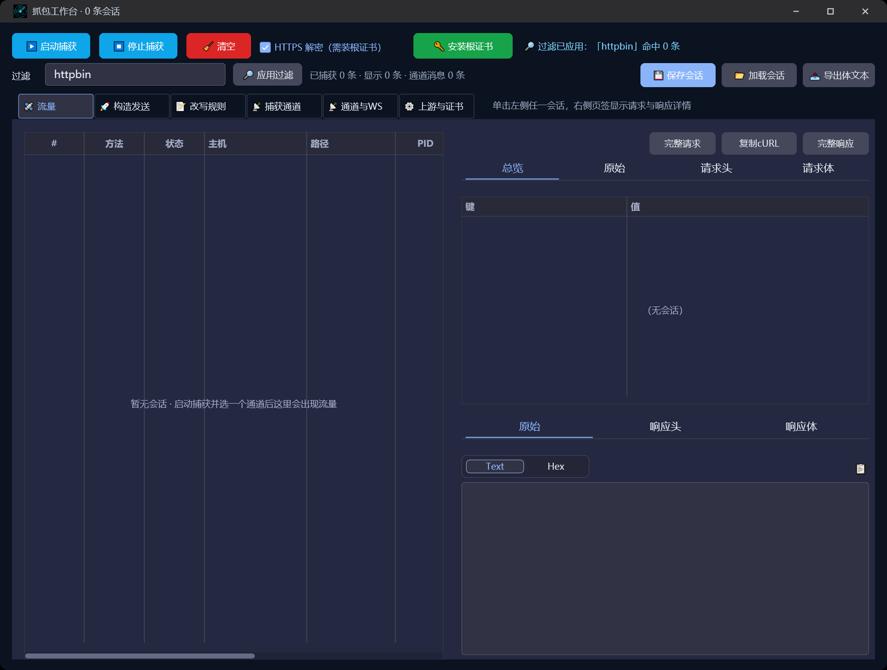
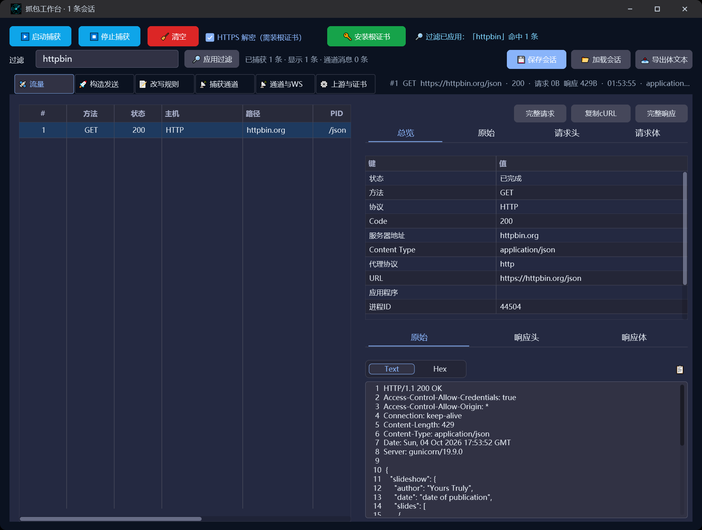
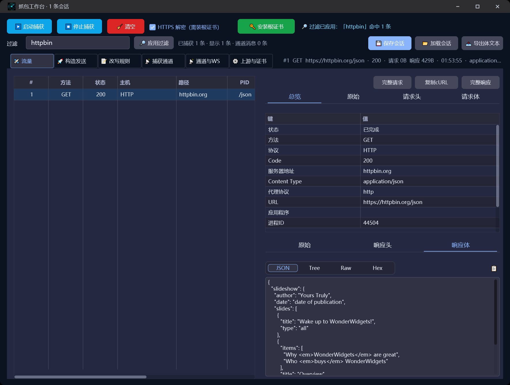
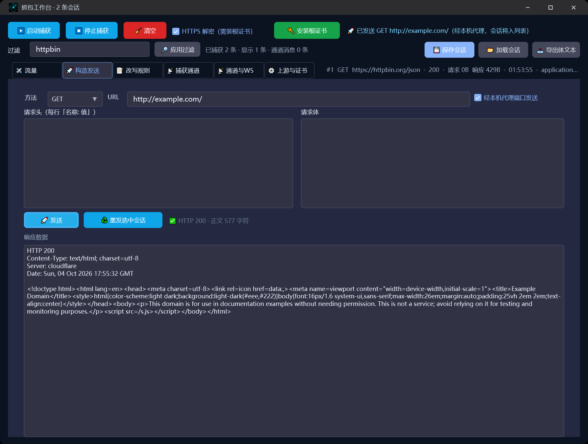
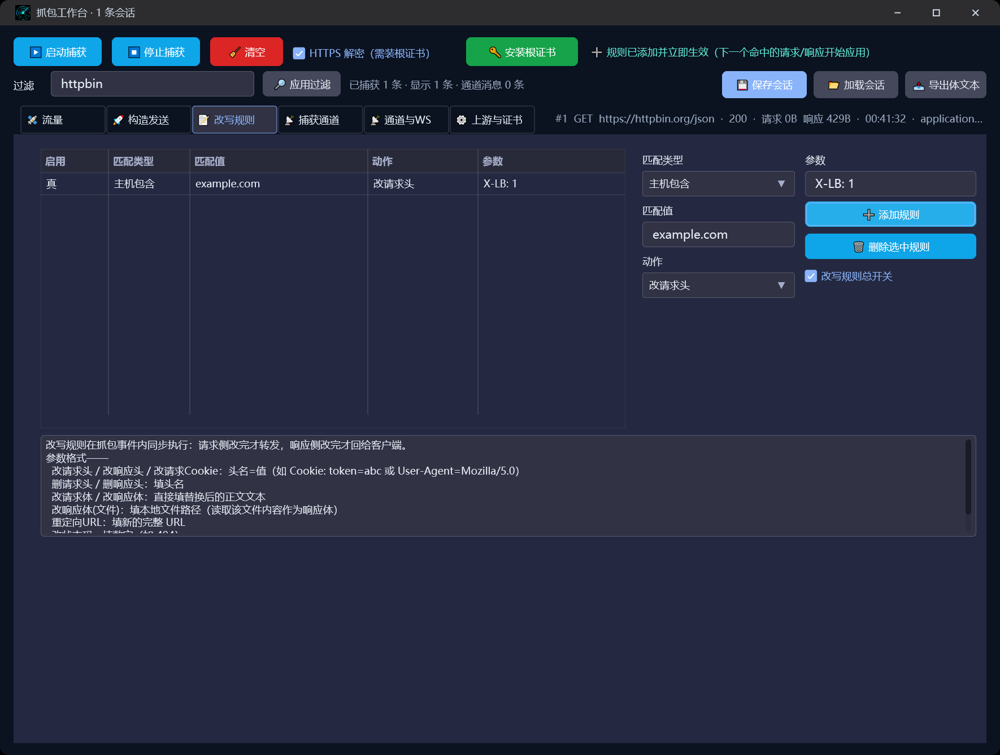
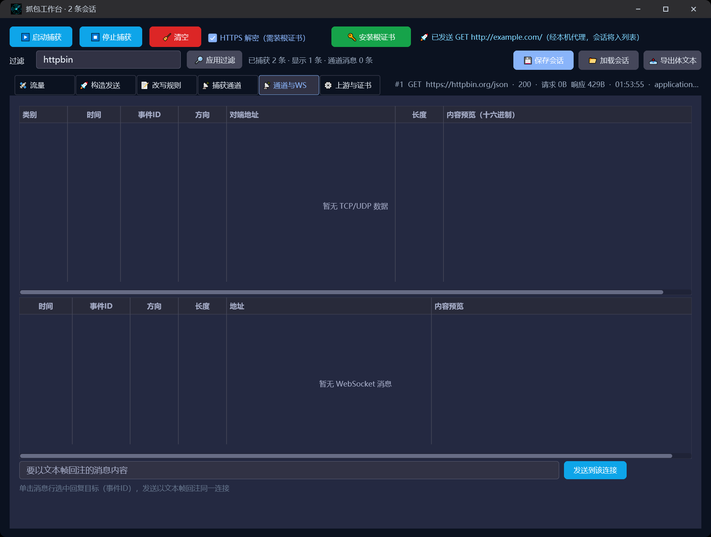

# 抓包工作台

> 优秀案例 · [🕒 阅读约 3 分钟]

> [!NOTE]
> 本文为真实项目案例展示，仅公开功能亮点与效果截图，不包含源码与工程下载。

**一句话介绍**：效仿 Fiddler / Reqable 的中文抓包工具——HTTPS 解密、会话检查器、构造发送、改写规则、多通道捕获，一个单文件 exe 全部搞定。

## 核心亮点

- **Reqable 式检查器**：左侧会话列表 + 右侧「总览 / 原始 / 请求头 / 请求体」「原始 / 响应头 / 响应体」两组页签；完整报文 Text / Hex 切换，请求/响应体 JSON / Tree / Raw / Hex 四视图智能默认。
- **HTTPS 明文解密**：MITM 根证书一键安装，浏览器流量实时解密进列表；真实抓取 example.com / httpbin.org 全程验证。
- **三种捕获通道**：系统代理（停止/退出自动还原）、进程代理驱动（Proxifier / NFAPI / Tun，按进程名或 PID 定向抓取）、SOCKS5 用户校验入口——不动系统代理也能只抓目标程序。
- **构造发送**：方法 + URL + 自定义头 + 正文自由构造，可勾选「经本机代理端口发送」让请求重新进入抓包列表，一键重发选中会话。
- **改写规则**：主机 / URL / 方法多维度匹配 × 请求头、Cookie、请求体、重定向、状态码、响应头、响应体（含文件）改写，总开关一键启停，规则在抓包事件内即时生效。
- **万级流量不卡界面**：事件只写内存环形缓冲 + 节流合并刷新，虚拟表格按行号取数；TCP/UDP 通道与 WebSocket 消息同台监控，支持文本帧回注。
- **会话可存档**：保存 / 加载会话（含通道消息与改写规则），响应体一键导出，完整请求报文与 cURL 一键复制。

## 界面一览

流量与检查器总览：左侧会话列表单击选中，右侧总览页签展示会话元数据，顶部一键复制完整请求报文与 cURL：

请求头检查器：键值表格式展示全部请求头，支持排序、复制为 JSON、文本/表格模式切换：

响应体 JSON 视图：JSON 响应自动缩进展示，JSON / Tree / Raw / Hex 四段切换，非 JSON 内容智能回退：

构造发送：方法 + URL + 自定义头 + 正文，勾选「经本机代理端口发送」让请求重新进入抓包列表：

改写规则：多维度匹配 × 多种改写动作，总开关一键启停：

捕获通道：系统代理 / 进程代理驱动 / SOCKS5 用户校验三种捕获入口：

## 技术要点

| 项目 | 说明 |
|---|---|
| 抓包内核 | `lingbuilder.sunnynet`（SunnyNet 中间件：HTTP/HTTPS/WS/TCP/UDP） |
| 界面 | `lingbuilder.new_emoji.ui` 原生界面库，控件全设计器模型，暗色主题 |
| HTTPS 解密 | MITM 根证书一键安装 / 卸载 / 导出 PEM，按指纹判断当前进程证书 |
| 性能设计 | 事件环形缓冲 + ≥200ms 节流刷新 + 虚拟表格，万级会话流畅滚动 |
| 捕获通道 | 系统代理 / 进程级驱动（NFAPI / Tun / Proxifier）/ SOCKS5 校验 |
| 交付 | 单 exe 免安装，双击即用 |

[返回优秀案例](/guide/cases/)
