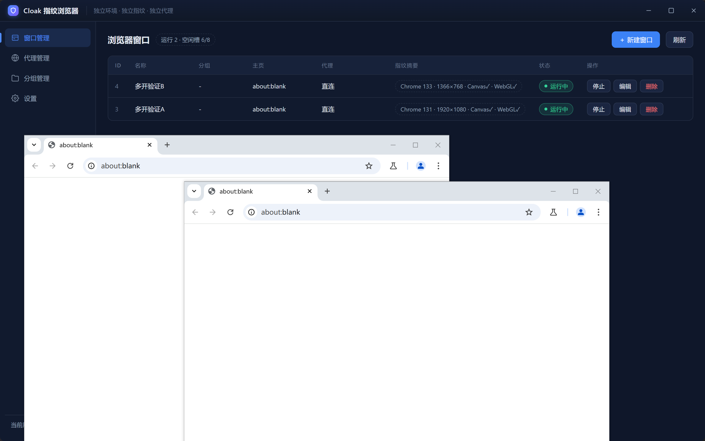
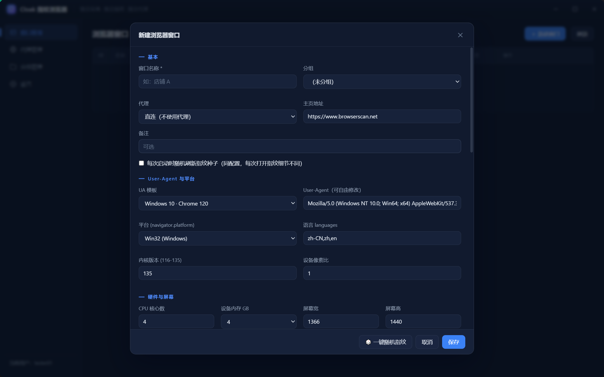
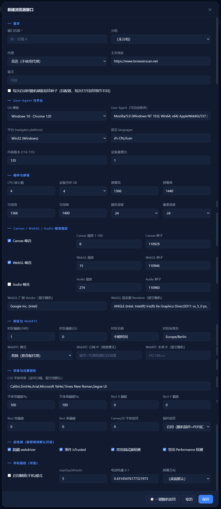
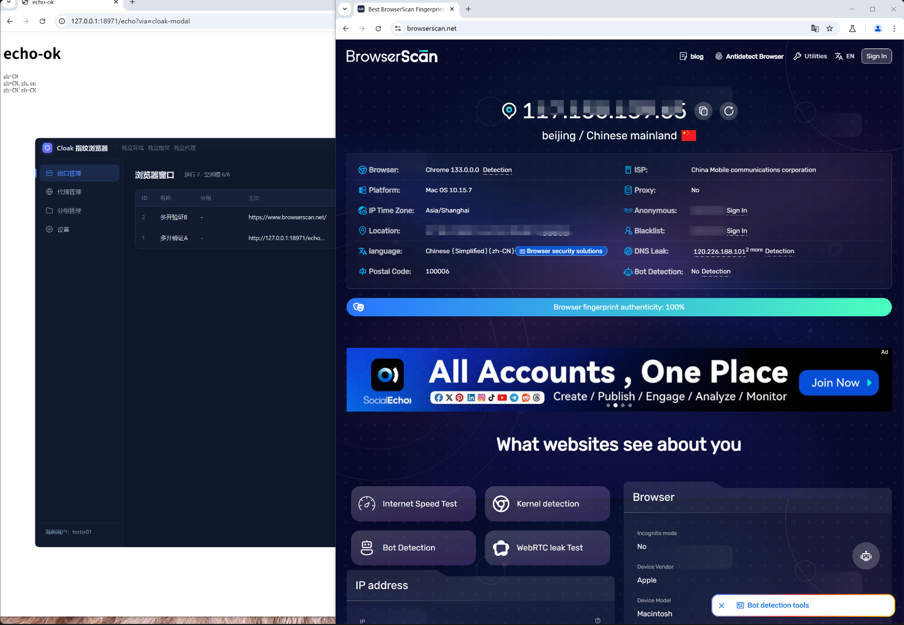

# Cloak 指纹浏览器

> 优秀案例 · [🕒 阅读约 3 分钟]

> [!NOTE]
> 本文为真实项目案例展示，仅公开功能亮点与效果截图，不包含源码与工程下载。

**一句话介绍**：多开防关联指纹浏览器——每个浏览器窗口独立指纹、独立代理、独立缓存，管理台 + 多开浏览器一体的桌面应用。

## 核心亮点

- **纯代码多开引擎**：基于 FBro（CEF 内核）后台实例池，按槽位管理浏览器实例，弹出 Chrome 原生 UI 独立窗口，全程无设计器浏览器控件。
- **内核级指纹**：UA / 平台 / 语言 / 内核版本 / CPU / 内存 / 屏幕 / Canvas / WebGL / Audio 噪音 / 时区 / WebRTC / 字体 / 插件 / webdriver / 触摸手机指纹全字段可配，支持一键随机与随机刷新指纹种子。
- **防关联实测**：browserscan 指纹真实性检测 100%，双开窗口读数互异；Accept-Language 三键同源等语言一致性细节已按检测站口径调平。
- **独立环境**：每窗口独立缓存目录 = 独立登录态；代理按窗口配置（SOCKS5/HTTP），WebRTC 公网 IP 随代理替换。
- **网页控制台**：管理台用 EdgeView 承载自绘网页 UI（窗口管理 / 代理管理 / 分组管理 / 设置），配置经 SQLite 持久化。

## 界面一览

窗口管理：实例列表显示指纹摘要（内核版本 · 分辨率 · Canvas/WebGL 状态）与运行状态，双开验证弹出的两个独立浏览器窗口：

新建窗口：指纹配置表单（UA 模板、平台、语言、内核版本、硬件与屏幕）：

完整指纹字段：Canvas / WebGL / Audio 噪音强度与种子、时区与 WebRTC 替换、字体与元素矩形、反检测开关、手机指纹：

指纹检测实测：browserscan 显示「Browser fingerprint authenticity: 100%」：

## 技术要点

| 项目 | 说明 |
|---|---|
| 浏览器引擎 | `lingbuilder.fbro.browser` 后台实例 + `lingbuilder.fbro.vip` 内核级指纹 JSON |
| 管理台 | EdgeView 网页 UI + postMessage 桥 |
| 持久化 | SQLite（窗口 / 代理 / 分组 / 设置） |
| 指纹校验 | browserscan 真机实测真实性 100% |

[返回优秀案例](/guide/cases/)
