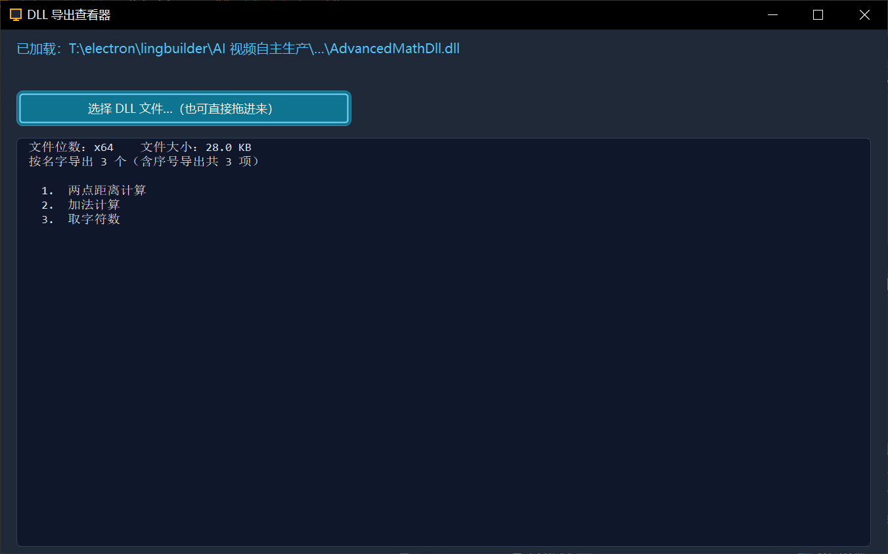

# DLL 导出查看器

> 优秀案例 · [🕒 阅读约 2 分钟]

> [!NOTE]
> 本文为真实项目案例展示，仅公开功能亮点与效果截图，不包含源码与工程下载。

**一句话介绍**：把任意 DLL 拖进窗口（或点按钮选择文件），立即列出该 DLL 全部按名字导出的函数名、文件位数与文件大小。

## 核心亮点

- **中文名导出正确显示**：按文件内原始字节读取导出表并经 UTF-8 还原显示——Dependency Walker、dumpbin 这类按 ANSI 解码的外部工具会把中文导出名显示成乱码或空白，看起来像「没有导出函数」，本工具能正确还原。
- **拖拽加载**：DLL 文件直接拖进窗口即列出结果，也可以走文件选择对话框。
- **位数与大小识别**：自动识别 x64 / x86 (Win32) 与文件大小（B/KB/MB 自动格式化），并区分按名字导出与序号导出项数。

## 界面一览

载入一个 x64 示例 DLL：显示位数、大小，列出 3 个中文导出函数（两点距离计算 / 加法计算 / 取字符数）：

## 技术要点

| 项目 | 说明 |
|---|---|
| 导出表解析 | PE 导出目录按名字导出表原始字节读取 |
| 编码还原 | UTF-8 经 MultiByteToWideChar 还原显示 |
| 交互 | 拖拽 + 文件对话框双入口 |

[返回优秀案例](/guide/cases/)
