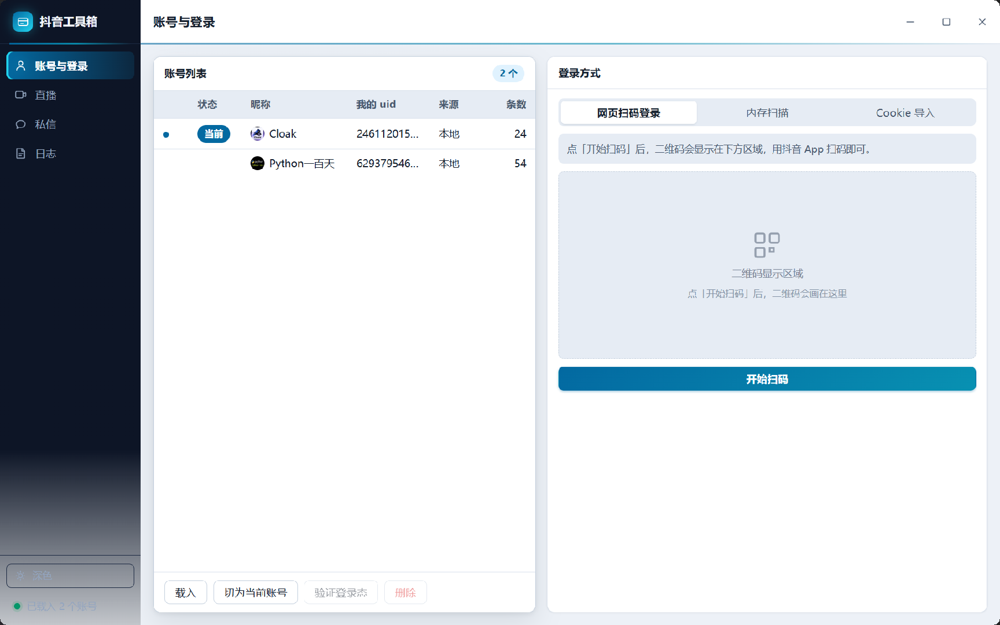
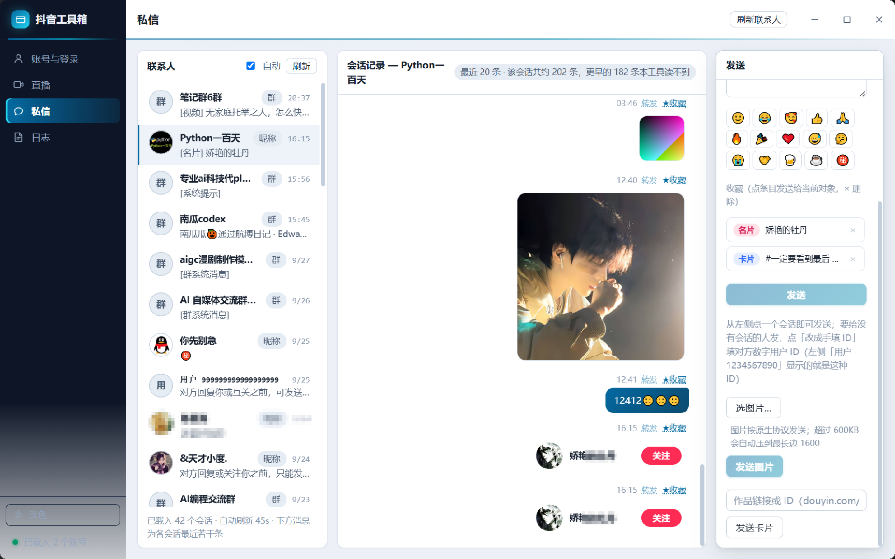

# 抖音工具箱

> 优秀案例 · [🕒 阅读约 3 分钟]

> [!NOTE]
> 本文为真实项目案例展示，仅公开功能亮点与效果截图，不包含源码与工程下载。

**一句话介绍**：抖音多账号管理与私信工作台——网页扫码 / Cookie 导入多账号登录，会话收发、收藏与图片卡片全支持。

## 核心亮点

- **多账号管理**：账号列表集中管理（昵称 / uid / 来源 / 会话条数），支持网页扫码、内存扫描、Cookie 导入三种登录方式，一键切换当前账号。
- **纯协议私信引擎**：联系人、会话记录、消息收发全走协议，不依赖浏览器界面操作；文字 / 表情 / 名片 / 卡片 / 图片多种消息类型。
- **IM 图片解密**：私信图片按加密格式传输，客户端按算法自动解密并原画质显示。
- **收藏直发**：收藏的名片、卡片条目直接发送给当前会话对象。
- **批量预取**：联系人与会话内容批量预取，大账号量下页面秒开。

## 界面一览

账号与登录页：左侧账号列表（已载入 2 个账号），右侧三种登录方式与扫码区域：

私信页：联系人列表（自动刷新）、会话记录（图片解密显示、转发/收藏标记）、发送区（表情 / 收藏 / 图片 / 卡片）：

## 技术要点

| 项目 | 说明 |
|---|---|
| 登录态 | 网页扫码 / 内存扫描 / Cookie 导入 |
| 私信引擎 | 纯协议收发，多消息类型 |
| 图片 | 加密图片自动解密渲染 |
| 界面 | new_emoji 原生界面库，浅色主题 |

[返回优秀案例](/guide/cases/)
