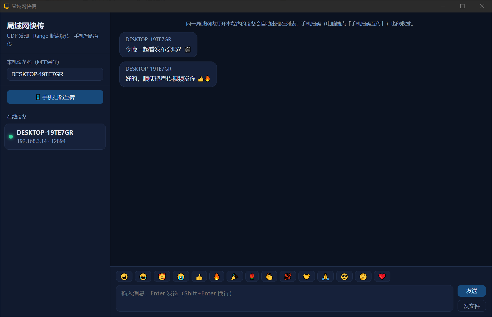
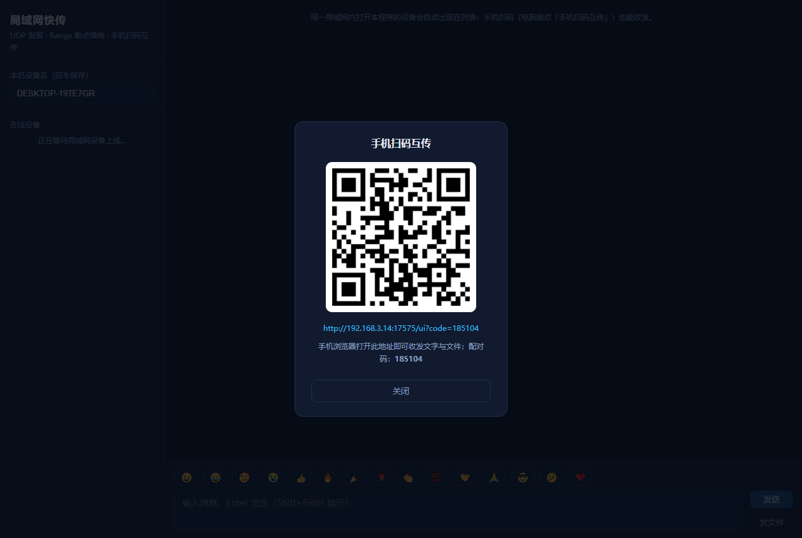

# 局域网快传

> 优秀案例 · [🕒 阅读约 2 分钟]

> [!NOTE]
> 本文为真实项目案例展示，仅公开功能亮点与效果截图，不包含源码与工程下载。

**一句话介绍**：电脑与电脑、电脑与手机（扫码打开网页）之间自动发现、收发文字表情与任意大小文件的局域网互传工具。

## 核心亮点

- **自动发现**：UDP 广播心跳（1.2 秒周期 / 6 秒判离线），同一局域网打开程序即出现在设备列表，上下线实时刷新，零配置。
- **手机扫码互传**：电脑端弹二维码，手机浏览器扫码打开网页即可收发文字与文件——手机侧免安装，网页由程序内置 HTTP 服务端直接托管。
- **断点续传**：任意大小文件走 HTTP Range 分块传输，中断后从断点继续，不重头来。
- **聊天室语义**：文字、表情面板、消息气泡，PC 内嵌页与手机网页同屏看到同一份会话。
- **构建零外部文件**：EdgeView（WebView2）全幅网页 UI，页面由自身 HTTP 服务托管，交付单个 exe。

## 界面一览

PC 端主界面：左侧设备列表与设备命名，右侧聊天区 + 表情面板 + 发文件：

手机扫码互传：弹出二维码与配对码，手机浏览器打开即连：

## 技术要点

| 项目 | 说明 |
|---|---|
| 设备发现 | UDP 广播心跳协议（发现 → 握手 → 传输三层） |
| 文件传输 | HTTP Range 分块 + 断点续传 |
| 界面 | EdgeView 内嵌网页 UI（PC）+ 自适应网页（手机） |
| 模块 | EdgeView 浏览器模块、网络 HTTP 服务端、字节数组模块 |

[返回优秀案例](/guide/cases/)
