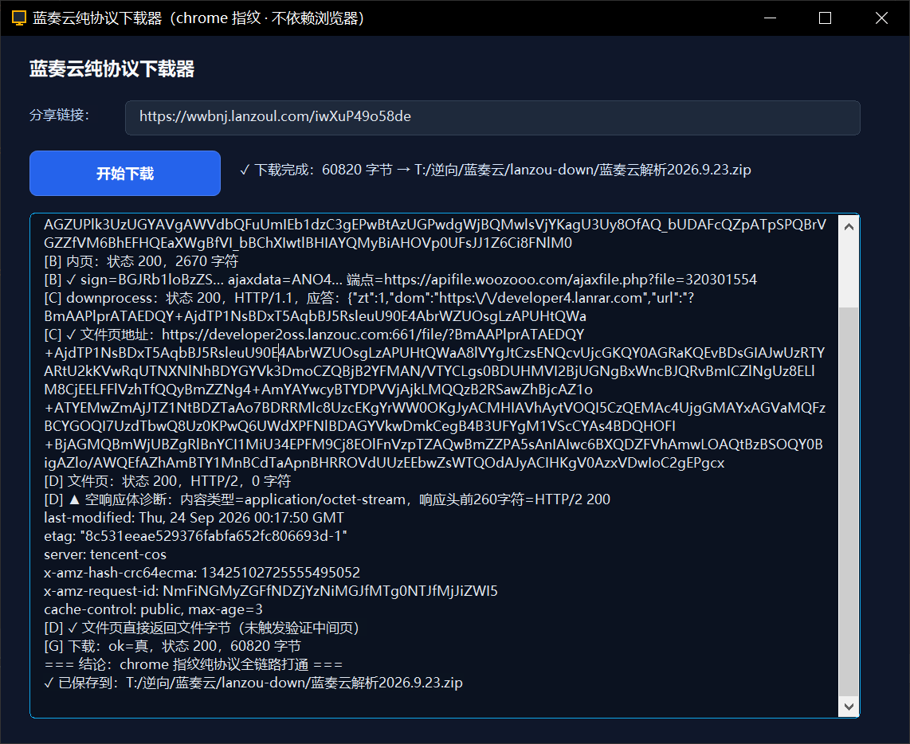

# 蓝奏云纯协议下载器

> 优秀案例 · [🕒 阅读约 2 分钟]

> [!NOTE]
> 本文为真实项目案例展示，仅公开功能亮点与效果截图，不包含源码与工程下载。

**一句话介绍**：不启动任何浏览器进程，贴入蓝奏云分享链接即可解析出真实文件直链并完整落盘的下载工具。

## 核心亮点

- **TLS 指纹仿真**：网络层基于 curl-impersonate 仿真栈，以 Chrome 指纹与 CDN 直接对话——蓝奏云的下载门禁判的是 TLS/HTTP2 指纹层，普通 HTTP 客户端会被直接掐断，本工具按浏览器指纹通吃全链。
- **全链纯协议**：分享页 → 内页解析 → 文件页 → 直链下载，四跳全部协议完成，全程零浏览器窗口、零 WebView。
- **后台线程不冻结 UI**：下载引擎跑在工作线程，日志经线程进度通道回传界面，窗口全程可拖动可操作。
- **全链路日志可见**：每一跳的状态码、HTTP 版本、响应头与诊断信息全部打印在窗口日志区，出问题一眼定位到哪一跳。

## 界面一览

贴入分享链接，点「开始下载」，日志区滚动输出各阶段解析过程，完成后给出落盘路径与字节数：

## 技术要点

| 项目 | 说明 |
|---|---|
| 网络内核 | `lingbuilder.net.http-client` TLS 指纹仿真（chrome 档案） |
| 线程模型 | 线程_提交 + 进度报告回传，日志合并刷新 |
| 工程形态 | 窗口程序，协议逻辑下沉功能库，约 800 行中文代码 |

[返回优秀案例](/guide/cases/)
