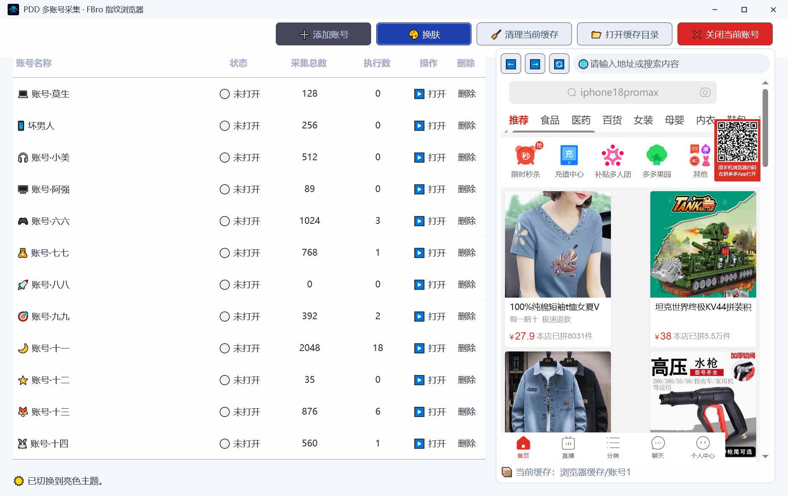
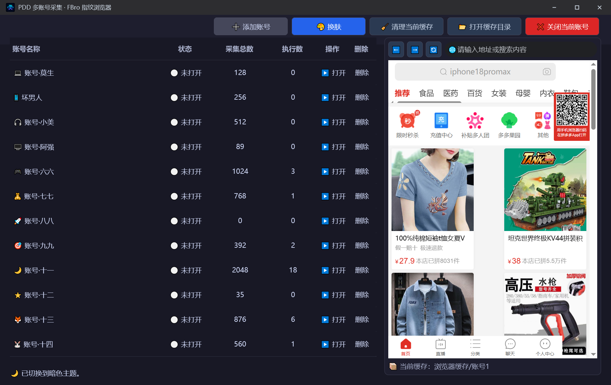

# PDD 多账号浏览器

> 优秀案例 · [🕒 阅读约 2 分钟]

> [!NOTE]
> 本文为真实项目案例展示，仅公开功能亮点与效果截图，不包含源码与工程下载。

**一句话介绍**：拼多多商家多账号指纹浏览器与采集工作台——每账号独立环境隔离，表格化管账号、看进度、发起采集。

## 核心亮点

- **多账号隔离**：每个账号独立浏览器缓存目录与指纹环境，账号之间互不串扰，支持批量挂机。
- **指纹浏览器内核**：基于 FBro 指纹浏览器，登录态稳定，同一台机器多个账号并行在线。
- **原生高性能表格**：账号名称 / 状态 / 采集总数 / 执行数 / 操作五列布局，表头列宽可拖拽，窗口缩放时按 DPI 自动重算列宽。
- **双主题**：提供白色主题与深色主题两套界面。

## 界面一览

白色主题主界面：

深色主题主界面：账号列表 + 采集进度统计：

## 技术要点

| 项目 | 说明 |
|---|---|
| 浏览器内核 | FBro 指纹浏览器（按账号独立缓存 + 指纹） |
| 界面 | new_emoji 原生界面库（表格 / 按钮 / 状态栏） |
| 适配 | 高 DPI 适配、表头拖拽列宽、窗口缩放重算 |

[返回优秀案例](/guide/cases/)
