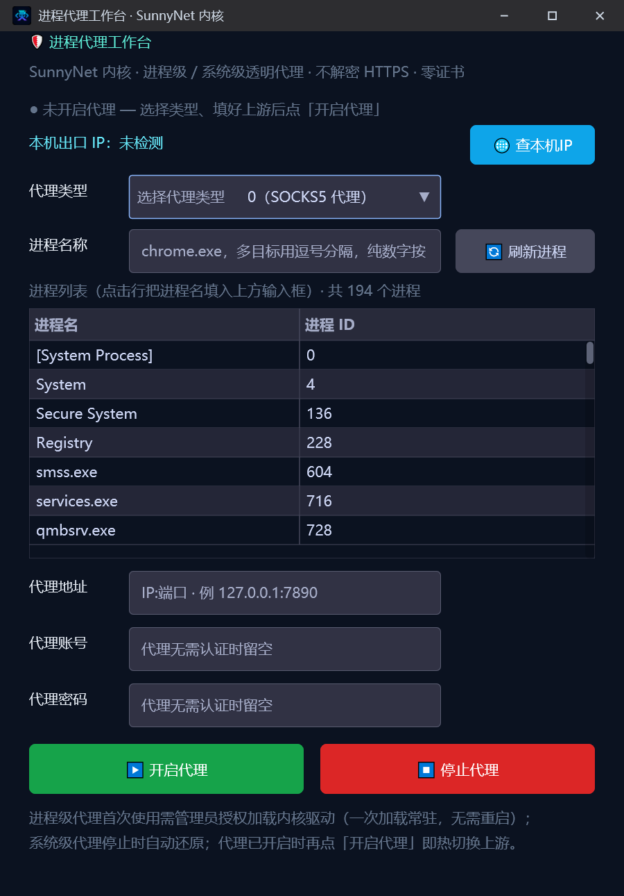
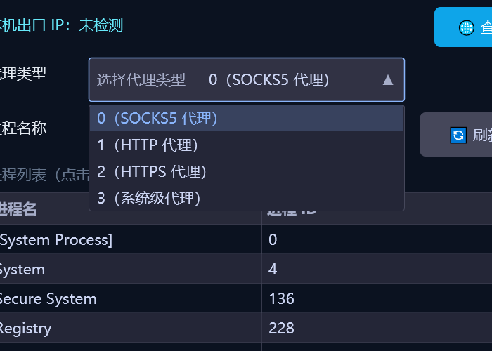

# SunnyNet 进程代理

> 优秀案例 · [🕒 阅读约 2 分钟]

> [!NOTE]
> 本文为真实项目案例展示，仅公开功能亮点与效果截图，不包含源码与工程下载。

**一句话介绍**：按进程名 / PID（或系统级）把指定程序的 TCP/UDP 流量透明转发到指定 SOCKS5 / HTTP / HTTPS 代理的进程级代理工具。

## 核心亮点

- **四种代理模式**：SOCKS5 / HTTP / HTTPS 上游代理 + 系统级代理一区切换，多目标进程用逗号分隔，纯数字按 PID。
- **进程级透明转发**：SunnyNet 内核驱动级转发，只代理选中的进程，其他程序流量不受影响；首次使用管理员授权加载内核驱动（一次加载常驻）。
- **纯转发零负担**：不解密 HTTPS、不装根证书、零证书维护。
- **进程列表点选**：自动枚举系统进程（实测 200 项），点行即把进程名填入输入框。
- **出口 IP 实证**：一键查本机出口 IP，开启代理后目标进程出口即变代理节点 IP；系统级模式停止时自动还原系统代理设置。

## 界面一览

主界面：代理类型 / 进程名称 / 进程列表 / 代理地址账密 / 开启停止 / 出口 IP：

代理类型下拉：SOCKS5 / HTTP / HTTPS / 系统级四模式：

## 技术要点

| 项目 | 说明 |
|---|---|
| 代理内核 | `lingbuilder.sunnynet`（SunnyNet 驱动级转发） |
| 进程枚举 | 系统进程列表点选回填 |
| 界面 | new_emoji 原生界面库，暗色主题 |
| 交付 | 单 exe 免安装，双击即用 |

[返回优秀案例](/guide/cases/)
