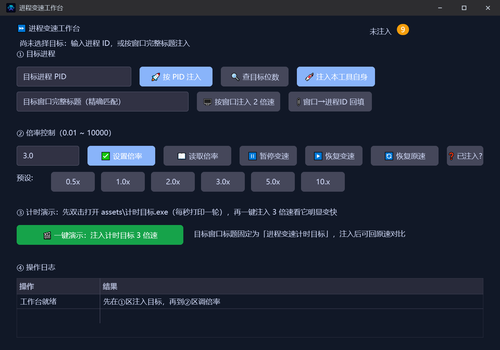

# 进程变速工作台

> 优秀案例 · [🕒 阅读约 2 分钟]

> [!NOTE]
> 本文为真实项目案例展示，仅公开功能亮点与效果截图，不包含源码与工程下载。

**一句话介绍**：对指定进程注入时间流速控制的工作台——0.01~10000 倍率任意调节，支持暂停 / 恢复 / 恢复原速，附计时目标一键演示。

## 核心亮点

- **双入口注入**：按目标进程 PID 注入，或按窗口完整标题注入（窗口 → 进程 ID 自动回填），也能注入本工具自身做实验。
- **倍率全程控**：0.01 ~ 10000 任意倍率 + 六档预设（0.5x / 1x / 2x / 3x / 5x / 10x），暂停变速、恢复变速、恢复原速、读取当前倍率、已注入状态查询一条齐。
- **免注入式调速**：基于命名文件映射通信，改倍率不需要反复注入，运行中随时热调。
- **一键演示**：自带计时目标程序（每秒打印一轮），一键注入 3 倍速后打印速度肉眼可见地变为 3 倍，虚拟时长保持不变。
- **中文诊断**：目标未注入、倍率超范围、找不到窗口等失败场景全部给出中文原因并写入操作日志。

## 界面一览

工作台四区：目标进程注入、倍率控制与预设、计时演示、操作日志：

## 技术要点

| 项目 | 说明 |
|---|---|
| 变速内核 | `lingbuilder.speedcontrol` 模块（11 条命令全覆盖） |
| 通信机制 | 命名文件映射 + 窗口消息，热调倍率 |
| 界面 | new_emoji 原生界面库，暗色主题 |

[返回优秀案例](/guide/cases/)
