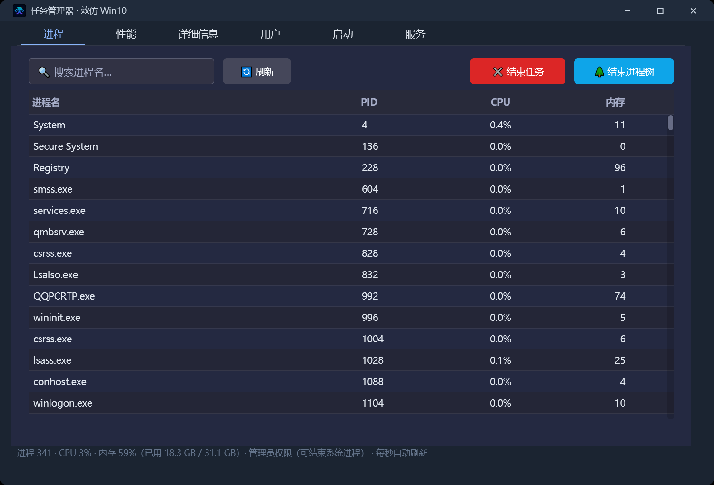
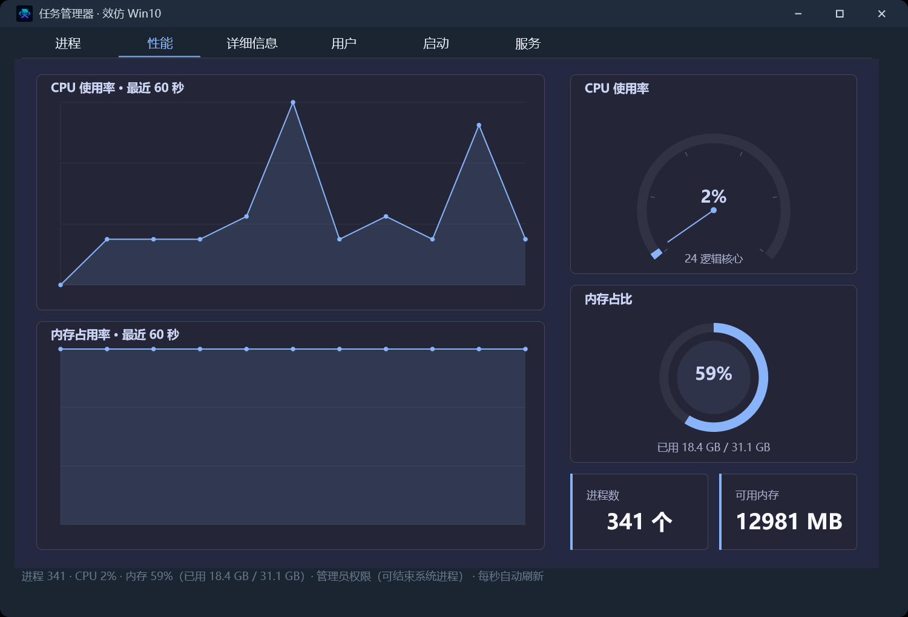
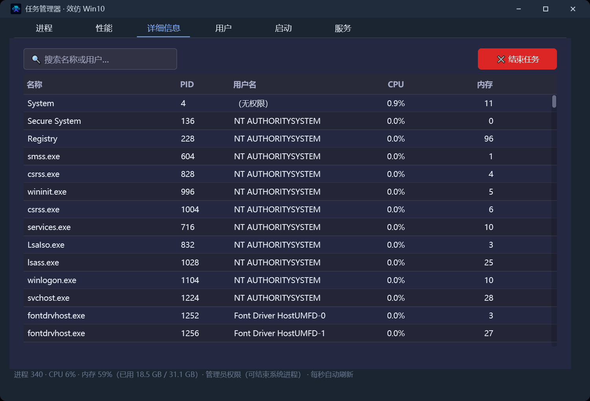
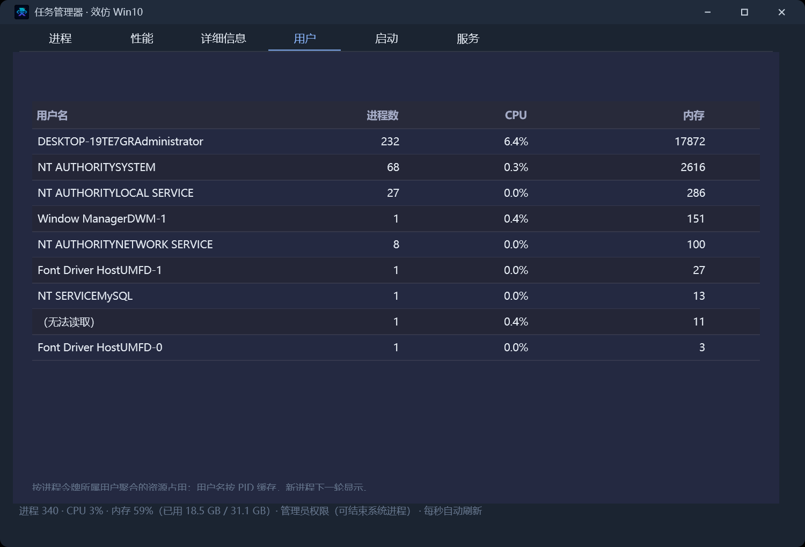
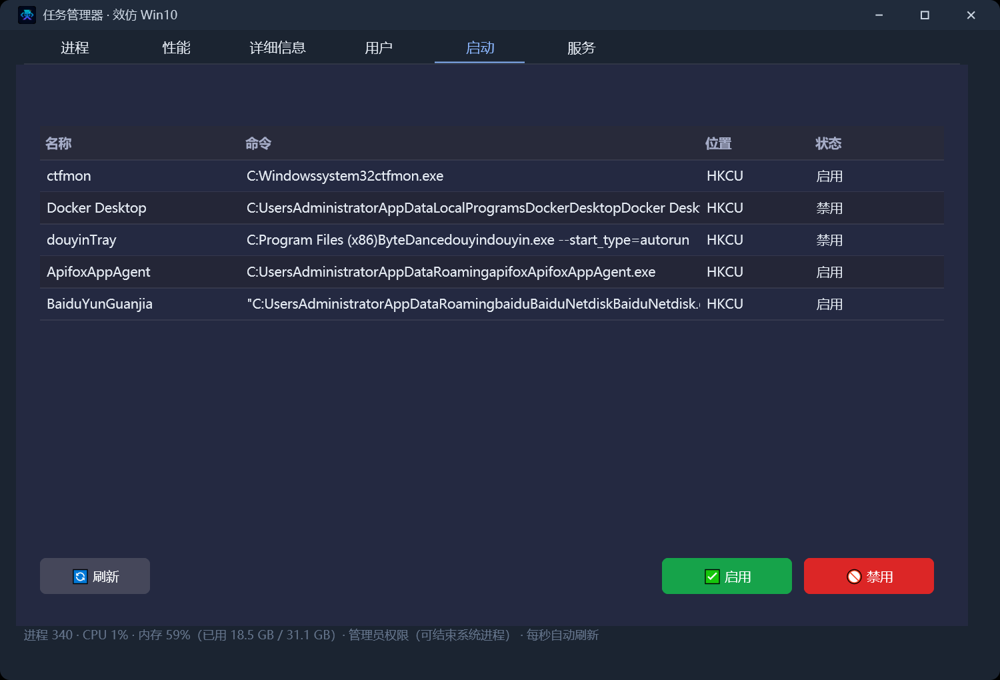
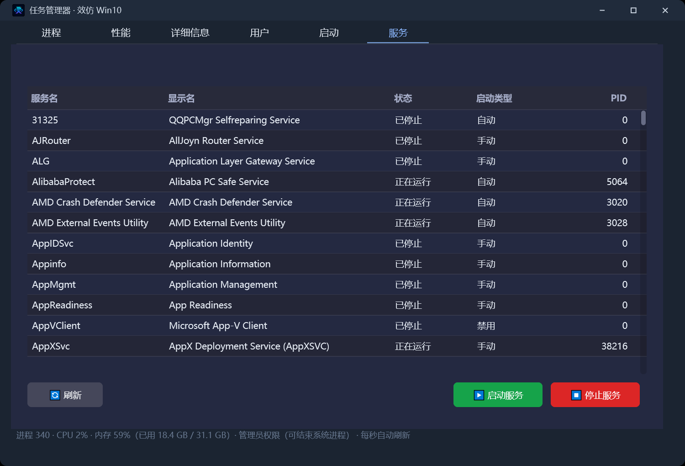
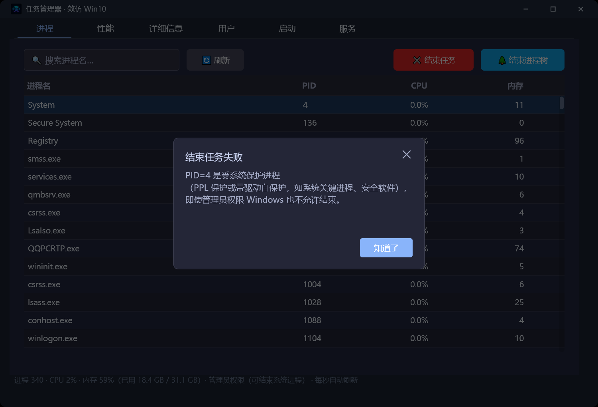

# 任务管理器

> 优秀案例 · [🕒 阅读约 3 分钟]

> [!NOTE]
> 本文为真实项目案例展示，仅公开功能亮点与效果截图，不包含源码与工程下载。

**一句话介绍**：用 new_emoji 原生界面库完整复刻 Windows 10 任务管理器核心形态——进程 / 性能 / 详细信息 / 用户 / 启动 / 服务六个页签，每秒实时刷新，支持结束进程、排序、启动项与服务管理。

## 核心亮点

- **六个页签全部真机可用**：进程实时表格、CPU/内存 60 秒曲线与仪表盘、详细信息、按用户聚合、启动项启用/禁用、系统服务启动/停止，与 Win10 任务管理器同款交互。
- **28 个控件全部来自可视化设计器**：界面在窗口设计器里拖拽完成（window-designer 模型），源码只写事件联动，零代码创建控件——「所见即所得」开发方式的完整示范。
- **数值感知排序**：点 CPU / 内存表头即按数值升降序切换，右键菜单同样可按 CPU / 内存 / PID 排序；搜索框实时过滤进程。
- **每秒采样引擎**：模块内置工作线程每秒采样全进程 CPU / 内存（与任务管理器同口径：系统总时间差分当归钟，多核进程可超 100%），结果直接投递到界面线程刷新，界面不卡顿。
- **受保护进程分状态提示**：结束 System（PPL 保护）等系统进程时，权限不足 / 受系统保护 / 已退出各有对应文案；管理员运行时自动启用调试特权，可结束 svchost 等系统服务进程。
- **启动项与服务管理**：枚举 HKCU + HKLM Run 启动项并按任务管理器同款机制启用/禁用；枚举 Windows 服务并支持启动/停止。

## 界面一览

进程页：全进程实时表格（名称 / PID / CPU / 内存），搜索过滤、表头点击排序、结束任务 / 进程树、打开文件位置：

性能页：CPU / 内存 60 秒实时曲线、CPU 仪表盘、内存环形进度、进程数与可用内存统计卡：

详细信息页：完整进程清单（含所属用户名），独立搜索与结束任务：

用户页：按进程令牌所属用户聚合的进程数 / CPU / 内存：

启动页：自启动项枚举（HKCU + HKLM Run），启用 / 禁用与任务管理器同机制：

服务页：Windows 服务枚举（状态 / 启动类型 / 宿主 PID）与启动 / 停止：

受保护进程提示：结束 System（PPL 保护）时的分状态提示——权限不足 / 受保护 / 已退出各有对应文案：

## 技术要点

| 项目 | 说明 |
|---|---|
| 界面 | `lingbuilder.new_emoji.ui` 原生界面库，28 控件全设计器模型，六页签布局 |
| 监控引擎 | `lingbuilder.system.monitor` 内置工作线程每秒采样，跨线程投递界面刷新 |
| 数据来源 | Toolhelp32 快照 + GetProcessTimes / GetProcessMemoryInfo / GetSystemTimes 差分 + 令牌用户名缓存 |
| 启动项/服务 | 注册表 Run 键 + StartupApproved 启用机制；服务控制管理器枚举与启停 |
| 权限 | 自动启用 SeDebugPrivilege，管理员运行可结束系统服务进程 |
| 交付 | 单 exe 免安装，F5 一键构建运行 |

[返回优秀案例](/guide/cases/)
