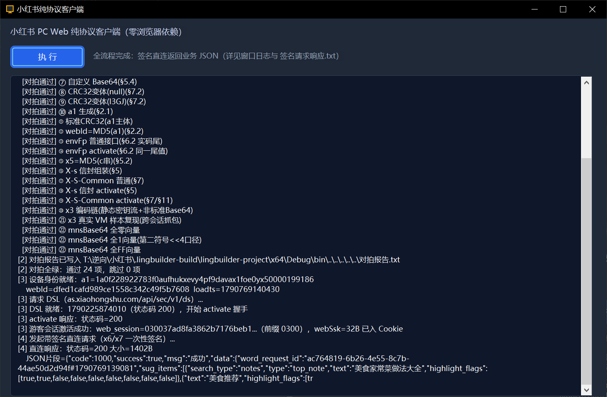
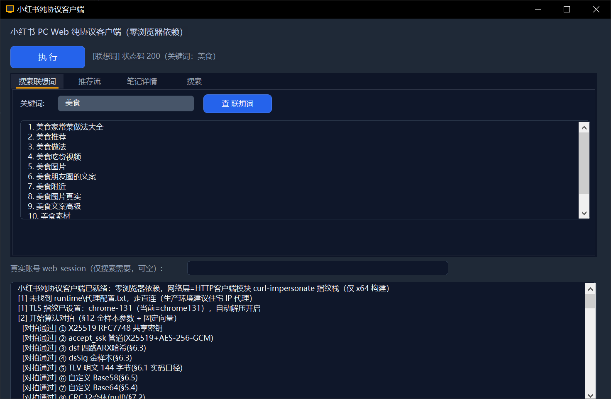
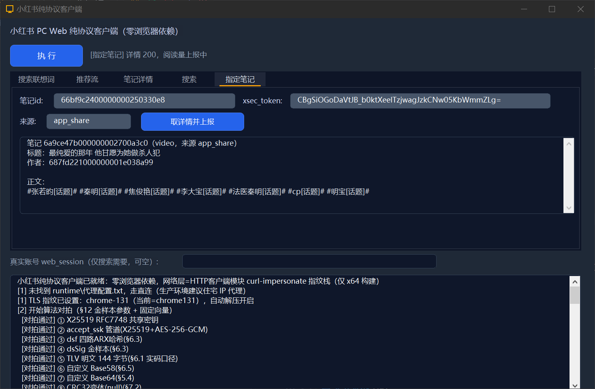
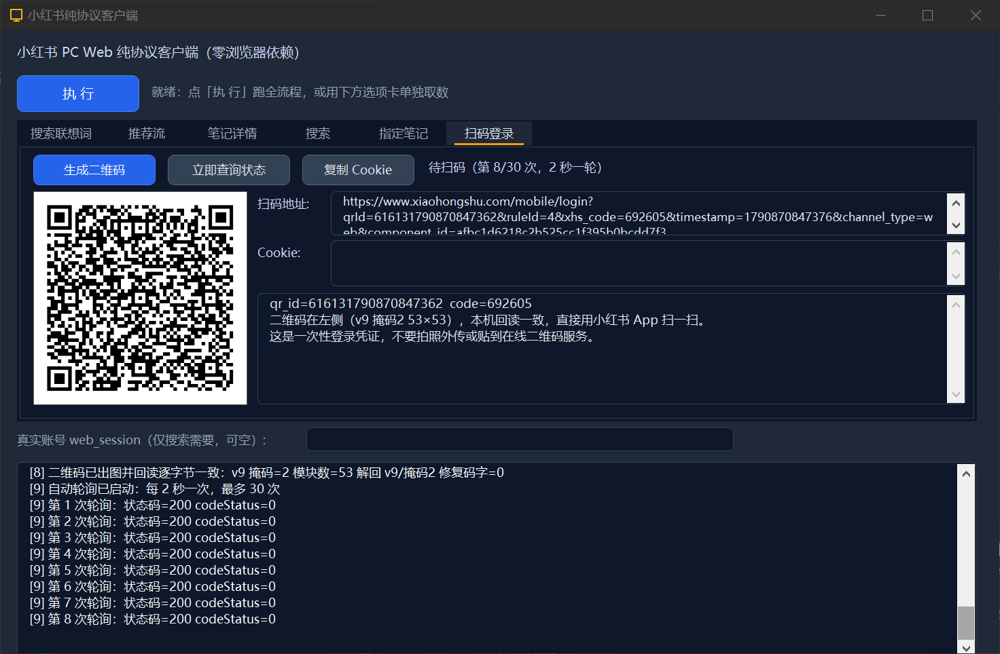
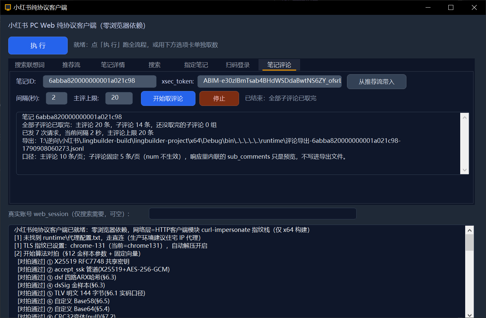

# 小红书 Web 纯协议客户端

> 优秀案例 · [🕒 阅读约 3 分钟]

> [!NOTE]
> 本文为真实项目案例展示，仅公开功能亮点与效果截图，不包含源码与工程下载。

**一句话介绍**：零浏览器依赖的小红书 PC Web 协议客户端——会话激活、签名算法、带签名直连业务接口，全程不启动任何浏览器框架。

## 核心亮点

- **零浏览器依赖**：无 CEF3 / FBro / EdgeView、无浏览器控件；网络层只用 HTTP 客户端模块的 curl-impersonate TLS 指纹仿真栈（chrome-131 档案）直连。
- **签名离线计算**：X-s / X-S-Common / x3 签名所需的密钥流与编码层全部内置在代码里，可完全离线计算，不依赖远程签名服务。
- **算法对拍验证**：签名算法链（密钥协商 / Base58 / Base64 / CRC32 变体 / MD5 / 信封组装等 24 项）逐项与样本对拍全部通过，再上真接口。
- **多选项卡取数**：搜索联想词、推荐流、笔记详情、搜索、指定笔记、扫码登录、笔记评论七组能力各自可单独调用。
- **扫码登录**：生成登录二维码、自动轮询扫码状态、取回 Cookie 供需要登录态的接口使用。

## 界面一览

一键跑完整链：算法对拍 24 项通过 → 游客会话激活（activate 200）→ 带签名直连返回业务 JSON：

搜索联想词：关键词实时取联想列表：

指定笔记：取详情并上报阅读量：

扫码登录：二维码生成 + 轮询扫码状态 + Cookie 取回：

笔记评论：主评论 + 子评论分页抓取，全量导出 JSON：

## 技术要点

| 项目 | 说明 |
|---|---|
| 网络内核 | `lingbuilder.net.http-client` TLS 指纹仿真（chrome-131） |
| 签名层 | 密钥流 + 编码层离线计算，样本对拍 24 项通过 |
| 工程形态 | 窗口程序，签名/业务逻辑下沉功能库 |

[返回优秀案例](/guide/cases/)
