# LingBuilder「DLL 命令」零基础图文教程

> 适用版本：LingBuilder 0.8.12 及以上（界面以简体中文为准）
> 你将做出：一个窗口程序，点按钮调用 Windows 系统 DLL 里的真实函数——把屏幕宽度显示到窗口标题上、弹出系统消息框。全程不需要写一行英文 C++。

**DLL 命令是什么？** Windows 的系统功能（弹窗、取时间、读写文件……）都封装在一个个 `.dll` 文件里（如 `user32.dll`、`kernel32.dll`）。「DLL 命令」就是 LingBuilder 提供的声明表：把 DLL 里的函数声明成一条中文名命令，之后就能在中文代码里直接调用，和你用自己的命令一模一样。它和易语言里的「DLL 命令」是同一个概念。

---

## 第 1 步：新建一个窗口项目

启动 LingBuilder，在欢迎页点 **新建项目**（图①）。

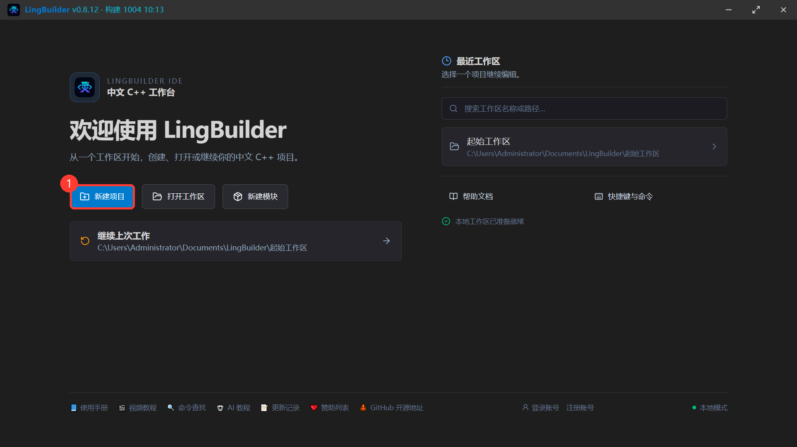

在弹出的类型选择里选 **Windows 界面设计**（当前可用），点卡片里的「选择此类型」。

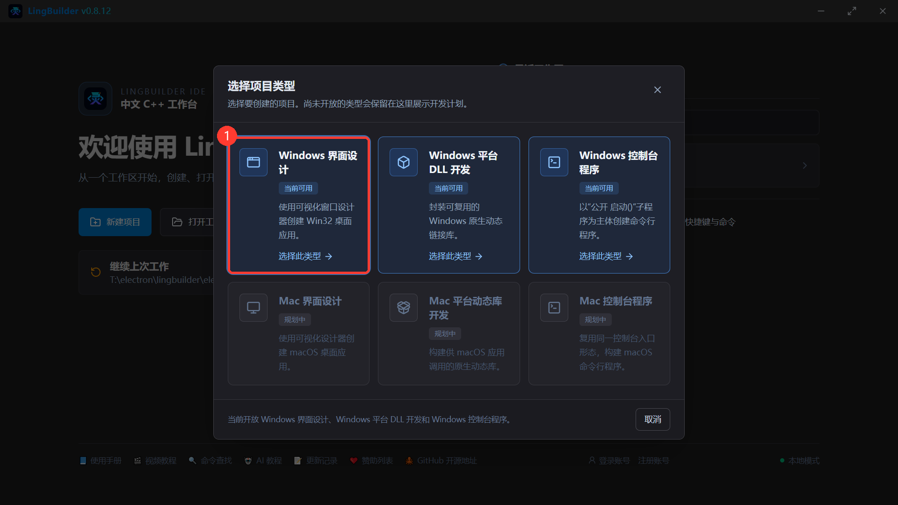

给项目起个名字（本例叫 `DLL命令演示`），点 **创建项目**。创建位置留空就建在当前工作区里。

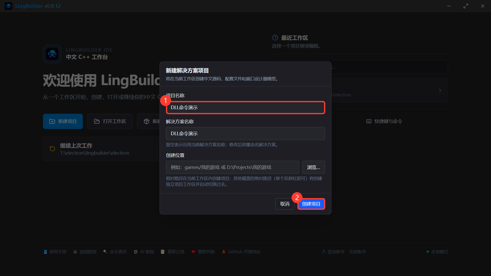

创建完成自动进入工作台。先认认位置：① 左侧是**解决方案资源管理器**（项目文件树），② 工具栏的绿色箭头就是 **运行 F5**（编译并运行）。

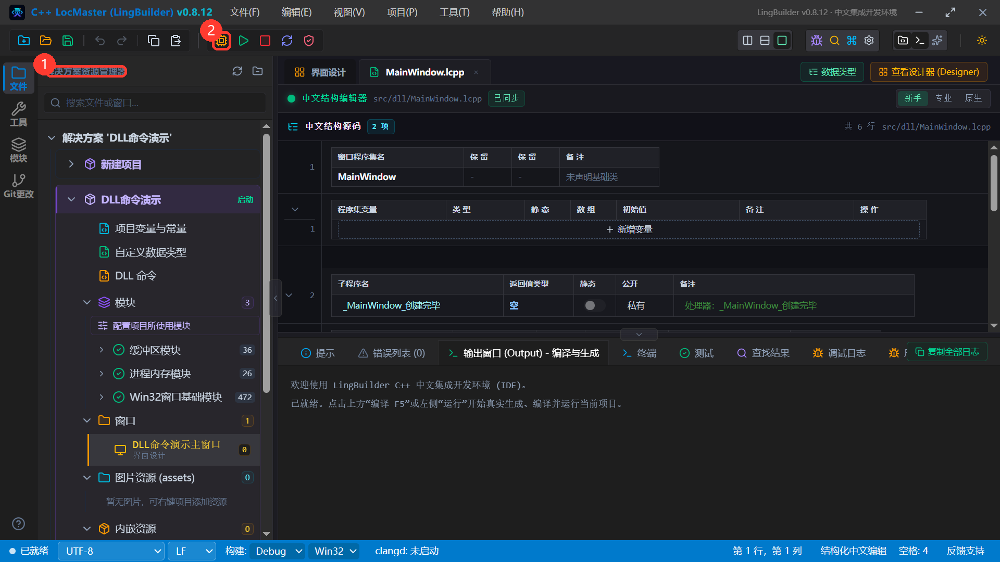

---

## 第 2 步：声明第一条 DLL 命令

### 2.1 打开 DLL 命令编辑器

在左侧项目树下点 **DLL 命令**（图①）。声明会保存在项目的 `项目DLL命令.lcpp` 文件里，随项目一起复制、分享。

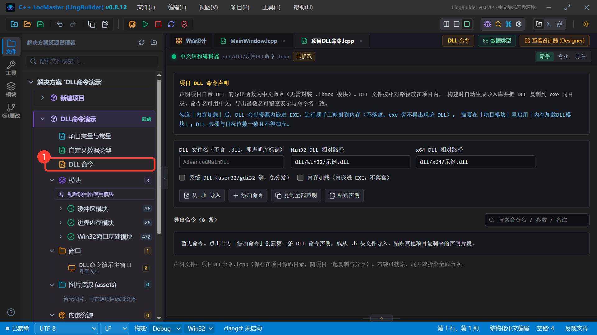

打开后是一个「声明表格」编辑器，顶部一栏用来填 **DLL 文件名**（图①，不含 `.dll` 后缀）。第一次打开是空的。

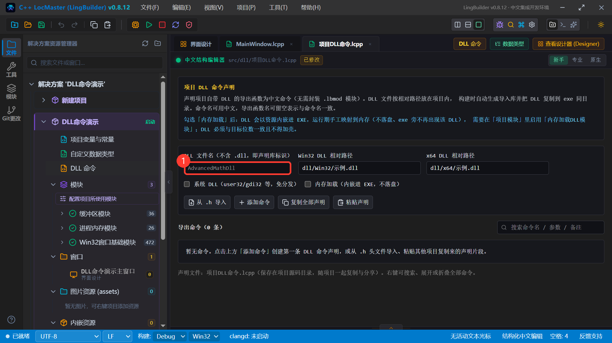

### 2.2 填库名、勾选系统 DLL

在 **DLL 文件名** 里填 `user32`，然后勾选 **系统 DLL（user32/gdi32 等，免分发）**。

> **为什么要勾？** `user32.dll` 是 Windows 自带的。勾上后构建时直接链接系统导入库，**不需要**你提供 DLL 文件，做出来的 exe 也不用附带任何东西。如果你调用的是自己或第三方的 DLL，就不要勾，改为填写 DLL 文件的项目内路径。

### 2.3 添加命令

点工具栏 **＋ 添加命令**（图①），表格里会出现一张新命令卡片（图②，默认带一个参数行和临时名字「新命令1」）。

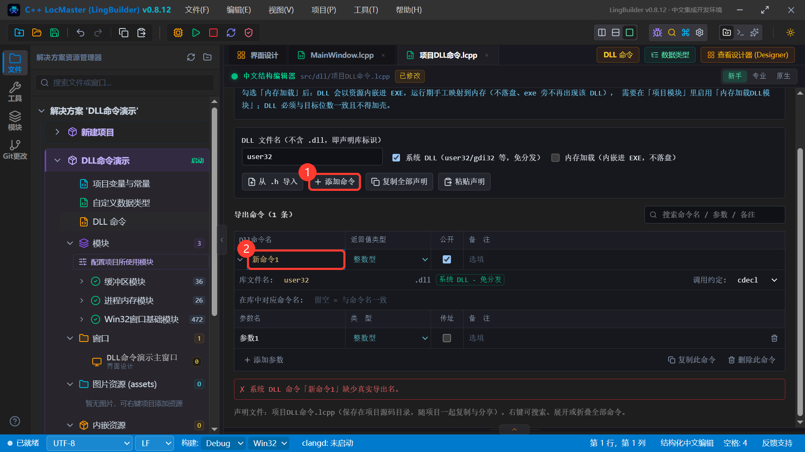

### 2.4 填写命令的四个关键位置

按图中 ①~④ 逐个填：

| 位置 | 填什么 | 说明 |
| --- | --- | --- |
| ① Dll命令名 | `取屏幕宽度` | 你以后在代码里写的名字，中文随意 |
| ② 返回值类型 | `整数型` | GetSystemMetrics 返回 int |
| ③ 在库中对应命令名 | `GetSystemMetrics` | DLL 里的**真实导出函数名**（别名） |
| ④ 库文件名 | `user32` | 这条命令属于哪个 DLL |

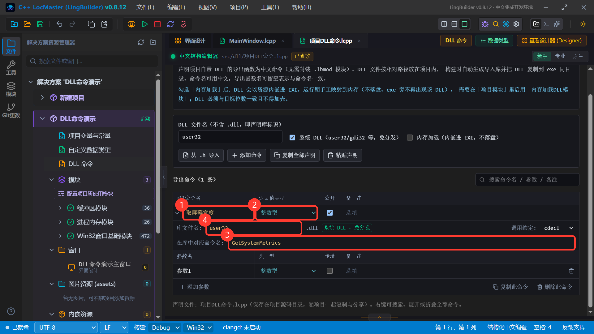

> **别名规则（重要）**：命令名是中文时，**必须**在「在库中对应命令名」里写 DLL 的真实英文导出名。如果命令名直接用英文导出名本身（如 `GetSystemMetrics`），别名可以留空。

### 2.5 填参数

`GetSystemMetrics` 接收一个整数参数。把卡片里自带的参数行改成：参数名 `索引`、类型 `整数型`（图①②）。以后要加更多参数就点 **＋ 添加参数**（图③），要删参数点行尾的垃圾桶。

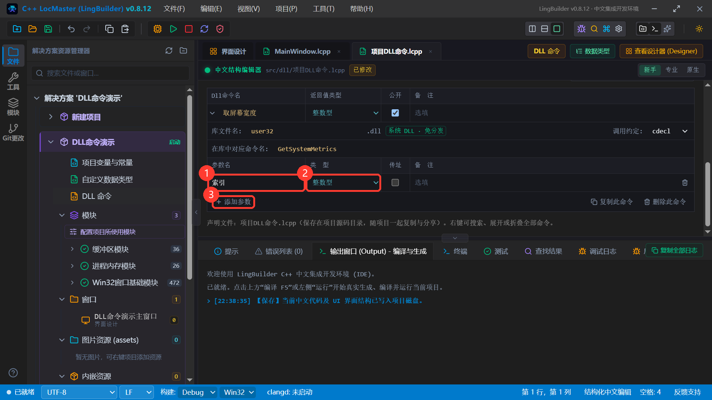

### 2.6 保存

按 `Ctrl+S` 保存。声明在磁盘上是这样的文本（了解即可，平时用表格编辑就行）：

```lcpp
包 项目DLL命令

DLL命令库 user32
  系统 = 真
  Win32 = "dll/Win32/示例.dll"
  x64 = "dll/x64/示例.dll"

  整数型 取屏幕宽度(整数型 索引) = GetSystemMetrics
结束DLL命令库
```

> 中间两行 `Win32 = ...` / `x64 = ...` 是给第三方 DLL 准备的架构路径占位；系统 DLL 用不到，留着不影响。

---

## 第 3 步：在窗口上放一个按钮

点编辑区顶部的 **界面设计** 页签，进入可视化窗口设计器。左侧 **控件工具箱** 里有「按钮 (Button)」（图①），把它拖到中间画布上；松手后画布上就有了一个按钮（图②），右侧属性面板可以改它的标题（内容）、位置和大小。本例把按钮标题改成 `调用 DLL 命令`。

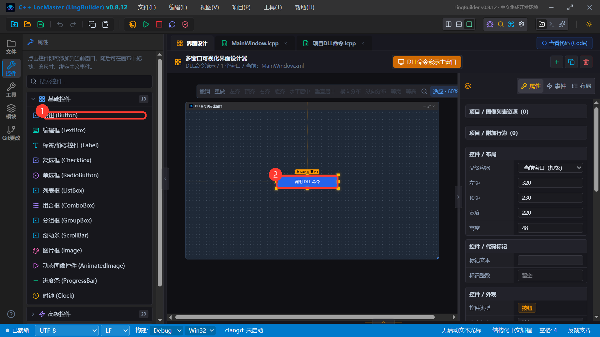

按钮放好后，还要告诉设计器「点击时执行哪段代码」。选中按钮，在右侧面板切到 **事件** 页（图①），`被单击` 事件里填处理器名 `_按钮1_被单击`（图②）——这个名字要和下一步代码里的事件名一模一样。

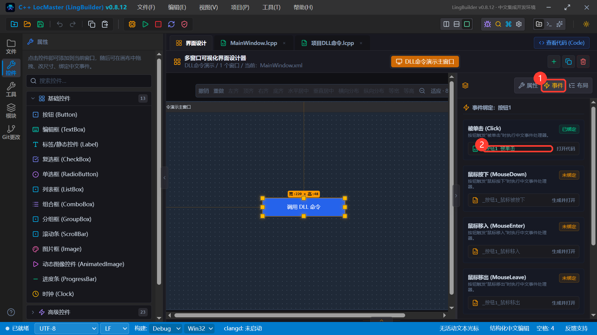

---

## 第 4 步：写按钮点击代码

回到 `MainWindow.lcpp` 页签（新手模式的结构化编辑器），在项目里已有的事件块下面新增一个事件块，内容如下：

```lcpp
事件 _按钮1_被单击()
    局部 整数型 屏幕宽度 = 0
    屏幕宽度 = 取屏幕宽度(0)
    窗口_设置自身标题(格式化文本("DLL 命令调用成功！屏幕宽度 = {} 像素", 屏幕宽度))
结束
```

三行代码的含义：

1. 声明一个整数变量 `屏幕宽度`；
2. **调用我们声明的 DLL 命令** `取屏幕宽度(0)` —— `0` 是系统约定的参数值（取屏幕宽度），返回值存进变量；
3. 用 `窗口_设置自身标题` 把结果写到窗口标题栏，`格式化文本` 里的 `{}` 会被替换成数字。

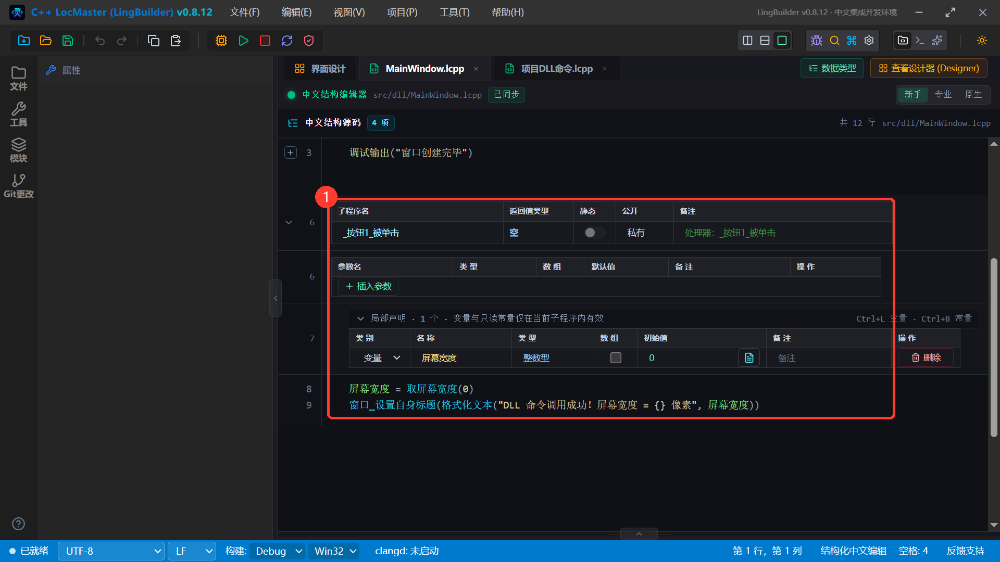

---

## 第 5 步：F5 构建运行

点工具栏 **运行 F5**（图①）。LingBuilder 会把中文源码和设计器界面翻译成真实的 C++ 工程并编译，日志里依次出现 **编译成功**、程序产物路径、**已启动受控运行窗口**（图②）——你的 exe 已经跑起来了。

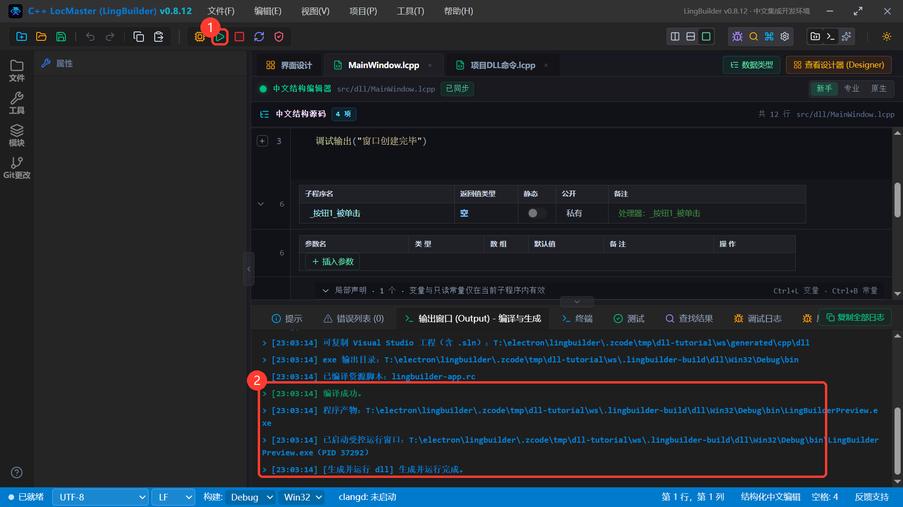

---

## 第 6 步：验收！点击按钮看真实效果

编译出来的窗口长这样（图①是按钮）：

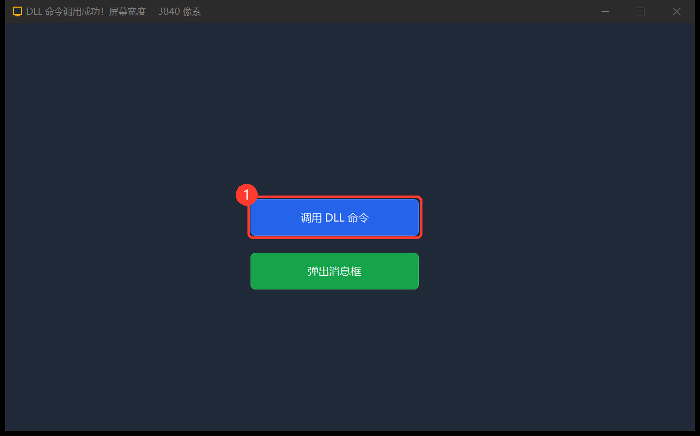

**点击「调用 DLL 命令」按钮**——窗口标题立刻变成：

> DLL 命令调用成功！屏幕宽度 = 3840 像素

这个数字不是写死的：它是 `user32.dll` 的 `GetSystemMetrics` 在你的电脑上返回的**真实屏幕宽度**（图上箭头所指的标题栏；3840 是 4K 屏的物理像素宽度，你的数值取决于自己的屏幕）。

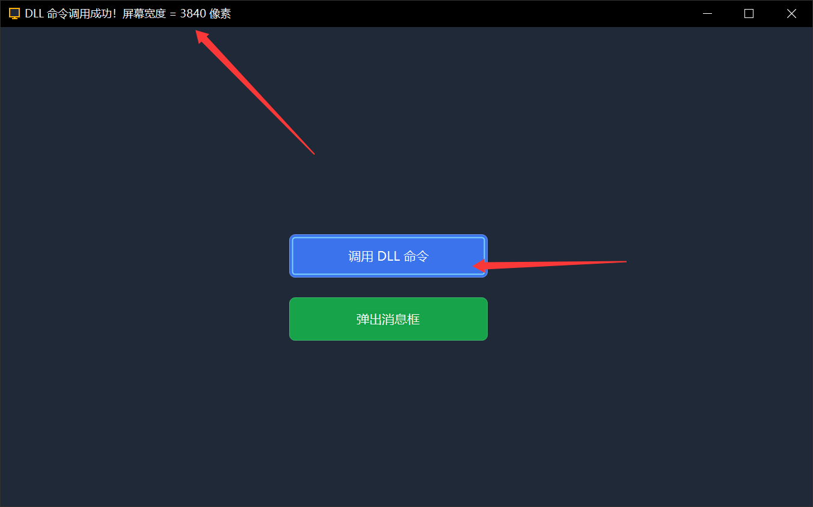

到这里你已经完整跑通了一次「声明 DLL 命令 → 中文代码调用 → 真实运行」。下面再进阶一步：弹出系统对话框。

---

## 进阶：用 DLL 命令弹出系统消息框（MessageBoxW）

### 7.1 声明命令

`MessageBoxW` 的第一个参数是**窗口句柄**，句柄在声明表里要用特殊类型「**指针整数**」（原因见后面「常见坑」第 2 条）。这个类型暂时不在下拉列表里，用编辑器工具栏的 **粘贴声明** 按钮最方便：复制下面整段文本，点「粘贴声明」，命令就会合并进 `user32` 库。

```lcpp
DLL命令库 user32
  系统 = 真
  整数型 弹出消息框(指针整数 父窗口句柄, 文本型 内容, 文本型 标题, 整数型 按钮) = MessageBoxW
结束DLL命令库
```

四个参数：父窗口句柄（传 0 表示无归属）、内容、标题、按钮样式（0 = 只显示「确定」）。

### 7.2 放第二个按钮、写代码

照第 3 步再放一个按钮（标题 `弹出消息框`，事件处理器名 `_按钮2_被单击`），代码：

```lcpp
事件 _按钮2_被单击()
    局部 整数型 结果 = 0
    结果 = 弹出消息框(0, "你好！这行文字来自 user32.dll 的 MessageBoxW 函数。", "DLL 命令演示", 0)
结束
```

再次 F5，点绿色按钮——标准的 Windows 消息框弹出来了（图上箭头指向的就是刚点的按钮）：

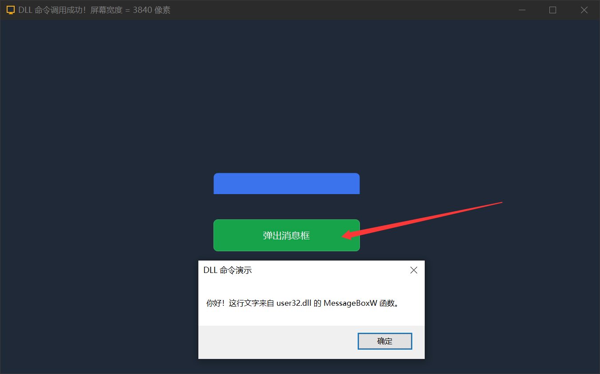

---

## 常见坑与红线（新手必读）

1. **中文命令名必须写别名**。漏写「在库中对应命令名」时，F5 会被一条中文诊断直接拦下，并告诉你怎么改（下图②）；照着补上 `= GetSystemMetrics` 这样的别名即可。

   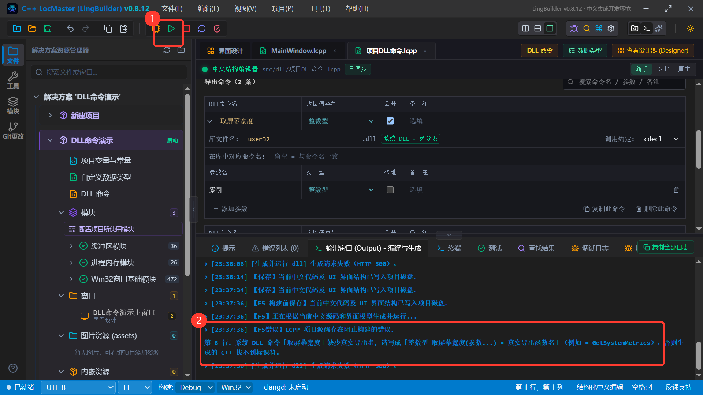

2. **句柄参数要用「指针整数」，不要选「长整数型」**。`长整数型` 固定 8 字节，在 32 位（Win32）构建下与 4 字节句柄长度对不上，编译能过、运行时报 `Run-Time Check Failure #0`。「指针整数」随程序位数伸缩，两种构建都正确。
3. **结构体参数不能跨 DLL 边界**。声明表里的参数只支持整数型、长整数型、小数型、逻辑型、字节型、文本型（及指针整数）；带结构体指针的系统函数（如枚举进程的 `Process32FirstW`）用普通声明表表达不了。
4. **声明只写在 `项目DLL命令.lcpp` 里**。不要把 `DLL命令库` 块复制进窗口主源码——那会让生成器把整个窗口类当声明文件处理，事件全部变成空壳（能编译、点击没反应）。
5. **第三方 DLL 注意位数**。构建配置默认是 `Debug | Win32`（32 位），第三方 DLL 要给 32 位版本并放进声明里写的路径（如 `dll/Win32/xxx.dll`）；构建时 LingBuilder 会自动把它复制到 exe 旁边。系统 DLL 没有这个问题。
6. **文本参数自动宽字符**。声明里的 `文本型` 按 `const wchar_t*` 传入 DLL，不需要自己处理编码；返回句柄的命令（`指针整数` 返回值）在调用端用 `长整数型` 变量接收。
7. 不想让第三方 DLL 落地成文件？库信息里勾 **内存加载**，DLL 会内嵌进 EXE 运行期手工映射（需启用「内存加载DLL模块」，且 DLL 不得加壳、位数必须匹配）。

## 本教程用到的命令速查

| 命令 | 来源 | 作用 |
| --- | --- | --- |
| `取屏幕宽度(索引)` | `user32.dll → GetSystemMetrics` | 取屏幕宽/高等系统度量 |
| `弹出消息框(句柄, 内容, 标题, 按钮)` | `user32.dll → MessageBoxW` | 弹出系统消息框 |
| `窗口_设置自身标题(标题)` | LingBuilder 内置（Win32窗口基础模块） | 改当前窗口标题栏 |
| `格式化文本(模板, 参数...)` | LingBuilder 内置 | 用 `{}` 占位拼接文本 |
| `调试输出(内容)` | LingBuilder 内置 | 打印到 IDE 调试日志 |

声明文件示例完整版（两个命令都启用后）：

```lcpp
包 项目DLL命令

DLL命令库 user32
  系统 = 真
  整数型 取屏幕宽度(整数型 索引) = GetSystemMetrics
  整数型 弹出消息框(指针整数 父窗口句柄, 文本型 内容, 文本型 标题, 整数型 按钮) = MessageBoxW
结束DLL命令库
```

祝你玩得开心——下一个想调用的系统函数，去 [Microsoft Learn](https://learn.microsoft.com/windows/win32/api/) 查它的导出名和参数类型，照第 2 步声明就行。
