# 功能代码（功能库）新手图文教程

> 适用对象：第一次接触 LingBuilder「功能代码」的新手
> 演示环境：LingBuilder v0.8.12 · Windows · **新手模式**（结构化中文编辑器）
> 学完你能：新建一个功能库 → 在库里写一个功能 → 在窗口程序里调用它 → 运行看到真实效果

在本教程里，我们会做一个最小的例子：功能库里写一个「生成问候语」的功能，窗口里点按钮就弹出它返回的问候。全部 13 张截图都来自真机操作，红框和箭头标出了每一步要点哪里。

---

## 第 1 章 功能代码是什么？

写窗口程序时，很多代码是「通用工具」：拼接文本、算日期、校验格式……如果把它们全塞进窗口代码里，窗口文件会越来越乱。

**功能代码（也叫功能库）就是专门放这类功能的独立文件。** 窗口需要时，按名字来「借」：

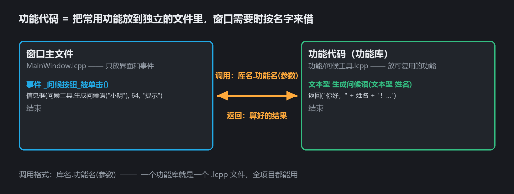

记住两件事就够了：

1. **一个功能库 = 一个独立的 `.lcpp` 文件**，放在项目的 `功能/` 目录下；
2. **调用格式：`库名.功能名(参数)`**，整个项目里的窗口都能用。

它在解决方案树里有自己的位置。展开项目就能看到「功能代码」节点：

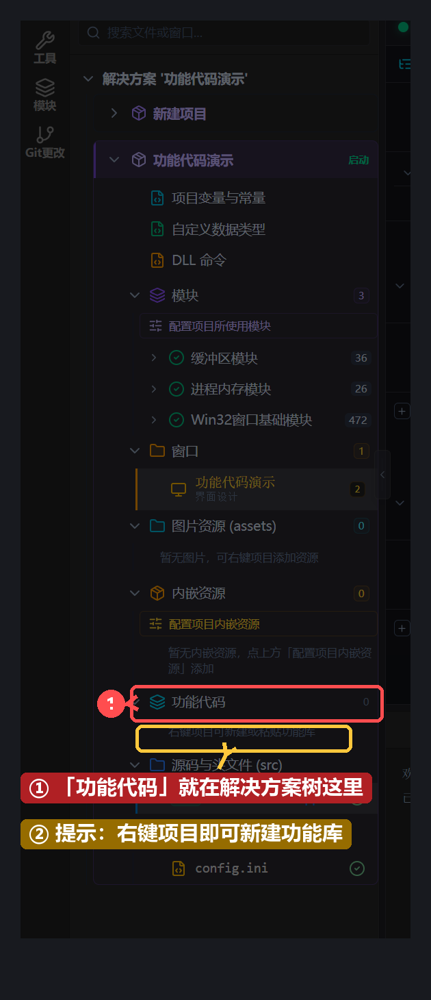

图中 ① 就是「功能代码」节点，后面的数字表示里面有几个功能库；② 的提示文字也告诉我们入口：**右键项目就能新建**。下一章就来做。

---

## 第 2 章 新建一个功能库

### 2.1 右键项目 → 新建功能库

在解决方案树里找到你的窗口项目（本例叫「功能代码演示」），在**项目名这一行**上点鼠标右键，弹出菜单后点第一项「新建功能库…」：

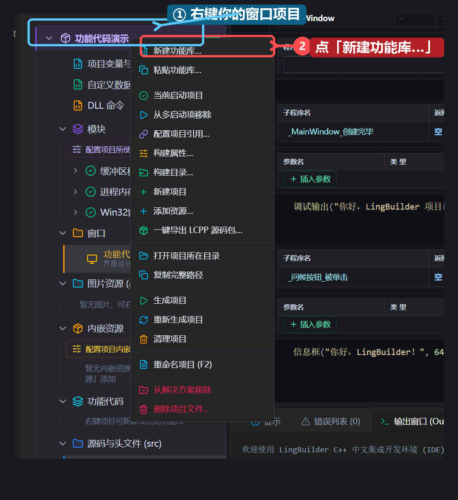

> 注意是右键**项目**（功能代码演示），不是最上面的解决方案，也不是左边的「新建项目」占位项。

### 2.2 给功能库起名

弹出命名框后，输入功能库名称，比如 `问候工具`，然后点「确定」：

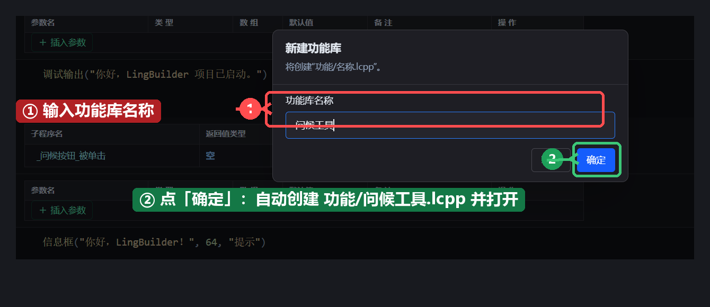

名称规则：中文、字母、数字、下划线都可以，**不能以数字开头**。

### 2.3 骨架自动生成

点确定后，两件事同时发生：

- 树里「功能代码」的计数变成 1，下面多出 `问候工具.lcpp`；
- IDE 自动打开这个文件，里面已经写好了一套骨架。

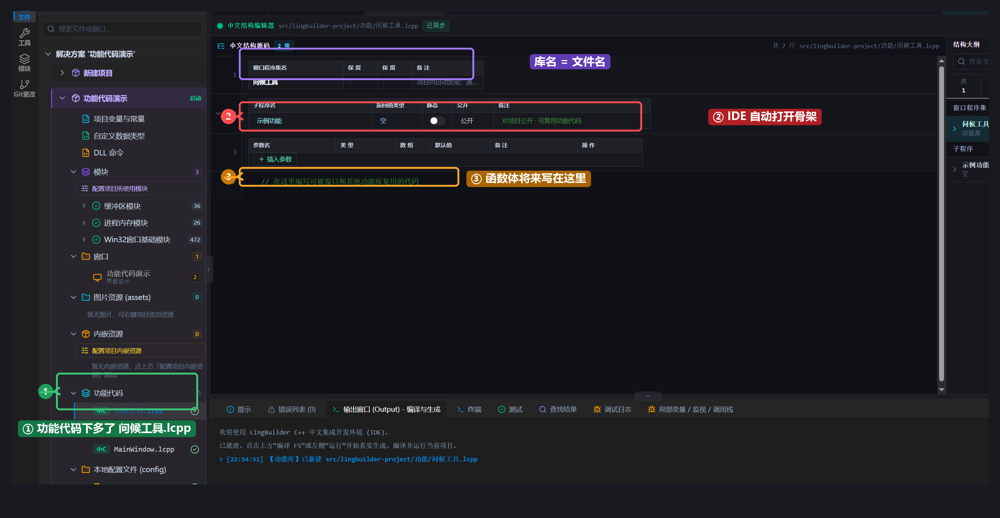

看图中标出的三处：

- **① 树里**：新文件住在「功能代码」节点下面；
- **② 子程序行**：IDE 送了一个 `示例功能` 占位，等会儿把它改成我们自己的功能；
- **③ 注释行**：`// 在这里编写可被窗口和其他功能库复用的代码` —— 以后功能体就写在这个位置。

---

## 第 3 章 写第一个功能：「生成问候语」

我们要写的功能很简单：传进去一个名字，返回一句话。先规划好三样东西：

| 要素 | 值 | 说明 |
| --- | --- | --- |
| 功能名 | `生成问候语` | 调用时用的名字 |
| 返回值类型 | `文本型` | 返回一句话 |
| 参数 | `姓名`（文本型） | 问谁好 |

### 3.1 改功能签名

直接在表格里改：① 功能名 `示例功能` → `生成问候语`；② 返回值类型 `空` → `文本型`；③ 点「插入参数」后把参数行填成 `姓名` / `文本型`。每格改完按回车或点别处即可写回源码：

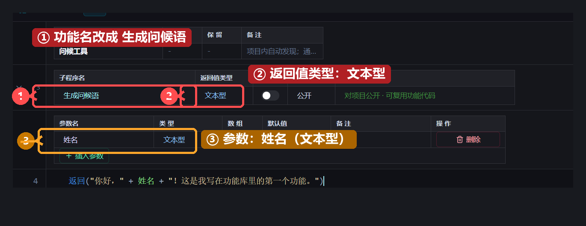

### 3.2 写函数体

点一下功能所在行，在下方代码区输入：

```lcpp
返回("你好，" + 姓名 + "！这是我写在功能库里的第一个功能。")
```

`返回(值)` 把结果交还给调用方；`+` 可以把文本连起来，`姓名` 会替换成调用方传进来的名字：

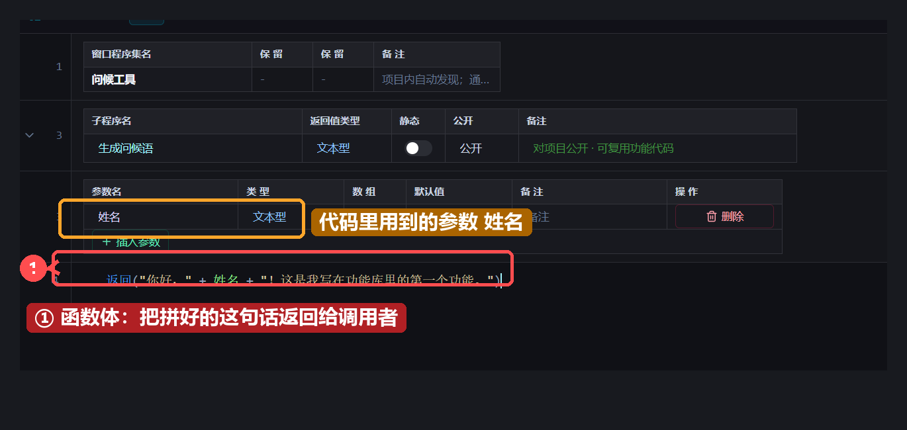

写完点左上角的**保存**按钮（或按 `Ctrl+S`），标题栏出现「已同步」就说明存好了。此时磁盘上的 `功能/问候工具.lcpp` 全文是：

```lcpp
功能库 问候工具
公开:
  文本型 生成问候语(文本型 姓名)
    返回("你好，" + 姓名 + "！这是我写在功能库里的第一个功能。")
  结束
结束功能库
```

对照着读一遍骨架，功能库的固定写法一目了然：

- `功能库 库名` 开头，`结束功能库` 收尾；
- `公开:` 下面写的功能，**项目里其他文件都能调用**；
- 每个功能用 `结束` 收尾；返回值写在 `返回(...)` 里。

---

## 第 4 章 在窗口里调用它

### 4.1 打开窗口主文件

在树里双击「源码与头文件 (src)」下的 `MainWindow.lcpp`。演示项目用的是「窗口应用（含示例）」模板，里面已经有一个按钮 `问候按钮` 和它的事件 `_问候按钮_被单击`。

### 4.2 输入调用：让补全帮你写

点开 `_问候按钮_被单击` 的代码区，把原来那句改成下面这样——先输入 `信息框(问候工具.`：

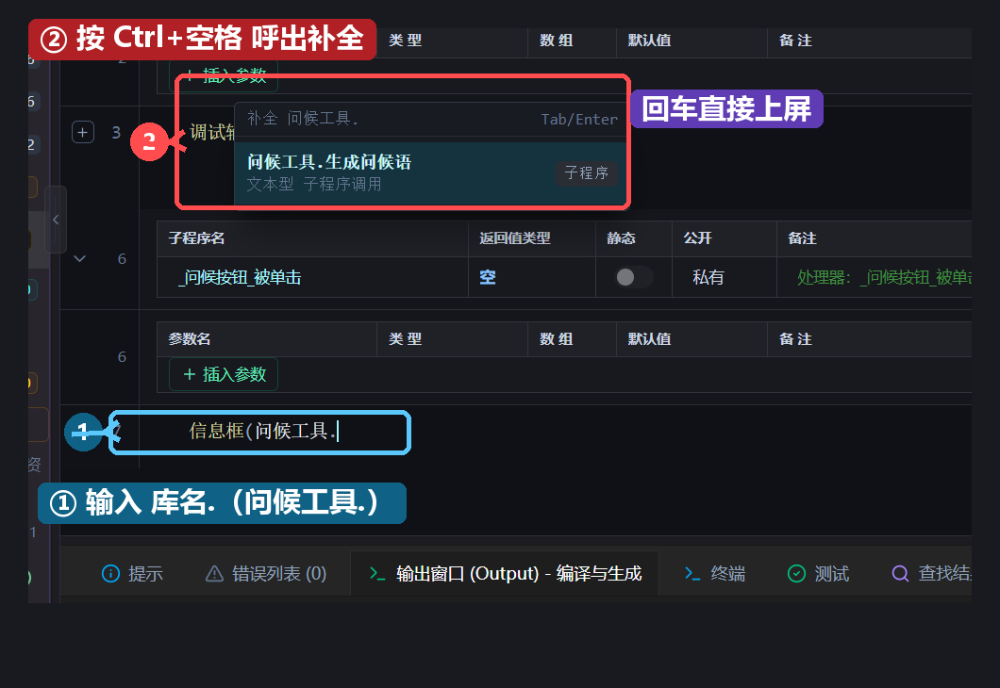

**按 `Ctrl+空格`，IDE 自动列出 `问候工具` 库里的功能**（图中 ②），用方向键选中 `问候工具.生成问候语`，按回车直接上屏。

### 4.3 补上参数

把参数填成 `"小明"`，再补全 `信息框` 的另外两个参数，整句就是：

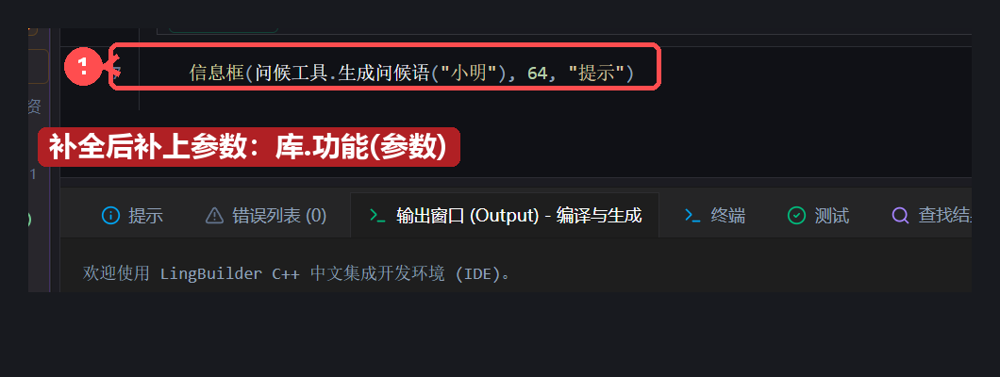

```lcpp
信息框(问候工具.生成问候语("小明"), 64, "提示")
```

按 `Ctrl+S` 保存。

---

## 第 5 章 构建运行，看真实效果

点工具栏的「运行 F5」（或直接按 F5 键）：

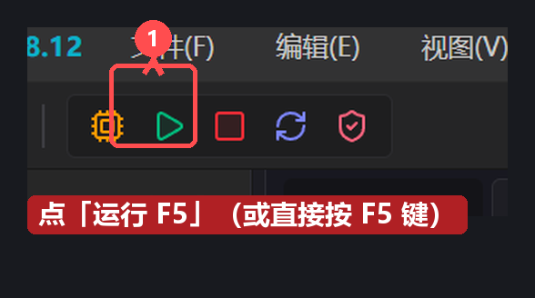

IDE 会自动完成：生成 C++ 工程 → 编译 → 启动编译出来的 exe。稍等片刻，程序窗口出现了：

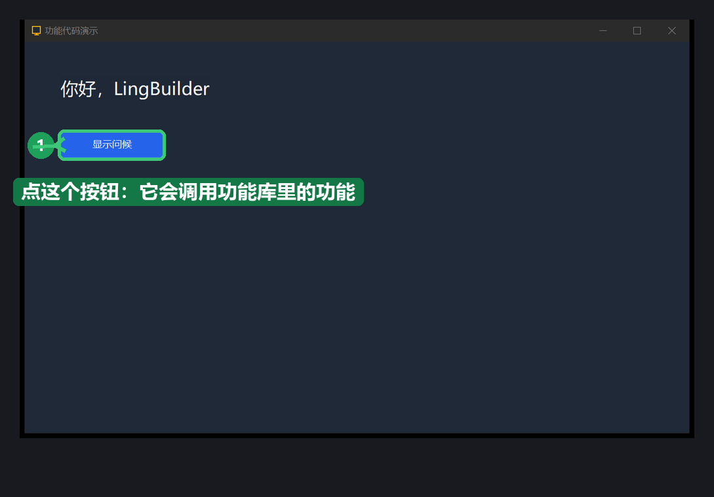

这是**真正编译出来的 C++ 程序**，不是预览动画。点「显示问候」按钮——

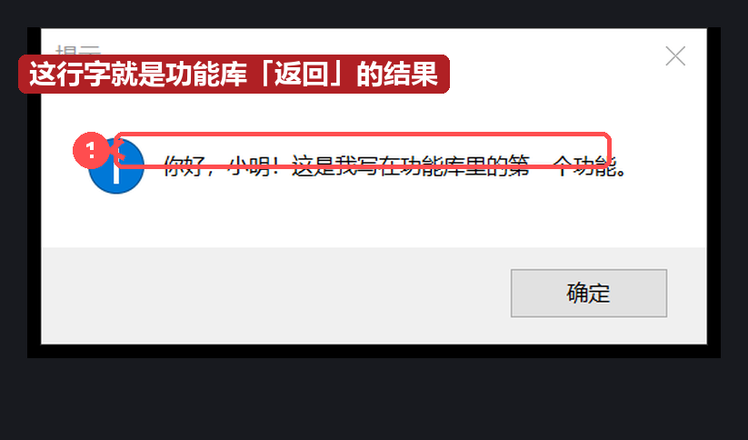

弹出的「你好，小明！这是我写在功能库里的第一个功能。」正是功能库 `返回` 的那句话。至此，**新建功能库 → 写功能 → 窗口调用 → 运行验证**全流程走通了。

---

## 第 6 章 调用规则与常见问题

### 6.1 一条调用，三个要素

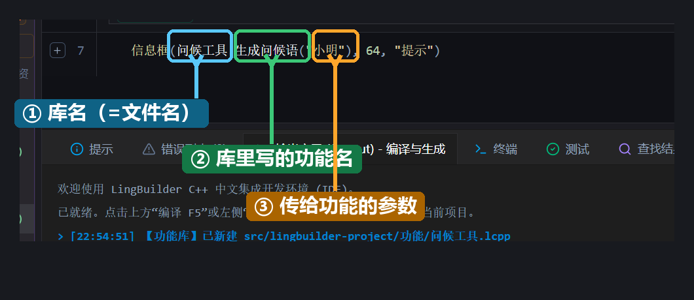

### 6.2 五条规则

1. **库名必须和文件名一致**：`问候工具` 库就要住在 `问候工具.lcpp` 里，不一致 IDE 会告警；改名请用树里的重命名，让声明、文件、调用同步变。
2. **调用必须带库名前缀**：写 `问候工具.生成问候语("小明")`，不能直接写 `生成问候语("小明")`——不带前缀，编译器不知道去哪找这个功能。
3. **一个 `.lcpp` 文件只放一个功能库**；功能库文件里也不要写窗口类、项目变量。
4. **功能库是「参数进、值出」的纯功能**：不要在功能库里直接操作窗口控件；需要什么数据，用参数传进来，结果用 `返回(...)` 交出去。
5. **写完记得保存**：`Ctrl+S` 或工具栏保存按钮，看到「已同步」再运行。

### 6.3 常见问题

| 现象 | 原因与解法 |
| --- | --- |
| 输入 `库名.` 后按 `Ctrl+空格` 没有补全 | 检查库名拼写是否和树里的一致；功能库文件还没保存时先 `Ctrl+S` |
| 提示「找不到功能库」 | 调用处带了错误的前缀，或库里根本没有这个功能名；对照第 6.1 节三要素逐个核对 |
| 功能库名称与文件名不一致的告警 | 用解决方案树的重命名功能统一改名，不要手动改文件名 |
| 想给功能加第二个参数 | 参数表里再点一次「插入参数」，调用处按顺序多传一个值即可 |

---

## 下一步

- 给 `问候工具` 再加一个功能（比如 `生成再见语`），体会一个库放多个功能；
- 新建第二个功能库（比如 `文本工具`），体会按用途分库；
- 功能库里也能调用内置模块的命令（文本处理、字节集、正则……），配合 `Ctrl+空格` 补全慢慢探索。

> 教程截图与演示基于 LingBuilder v0.8.12（2026-10）。界面随版本更新可能略有差异，但流程不变。
