# 项目变量与常量图文教程

> 适用对象：LingBuilder 中文 C++ 集成开发环境（IDE）的初学者。
> 学完本教程，你可以：把整个项目都要用的数据声明成**项目变量**和**项目常量**，在窗口代码、功能库等所有 `.lcpp` 源码里直接使用，并真实构建运行看到效果。

---

## 一、先搞懂三个概念

| 名称 | 在哪里声明 | 谁能用 | 值能变吗 | 典型用途 |
|------|-----------|--------|---------|---------|
| 局部变量 | 事件、子程序内部（`局部 整数型 i = 0`） | 只在当前事件/子程序里 | 可以 | 临时计算 |
| **项目变量** | 「项目变量与常量」页面 | 当前项目**全部** `.lcpp` 源码 | 可以 | 跨事件保存状态（如点击次数、累计金额） |
| **项目常量** | 「项目变量与常量」页面 | 当前项目**全部** `.lcpp` 源码 | **创建后只读** | 固定不变的数据（如应用标题、上限值） |

一句话：**只在一次事件里用的数据用局部变量；整个项目要共用、关了程序就没了的，用项目变量；永远不变的，用项目常量。**

本教程的演示项目是一个窗口程序：窗口上有一个标签（欢迎标题）和一个按钮（问候按钮）。我们要实现——

- 项目常量 `应用标题`（文本型）：值固定为「我的教程小应用」；
- 项目变量 `点击次数`（整数型）：每点一次按钮加 1；
- 点按钮后，标签显示：`我的教程小应用：你已经点了 3 次`。

---

## 二、打开「项目变量与常量」

在解决方案资源管理器中展开你的项目，点击**「项目变量与常量」**节点。

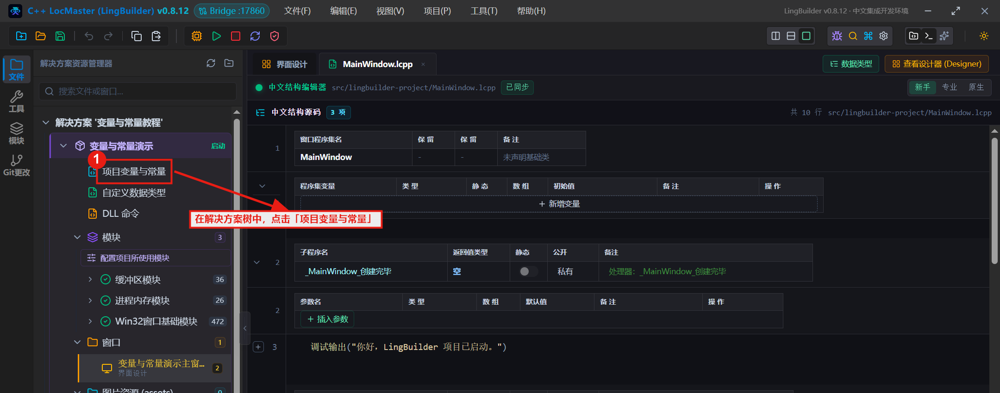

右侧会打开「项目变量与常量」页面。页面顶部有两个页签：**项目变量**和**项目常量**；下方是一个表格，最底下一行是**草稿行**（用来填写新条目）。

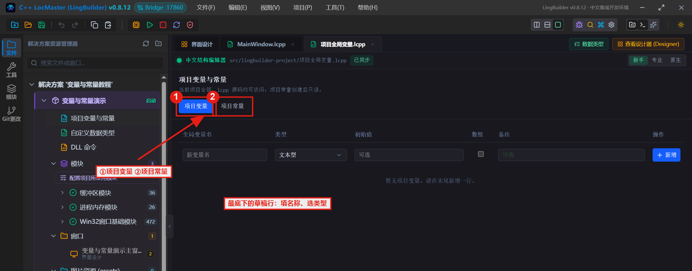

---

## 三、新建一个项目变量

以「点击次数」（整数型，初始值 0）为例。

**第 1 步：输入变量名。** 在草稿行的「全局变量名」一栏输入 `点击次数`。

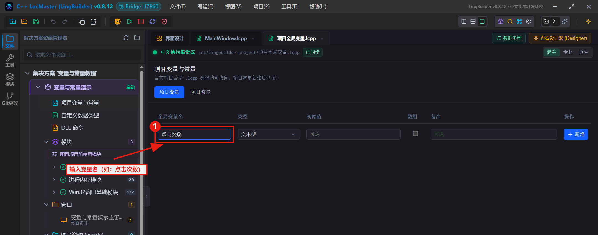

**第 2 步：选择类型。** 点击「类型」一栏的下拉框，在弹出的列表中选择 `整数型`（列表里还带英文别名提示，直接选中文名即可）。

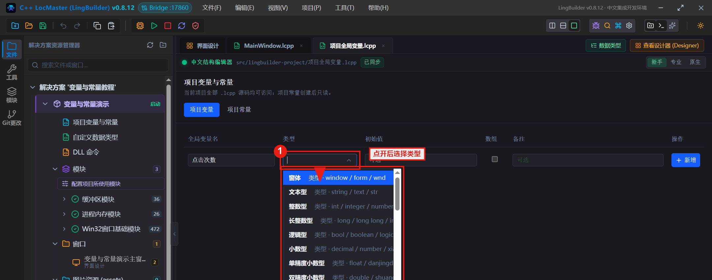

**第 3 步：填写初始值（可选）。** 在「初始值」一栏输入 `0`。整数型变量不填初始值时默认按 0 处理，但建议写清楚。

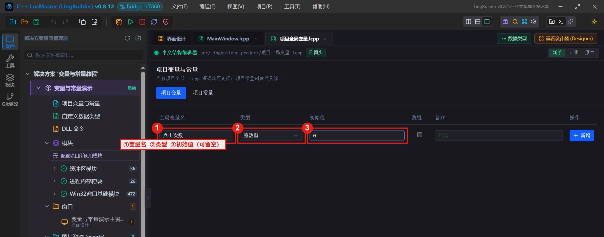

**第 4 步：点击「新增」按钮。** 变量会出现在上面的表格里。别忘了按 `Ctrl+S` 保存（页签上的「已修改」变成「已同步」即保存成功）。

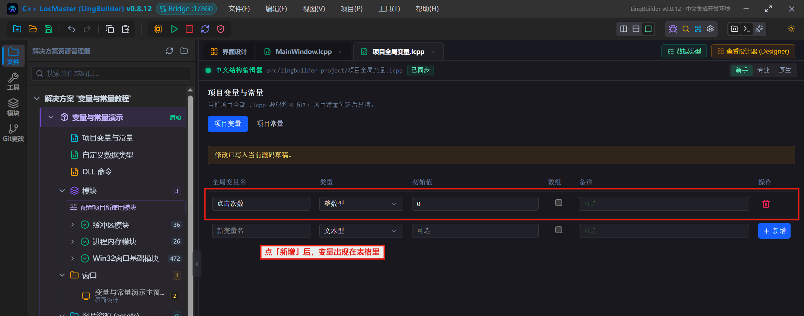

打开项目源码里的 `项目全局变量.lcpp` 文件可以看到，IDE 自动写入了这一行：

```lcpp
全局 整数型 点击次数 = 0
```

> **语法规则**：项目变量在源码里就是 `全局 类型 名称 = 初值`。「全局」两个字不能少——漏写的话这一行会被当成普通语句忽略，其他源码就找不到这个变量了。

---

## 四、新建一个项目常量

以「应用标题」（文本型）为例。

**第 1 步：切换到「项目常量」页签。**

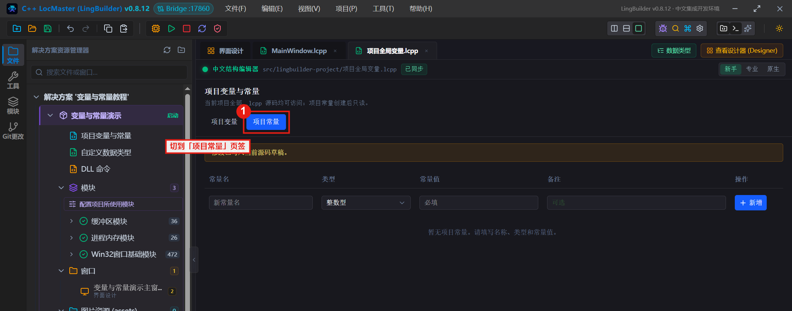

**第 2 步：填写常量名和常量值。** 常量名输入 `应用标题`；**常量值必须加英文双引号**，输入 `"我的教程小应用"`（含引号）。

> ⚠️ **注意类型下拉**：类型选择器会记住上一次的选择——如果你刚在「项目变量」页选过「整数型」，切过来时它会还停在那里（下图就是这样）。动手填值前，先确认类型是 `文本型`，不是就手动改一下。

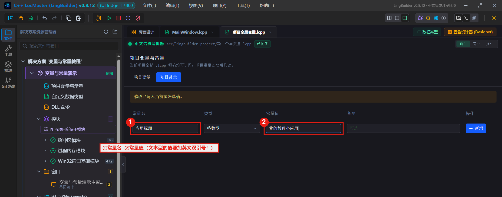

> **新手最常踩的坑**：文本型常量的值**必须写成带英文双引号的字符串**（如 `"我的教程小应用"`），类型也必须真的是「文本型」。两条有一条不满足，点「新增」时 IDE 都会报错「常量值无效：只能引用前面已经声明的项目常量」——比如值没加引号时，IDE 会把你写的裸中文当成另一个常量的名字去找。见下图：

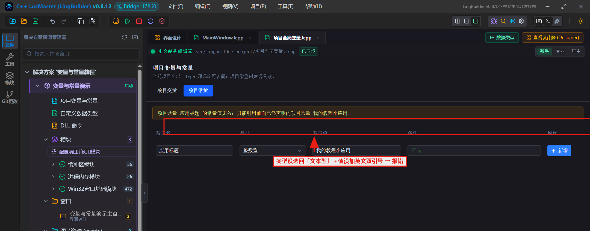

**第 3 步：点击「新增」按钮并保存（Ctrl+S）。** 常量出现在表格里。源码文件中对应的是这一行：

```lcpp
常量 文本型 应用标题 = "我的教程小应用"
```

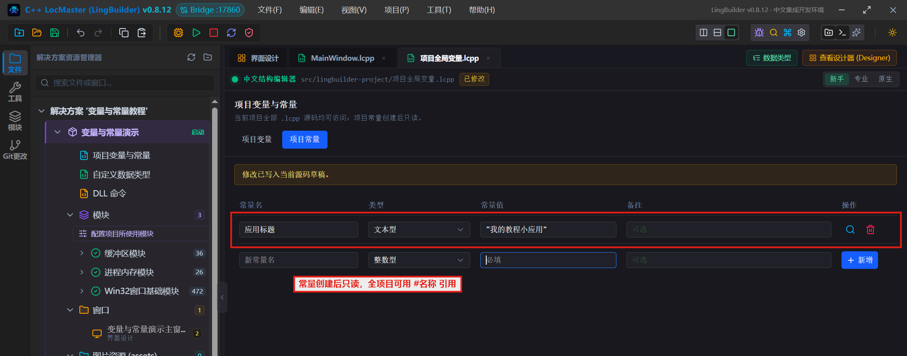

> **常量与变量的两个重要区别**：
> 1. 常量**创建后只读**——表格里没有编辑入口，代码里也不能给它赋值；
> 2. 常量**必须声明在所有项目变量之前**（IDE 会自动维护顺序，手写源码时要注意）。
>
> 常量支持的类型：文本型、整数型、长整数型、小数型、单精度小数型、双精度小数型、逻辑型。

---

## 五、在代码中使用变量和常量

打开窗口源码 `MainWindow.lcpp`（解决方案树 → 源码与头文件 → 双击）。整个演示代码如下：

```lcpp
类 MainWindow
    事件 _MainWindow_创建完毕()
        控件_设置文本(欢迎标题, #应用标题 + " —— 点下面的按钮试试")
    结束

    事件 _问候按钮_被单击()
        点击次数 = 点击次数 + 1
        控件_设置文本(欢迎标题, #应用标题 + "：你已经点了 " + 到文本(点击次数) + " 次")
    结束
结束类
```

**引用规则只有两条：**

1. **项目变量直接写名字**。比如 `点击次数 = 点击次数 + 1`，就是在给项目变量自增——它不在任何事件里声明，却能在事件里直接读写；
2. **项目常量用 `#常量名` 引用**。比如 `#应用标题`。在代码里输入 `#` 时，IDE 会自动弹出项目常量补全列表，按 `Tab` 或 `Enter` 直接上屏：

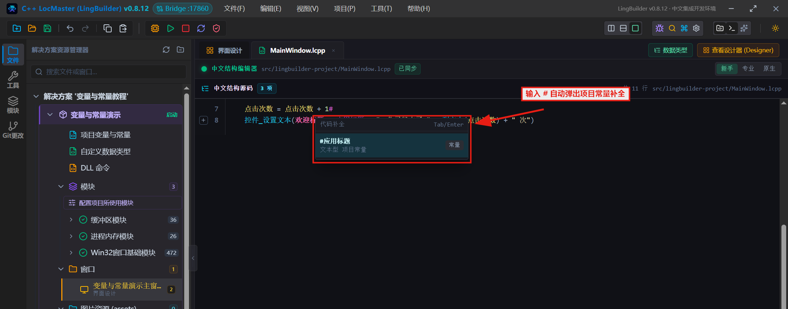

窗口创建完毕事件在启动时执行一次，用常量拼出初始文字：

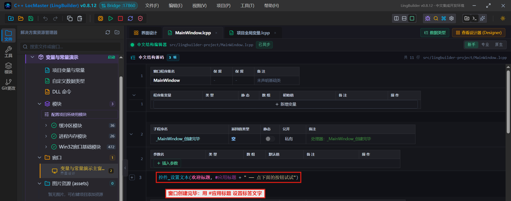

按钮被单击事件里，先给项目变量自增，再把常量、变量拼成提示文字（`到文本()` 命令把整数转成文本）：

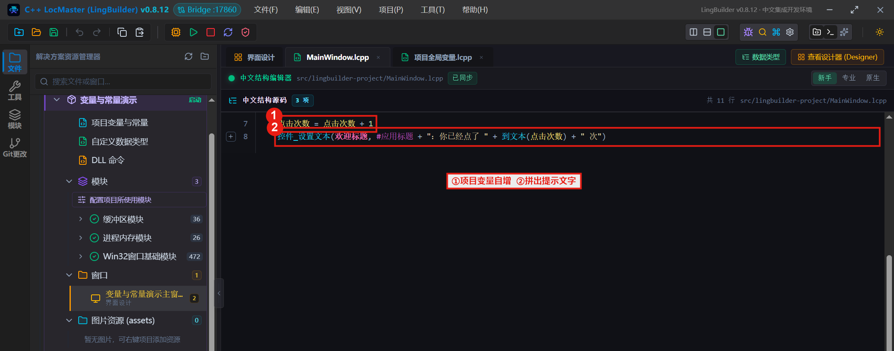

> 小知识：项目变量和常量不止窗口源码能用——项目里的**功能库**（`.lcpp` 功能库文件）也同样可以直接使用，这是它们和局部变量最大的区别。

---

## 六、按 F5 构建运行，看真实效果

按 **F5**（或点工具栏的绿色运行按钮），IDE 会自动保存代码 → 生成 C++ 工程 → 编译 → 运行。输出窗口会显示整个过程：

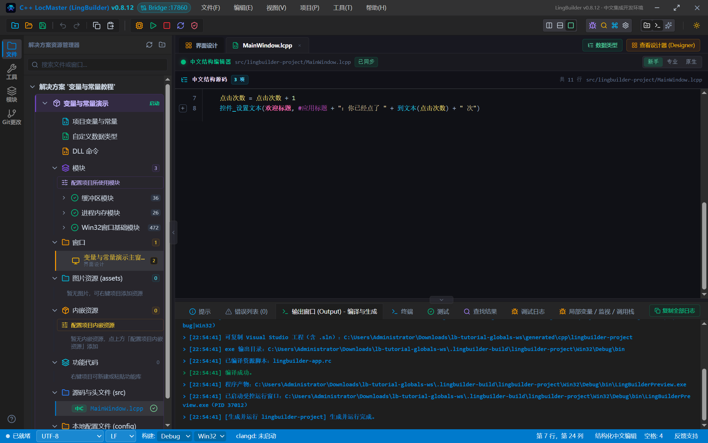

程序启动后，窗口创建完毕事件已经用常量设置好了初始文字「我的教程小应用 —— 点下面的按钮试试」：

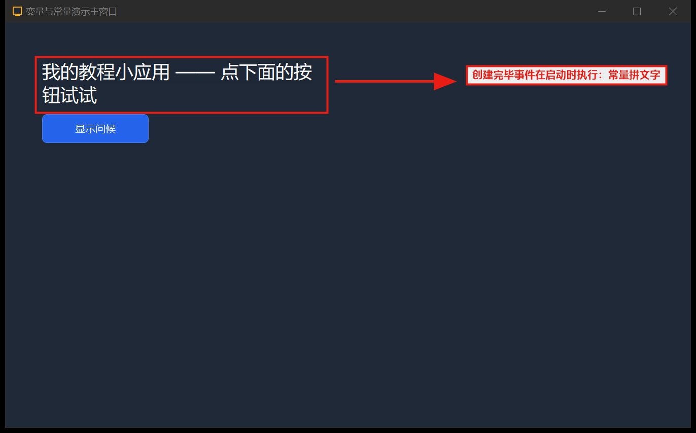

连续点击「显示问候」按钮 3 次，标签变成「我的教程小应用：你已经点了 3 次」——**变量在多次点击之间一直记得上次的值**，这正是项目变量的价值：

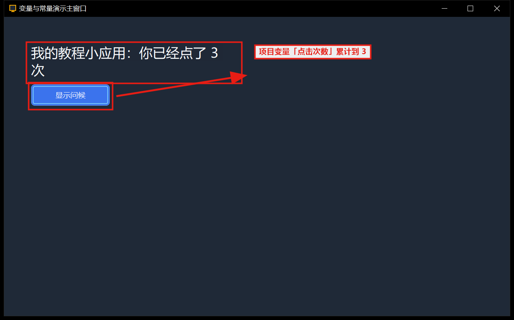

---

## 七、规则与常见错误速查

| 现象 / 报错 | 原因 | 解决办法 |
|------------|------|---------|
| 「常量值无效：只能引用前面已经声明的项目常量」 | 常量的类型没选回「文本型」，或文本值没加英文双引号 | 类型选「文本型」，值写成 `"我的教程小应用"`（英文引号） |
| 「项目全局变量 ××× 缺少"全局"关键字」 | 手写源码时把 `全局 整数型 x = 0` 写成了 `整数型 x = 0` | 补上 `全局` 关键字 |
| 「项目常量 ××× 是只读值，不能重新赋值」 | 给常量赋值（如 `应用标题 = "新标题"`） | 改用项目变量保存运行时会变的数据 |
| 「项目常量 ××× 必须声明在全部项目全局变量之前」 | 手写源码时把常量写在了变量后面 | 把常量行挪到文件最上面 |
| 「项目常量 ××× 不支持类型 ×××」 | 常量用了数组或非基础类型 | 常量只支持 7 种基础标量类型 |
| 其他源码里找不到变量 | 变量声明在了普通 `.lcpp` 文件里 | 项目变量/常量只能声明在「项目全局变量.lcpp」中，从解决方案树入口操作最保险 |
| 数组全局变量保存后变成空数组 | 首版数组只支持空初始值 | 声明空数组，在窗口创建完毕事件里再添加内容 |

**语法速查：**

```lcpp
// —— 项目全局变量.lcpp 里的声明 ——
常量 文本型 应用标题 = "我的教程小应用"   // 常量：创建后只读，必须写在最前
全局 整数型 点击次数 = 0                  // 变量：可读写
全局 文本型 备注 = "初始"                 // 文本型变量初值同样要加英文引号

// —— 任意 .lcpp 源码里使用 ——
点击次数 = 点击次数 + 1                   // 变量直接写名字
控件_设置文本(欢迎标题, #应用标题)         // 常量用 #名称 引用
```

---

## 八、它背后发生了什么（给好奇的你）

- 「项目变量与常量」页面其实就是项目里 `src/<项目名>/项目全局变量.lcpp` 这个源码文件的**可视化编辑器**——你在界面上新增一条，IDE 就往这个文件里写一行 `全局 …` 或 `常量 …` 声明；
- 构建时，这些声明会被翻译成真正的 **C++ 全局变量**（常量对应 C++ 里带初始值的全局量），所以它们的生存期和整个程序一样长，且在任意事件处理函数间共享；
- 项目常量的「只读」不仅是界面限制：代码里给常量赋值会直接产生中文诊断错误，编译不过去。
