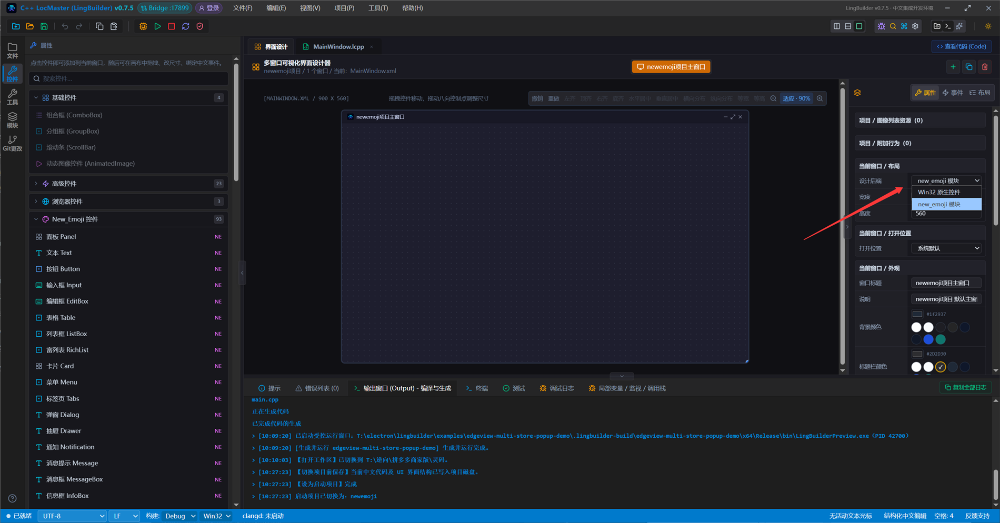

# new_emoji 原生界面库模块

> [🕒 预计 8 分钟] | 难度：入门

new_emoji 是基于 **Direct2D / DirectWrite** 的 Windows 原生界面库：不依赖系统通用控件外观，用 GPU 绘制出一整套现代风格的中文友好控件——表格、富列表、标签页、图表、步骤条、暗色主题一应俱全。在 LingBuilder 中它作为设计后端接入：窗口切换到 **new_emoji 模块** 后端后，工具箱提供 **93 种可视控件**，中文命令约 **4000 条**（1571 条 `NE_` 高层桥接 + 属性设置 / 运行时创建 / 查找绑定等），全部确定性生成可编译、可导出的 C++ 代码。

| 项目 | 说明 |
|---|---|
| 模块 ID | `lingbuilder.new_emoji.ui` |
| 版本 / 许可 | 2.0.0 / MIT |
| 设计器控件 | 93 种可视控件（需把窗口设计后端切到 new_emoji） |
| 平台目标 | `windows-msvc-win32`、`windows-msvc-x64`（MSVC 工具链） |
| 运行时分发 | exe 同目录随附 `new_emoji.dll`，导出 Visual Studio 工程时自动复制 |
| 获取方式 | 随 IDE 安装包内置铺设，无需在模块市场下载 |

## 启用模块

模块随 IDE 安装已铺设到本地模块列表。在解决方案资源管理器项目节点下右键 **模块 → 配置项目所使用模块**，勾选 **new_emoji 原生界面库** 即可参与本项目构建。详细步骤见[安装与管理模块](/guide/user/modules/install-module)。

> [!IMPORTANT]
> **必须把窗口的设计后端切换为 new_emoji，控件面板才会显示 New_Emoji 控件分组的内容。** 只启用模块不切后端，工具箱里看不到任何 new_emoji 控件，也无法添加到窗口。切换方法：在画布上**不选任何控件**，右侧属性面板 **当前窗口 / 布局 → 设计后端** 下拉选择 **new_emoji 模块**（见下图红箭头处）。窗口已有控件时后端锁定不能切换，请新建窗口再选。详见[窗口设计器](/guide/user/window-designer#_4-配置属性)。



## 控件一览（93 种）

| 分组 | 控件 |
|---|---|
| 基础 | 文本、按钮、输入框、编辑框、链接、图标、图标按钮、复选框、单选框、开关 |
| 布局容器 | 面板、容器、间距、分割线、边框、卡片、页眉、侧边栏、主要区域、页脚、布局 |
| 数据输入 | 数字输入框、标签输入框、组合输入、滑块、评分、颜色选择器、自动完成、提及、级联选择、树选择、穿梭框、日期选择、时间选择、日期时间、时间下拉、上传 |
| 数据展示 | 表格、列表框、富列表、树、日历、图片、轮播、徽标、标签、头像、统计数值、KPI 卡片、趋势、描述列表、时间线、无限滚动、水印 |
| 图表 | 折线图、柱状图、环形图、仪表盘、环形进度、子弹进度、进度条、状态点 |
| 导航 | 标签页、菜单、下拉菜单、面包屑、分页、步骤条、锚点、回到顶部、分段控制、页头、固钉、地址栏 |
| 反馈 | 弹窗、抽屉、通知、消息提示、消息框、信息框、空状态、警告提示、结果页、折叠面板、骨架屏、加载、文字提示、气泡卡片、气泡确认、漫游引导 |
| 浏览器外壳 | 浏览器视口（配合 `new_emoji FBro 浏览器外壳` 模块做浏览器风格应用） |

## 快速上手

设计器拖放的控件（如 `按钮1`）在 `.lcpp` 里作为**裸控件名**直接引用；也可以在「创建完毕」事件里用代码创建、按标记查找：

```lcpp
局部 NE按钮 动态按钮 = 控件_创建NE按钮(当前窗口, 20, 20, 120, 36, "确定", "确认", 1002)
局部 NE按钮 查找按钮 = 通过标记文本获取NE按钮("确认")
如果 (控件_是否有效(查找按钮))
    查找按钮.内容 = "已找到"
    NE按钮_绑定被点击(查找按钮, &动态按钮被点击)
如果结束
```

要点：

- `控件_创建NE类型(父级, 横坐标, 纵坐标, 宽度, 高度, 文本, [标记文本], [标记整数])` 是统一的运行时创建命令；父级可用只读关键字 `当前窗口`、容器引用或标签页容器。代码创建的元素只属于本次窗口运行时，**不写回设计器模型**。
- 标记（文本/整数）可省略，用于后续 `通过标记文本获取NE类型` / `通过标记整数获取NE类型` 查找；非空标记在「当前窗口 + 控件类型 + 标记类别」内唯一。
- 控件引用是类型化的（`NE按钮`、`NE表格`……），`控件_是否有效` 检查创建/查找结果；窗口销毁后引用自动失效，对无效引用操作会安全失败。

## 数据桥接与常用命令

底层 new_emoji API 多为 UTF-8 字节指针参数；模块提供了一批**宽字符封装命令**，`.lcpp` 直接写中文字符串即可，生成器自动完成转换——**不要改调参数相同的 `NE_EU_*` 底层命令**（宽指针与字节指针 ABI 不匹配，无法编译）。

```lcpp
NE表格_设置列(表格1, "title=名称\tkey=name\twidth=180\talign=center\ntitle=状态\tkey=status\twidth=120\talign=left")
NE表格_设置行数据(表格1, "key=r1\tc0=订单 A\tc1=待处理\nkey=r2\tc0=订单 B\tc1=已发货")
NE_显示确认框(当前窗口, "删除", "确定删除吗？", "删除", "取消", &确认框已关闭)
```

| 命令族 | 代表命令 | 说明 |
|---|---|---|
| 表格数据 | `NE表格_设置列 / 设置行数据 / 添加行 / 插入行` | 列与行使用 new_emoji 高阶 kv 协议文本（制表符分隔字段、换行分隔记录），非 JSON |
| 表格导入导出 | `NE表格_导出Excel / 导入Excel` | 直接落文件 |
| 富列表数据 | `NE富列表_设置模板 / 设置条目 / 添加条目 / 绑定虚拟数据源` | 虚拟列表在处理器里用 `NE富列表_设置虚拟行数据` 回填 |
| 菜单 | `NE菜单_设置项目`（换行分隔，`>` 前缀表示子菜单层级） | 另有图标 / 快捷键 / 元数据命令 |
| 标签页 | `NE标签页_设置激活索引 / 添加项目 / 关闭项目 / 设置标签样式` | 样式 0 线条、1 卡片、2 边框卡片；位置 0 顶、1 右、2 底、3 左 |
| 消息框 | `NE_显示消息框 / 显示确认框 / 显示扩展消息框 / 显示提问框` | 处理器用 `&处理器名` 引用；结果值 1 确认、2 取消/关闭；句柄参数可写 `当前窗口` |
| 窗口与主题 | `NE_设置窗口图标`（.ico 路径）、`NE_设置主题令牌`（令牌名 + 0xAARRGGBB） | 另有 `NE_显示通知`、`NE_显示加载遮罩 / NE_关闭加载遮罩` |
| 跨线程更新 | `NE表格_投递* / NE菜单_投递* / NE富列表_投递* / NE徽标_投递设置文本` | **可在工作线程调用**，由界面线程执行实际 setter |

## 限制与注意事项

- 链接 `.lib` 需要 **MSVC / Visual Studio Build Tools**；本机只有 g++/clang++ 时会给出中文阻断诊断。默认 F5 预览平台为 Win32。
- **非可视组件不生成运行时控件接口**；运行时控件引用只能作为局部变量、方法参数或返回值，不能作为常量、数组、类成员或项目全局变量，**也不能传入工作线程**——工作线程更新界面请走「投递」族命令。
- 设计器图标的「缩放」属性使用百分比（100 表示原始大小），生成器会按原生 ABI 自动换算为倍率；直接调用底层 API 时 scale 仍是倍率。
- 高频界面更新（每秒数千次）不要在循环里逐条投递，改由工作线程推进计数、界面侧低频读取，详见[多线程与线程安全 UI 更新](/guide/user/advanced/performance)。

## 在 IDE 内查看完整 API

模块详情自带完整文档：**模块** 活动栏页 → 本地模块 → **new_emoji 原生界面库** → 文档，可打开模块 README、`rich-list`（富列表模板协议）、`window-frame`（窗口框架）与全量 API 清单（`new_emoji-api.json`，1600+ 导出）。单个命令的签名与参数说明也可在编辑器里通过补全悬停查看。

## 下一步

- 设计后端与窗口属性：[窗口设计器](/guide/user/window-designer)
- 模块启用与管理：[安装与管理模块](/guide/user/modules/install-module)
- 浏览器风格外壳（地址栏 + 标签页 + FBro 页面）：启用 `new_emoji FBro 浏览器外壳` 模块，配合本页的 标签页 / 地址栏 / 浏览器视口 控件使用
- 线程安全更新界面：[多线程与性能进阶](/guide/user/advanced/performance)
