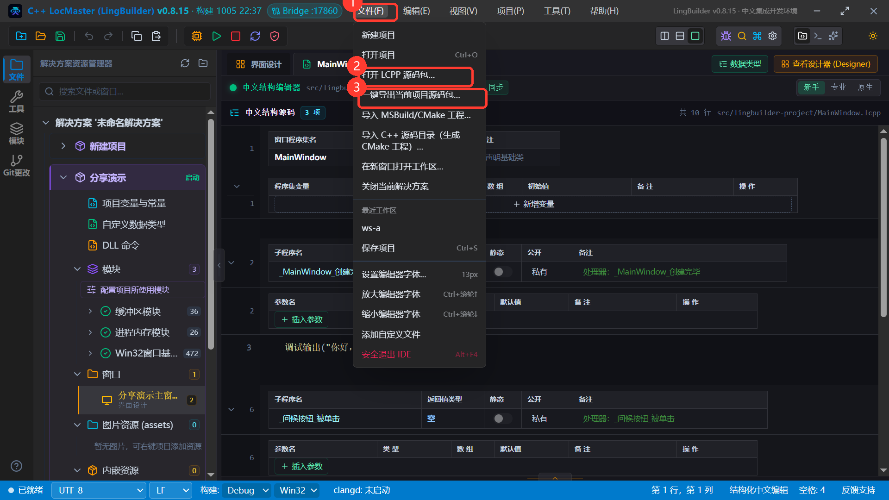
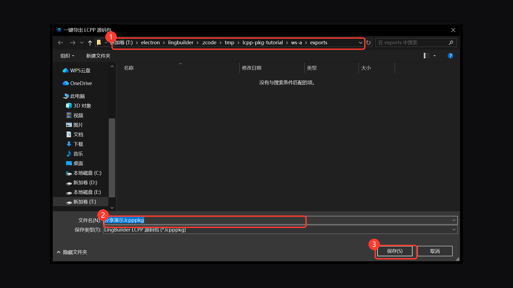
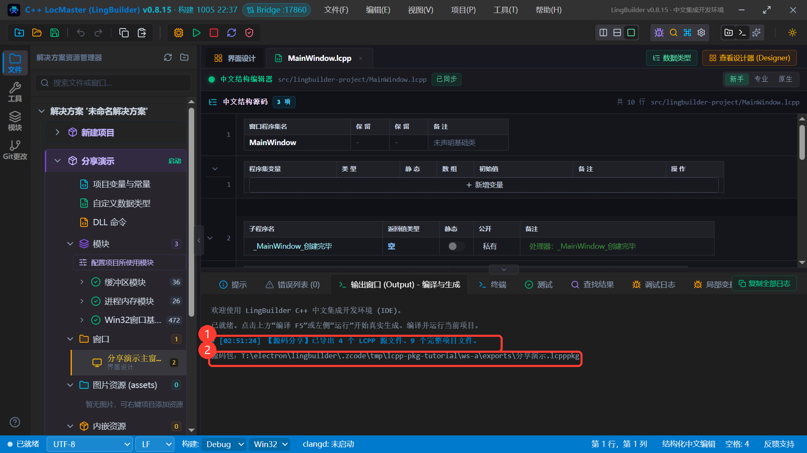
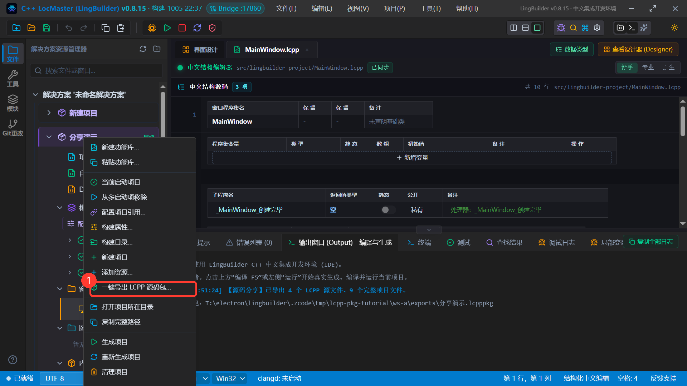
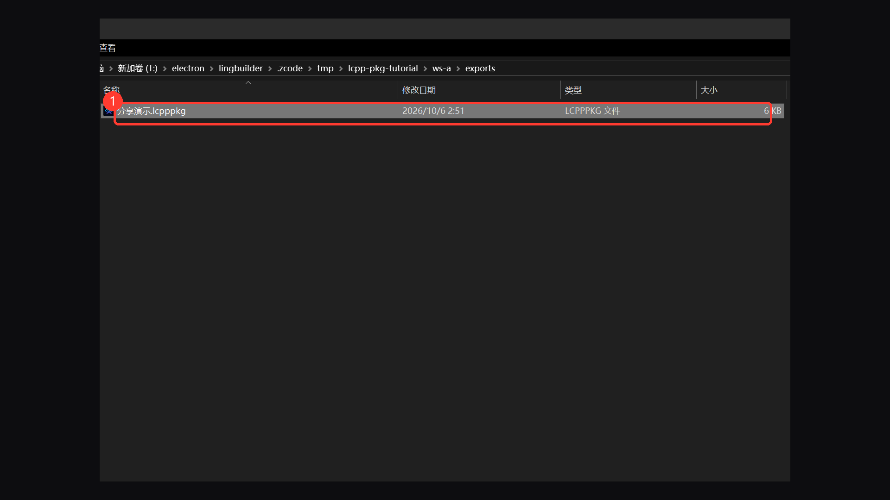
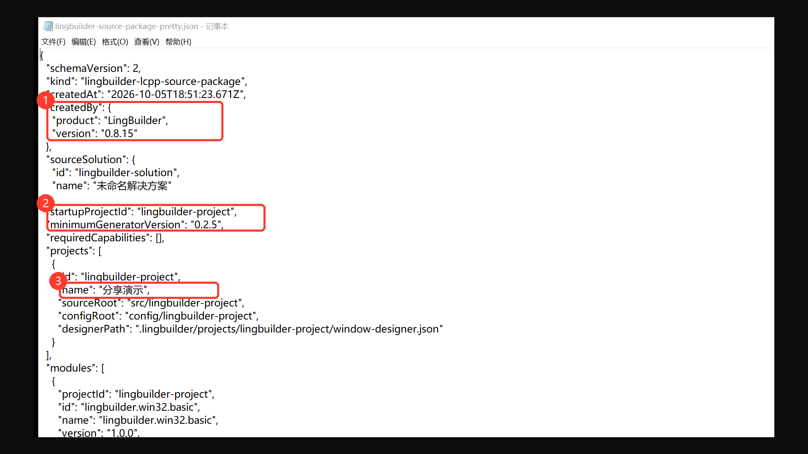
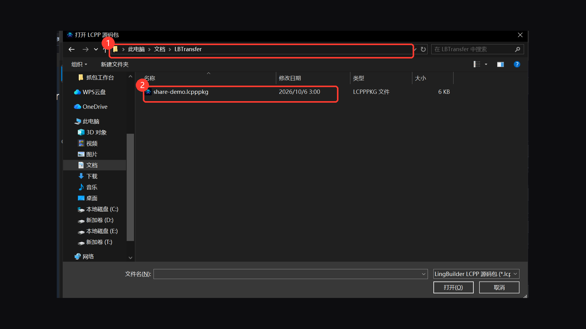
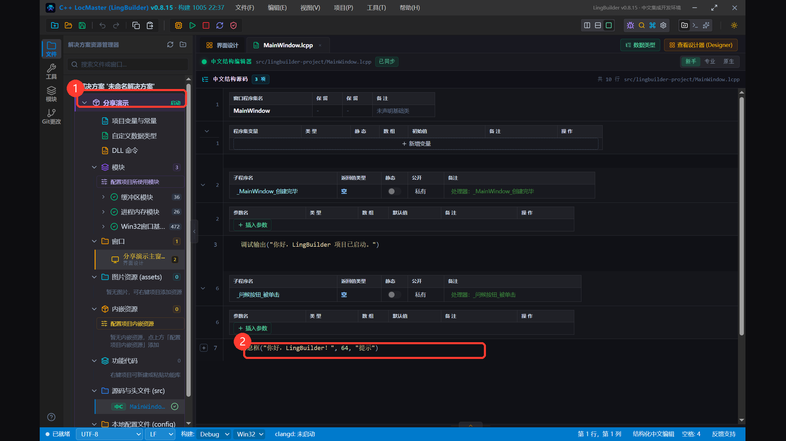
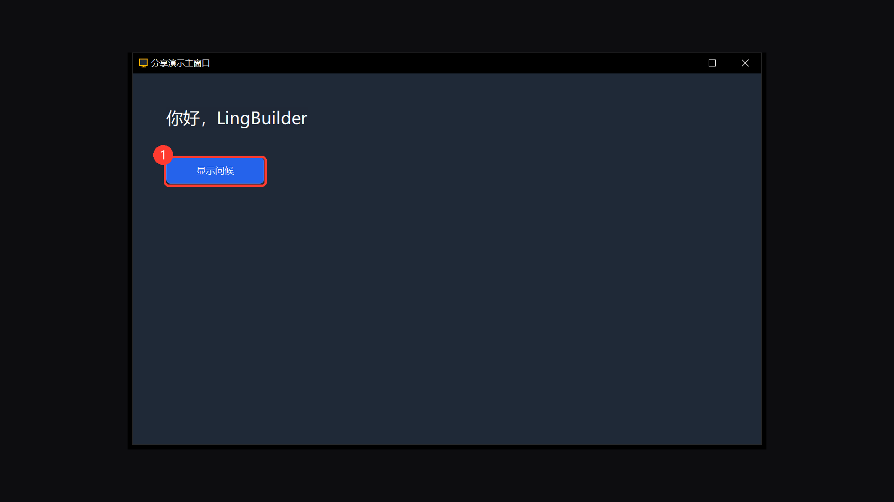
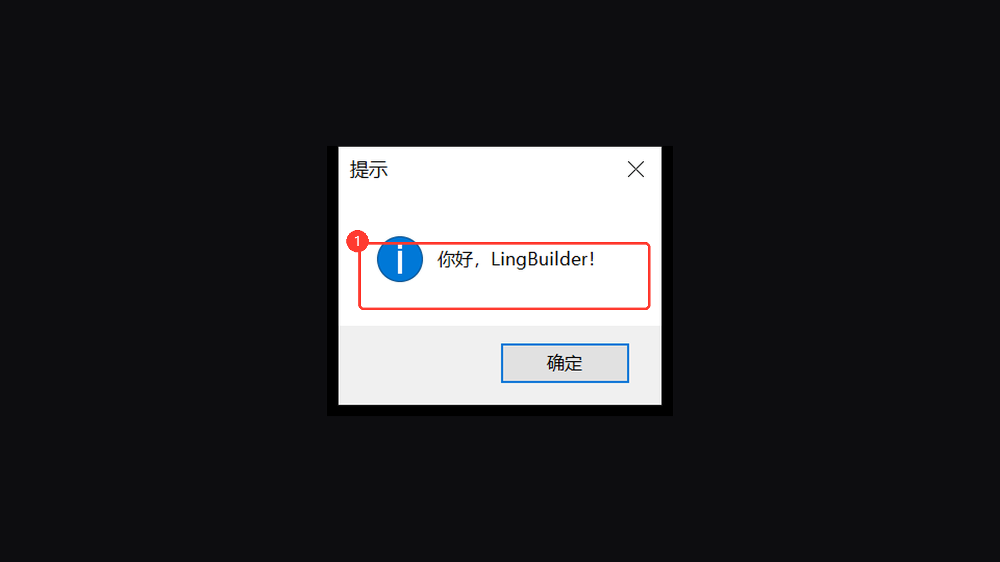

# LCPP 源码包分享图文教程

> 适用对象：想把自己的 LingBuilder 项目发给同学/同事/群友的新手
> 演示环境：LingBuilder v0.8.15 · Windows（导出与导入分别用了两台全新环境模拟「你」和「对方」）
> 学完你能：把整个项目一键打包成一个 `.lcpppkg` 文件发出去 → 对方导入后直接打开、编译、运行，不用手工复制任何散装文件

「**一键导出 LCPP 源码包**」就是把你的项目装进一个文件：源码、窗口设计器、配置、图片资源、项目启用的第三方模块全部打包；对方用 LingBuilder 的「打开 LCPP 源码包…」导入，就得到一个可以直接 F5 构建运行的独立工作区。

本教程全部 10 张截图来自真机双端演示：我们在「你的电脑」上导出，再模拟「对方的电脑」导入并运行，全程可复现。

---

## 第 1 章 一个 `.lcpppkg` 里有什么？

| 打包内容 | 说明 |
|---|---|
| 项目源码目录（`src/`） | 中文 `.lcpp` 源码，含全部子程序与事件 |
| 本地配置（`config/`） | 项目配置文件 |
| 窗口设计器 JSON | 界面布局、控件、事件绑定 |
| 图片资源（`assets/`）与内嵌资源 | 项目里引用的资源文件 |
| 第三方模块安装目录 | 项目启用的**第三方 `.lbmod` 模块整个打进包**（`.lingbuilder/modules/`）；内置 `lingbuilder.*` 模块不打包，对方的 IDE 自带 |
| 便携解决方案 | `.lingbuilder/solution.json` + 每个项目的模块引用清单 + 构建配置 |
| 包清单 `lingbuilder-source-package.json` | IDE 版本、启动项目、所需生成器能力、文件清单（含每个文件的 SHA-256）；导入方据此做兼容校验 |

格式本质是 ZIP。如果你的项目还依赖别的项目（项目引用），**依赖项目也会一起打包**。

---

## 第 2 章 准备一个演示项目

我们新建了一个「分享演示」窗口项目：界面上有一个标签「你好，LingBuilder」和一个按钮「显示问候」，点按钮弹出信息框。后面所有截图都以它为例——你可以用任何自己的项目照做。

---

## 第 3 章 一键导出

### 3.1 入口在哪

两处入口，效果一样：

- 顶部菜单 **「文件(F) → 一键导出当前项目源码包…」**（导出当前活动项目）；
- 资源管理器解决方案树里**项目右键 → 「一键导出 LCPP 源码包…」**（可以指定任意项目）。

同一个「文件」菜单里还有「打开 LCPP 源码包…」（第 5 章对方用的就是它）。

### 3.2 选保存位置

弹出保存对话框，**默认已经定位到工作区的 `exports` 目录**、文件名默认是「项目名.lcpppkg」，直接点「保存」即可（包固定落在这个目录里，不允许导到工作区外）：

### 3.3 导出完成

输出面板会报告导出结果：几个 LCPP 源文件、几个完整项目文件，以及 `.lcpppkg` 的完整路径：

树右键入口长这样：

`exports` 目录里就是打包好的单个文件，把它发给对方即可（QQ/网盘/邮件都行）：

> 💡 想看看包里有什么？`.lcpppkg` 本质是 ZIP，改后缀解压就能看到。根目录的 `lingbuilder-source-package.json` 是包清单：谁生成的（IDE 版本）、启动项目是哪个、最低生成器版本、需要哪些生成器能力（比如用到 ListView/EdgeView 会自动标记）、每个文件的 SHA-256：

---

## 第 4 章 安全与限制（导出前值得知道）

- **自动排除敏感文件**：构建产物目录、疑似凭据/私钥文件不会进包；有排除时输出面板会提示排除了几个；
- **只支持可视 C++ 项目**：外部 MSBuild/CMake 工程不能走这个通道（用「文件 → 导入 MSBuild/CMake 工程…」进来才可以）；
- **大小上限**：5 万个文件 / 解压内容 2GB / 单包 1GB；
- **自动保存**：点导出时会先保存你未保存的编辑；正在保存或构建时会提示「请稍后再试」。

---

## 第 5 章 对方拿到后：一键导入

「对方」不需要手工复制任何文件，两步完成。

### 5.1 打开源码包

对方在 LingBuilder 里点 **「文件(F) → 打开 LCPP 源码包…」**，在对话框里选中你发的 `.lcpppkg`（下图里对方把包存到了 `文档\LBTransfer\share-demo.lcpppkg`）：

> 💡 更直接的方式：**双击 `.lcpppkg` 文件**也能导入——LingBuilder 安装后接管了这个扩展名的文件关联；IDE 已经开着时再双击，会直接导入并切换到新工作区。

### 5.2 自动解压成全新工作区

IDE 先校验包清单（版本、生成器能力兼容性），然后解压成一个**全新的独立工作区目录**（按项目名建文件夹，放在「文档\LingBuilder\已导入源码\」下），并写入导入留痕 `source-package-import.json`（含包的 SHA-256）。完成后自动打开新工作区——解决方案、窗口设计器、代码和发出去时一模一样：

### 5.3 F5 构建运行

直接按 **F5**（或点工具栏「运行」）构建运行——运行窗口正常弹出：

点「显示问候」按钮，信息框如期弹出：

到这里，从「你的电脑」到「对方的电脑」的完整分享链路就走通了。

---

## 第 6 章 常见问题

**Q：对方打开后提示版本/能力不兼容？**
包清单里记录了生成所需的最低生成器版本和能力位（如 ListView 高级接口、EdgeView 安全 API）。让对方把 LingBuilder 升级到最新版即可——这也是清单做兼容校验的意义：缺什么直接告诉你，而不是打开后编译报错。

**Q：我用了收费的第三方模块，对方也要装吗？**
不用。项目启用的第三方模块会整个打进包里（`.lingbuilder/modules/`），导入后自动就位。但模块自身的授权跟随对方的本机授权状态：收费模块在对方机器上仍按其授权规则工作（未购买时会有明确的中文门禁提示）。

**Q：导出会泄露我的账号/密钥文件吗？**
导出器会排除构建产物目录和疑似凭据/私钥文件，并在输出面板提示排除数量。但最终责任在你：导出前最好自己解压扫一眼包内容（第 3 章教了怎么解）。

**Q：能导出多个项目吗？**
导出的是「选中的项目 + 它依赖的全部项目」。想分享一整个解决方案，从启动项目导出通常就能带走全家桶；包清单的 `projects` 数组会列出所有被打包的项目。

**Q：对方改了代码想发回给我怎么办？**
同样用「一键导出」打一个包发回来即可——注意这会覆盖式导入为新工作区，不会合并到你现有的工作区；重要改动建议先备份或用源码文件对比。

---

## 下一步

- 生态全景：[模块开发新手图文教程](/guide/tutorials/module-dev)，把你常用的功能做成可复用的模块
- AI 帮你写项目：[外部 AI 连接 MCP](/guide/tutorials/ai-bridge-mcp)
- 导出格式细节与工具链：官网文档 [MCP 工具协议](/guide/ai/mcp)
