# LingBuilder 内嵌资源图文教程

「内嵌资源」可以把**任意文件**（文本、图片、压缩包、音频、甚至 DLL）在构建时以 RCDATA 的形式**直接打包进 exe**。程序运行时不需要这些文件躺在磁盘上，随时能用 `资源_*` 命令按「逻辑名」读出来用——分发程序时只需要一个 exe 文件。

本教程带您从零做一个完整演示程序：内嵌 **1 个文本文件 + 1 张图片 + 1 个压缩包**，程序启动时自动读出文本内容显示在窗口里，点按钮可以查看资源清单、把图片和压缩包**释放成真实文件**。全程在 Windows 桌面版（中文界面、暗色主题、新手模式）下操作，每一步都有真实截图。

> 演示项目完整源码位于：`C:\Users\Administrator\Downloads\内嵌资源教程演示`，可以整目录复制后直接用 LingBuilder 打开对照学习。

---

## 这个功能和「图片资源 (assets)」有什么区别？

| | 内嵌资源 | 图片资源 (assets) |
| --- | --- | --- |
| 支持的文件 | **任意格式**（txt/png/zip/dll/mp3…） | 主要是图片 |
| 读取方式 | `资源_取字节集 / 取文本` 按逻辑名读 | 图片控件直接引用 |
| 典型用途 | 配置、素材包、数据文件、第三方库需要的磁盘文件 | 界面图片 |

---

## 第 1 步：新建一个窗口项目

启动 LingBuilder，在欢迎页点击「**新建项目**」。

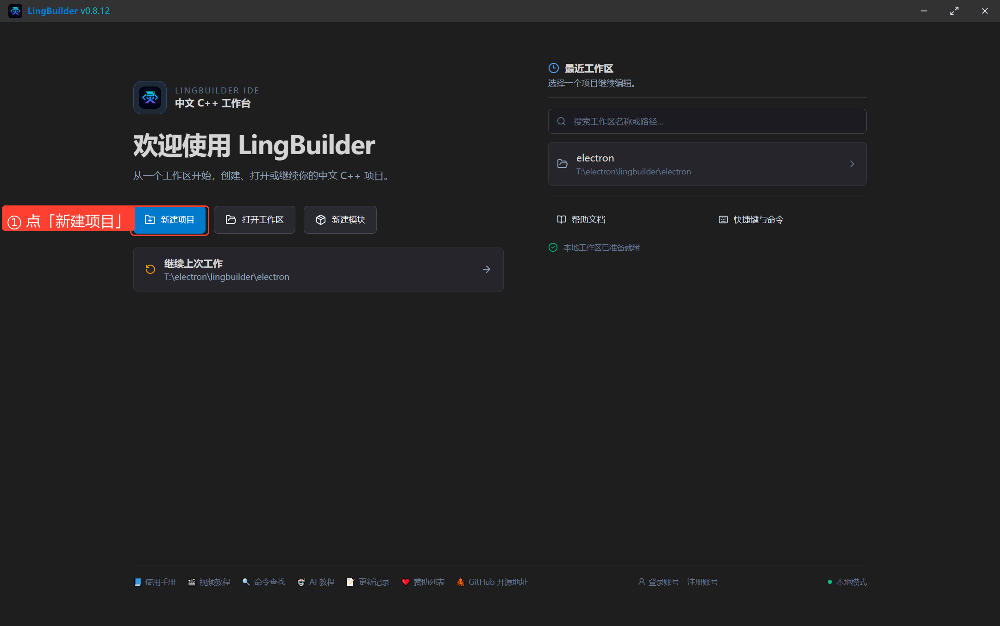

在「选择项目类型」对话框里选择「**Windows 界面设计**」（当前可用），点「选择此类型」。

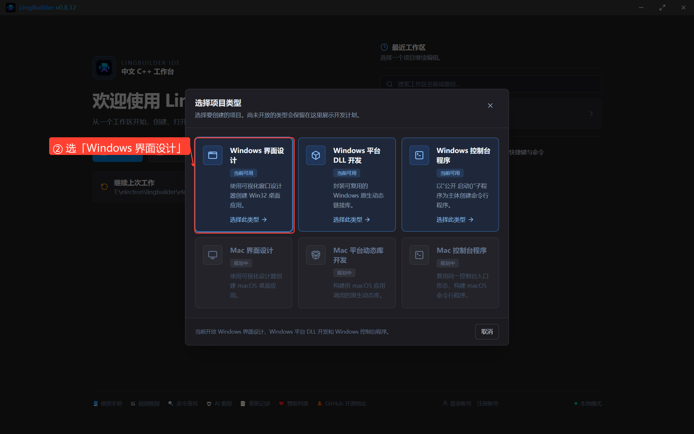

填写项目信息：

- **项目名称**：`内嵌资源演示`
- **解决方案名称**：留空自动跟随项目名
- **创建位置**：填一个相对路径文件夹（如 `内嵌资源演示`），或留空使用默认位置

然后点「**创建项目**」。

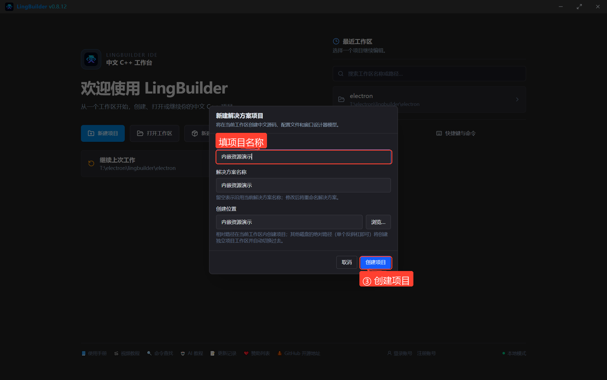

创建完成后自动进入工作台，解决方案资源管理器里会出现项目节点，`MainWindow.lcpp` 默认在新手模式编辑器中打开。

---

## 第 2 步：找到「内嵌资源」配置入口

看解决方案树的**项目节点**下方，有一个「**内嵌资源**」分组（和「图片资源 (assets)」并列）。点击其中的「**配置项目内嵌资源**」。

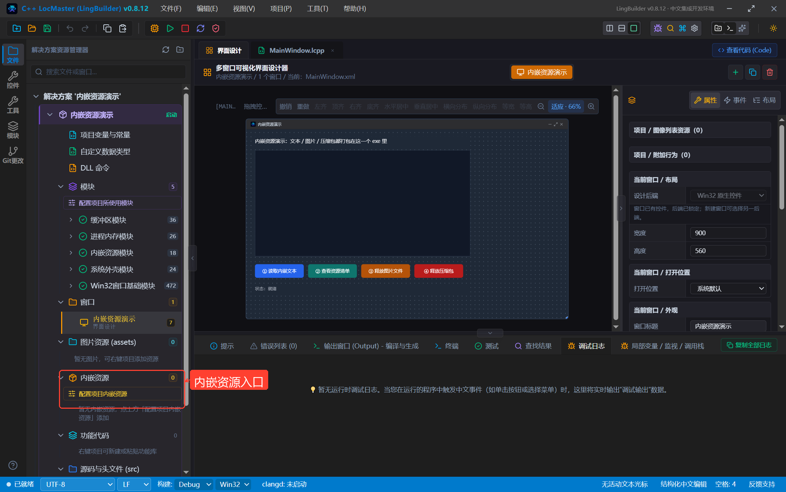

---

## 第 3 步：一键启用「内嵌资源模块」

打开「配置项目内嵌资源」对话框后，注意顶部有一条黄色警告：**当前项目未启用「内嵌资源模块」，构建会因为缺少 资源_\* 命令而阻断**。

点击警告里的「**一键启用内嵌资源模块**」，状态变成「已启用」即可。

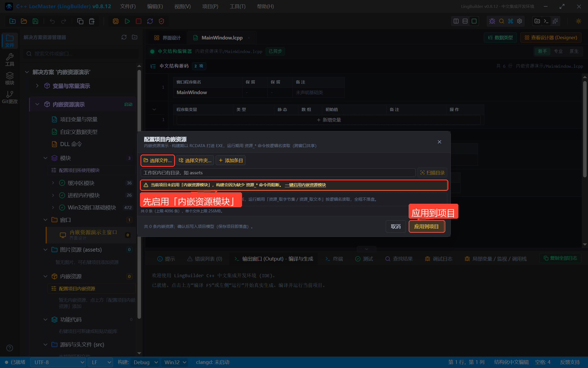

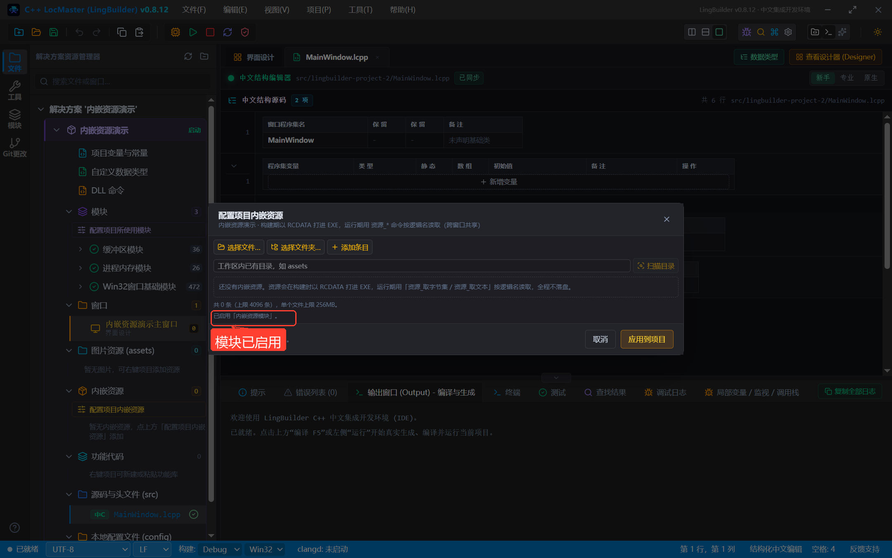

> 「内嵌资源模块」（`lingbuilder.resource.embed`）提供 `资源_*` 共 8 条命令，是读取内嵌资源的唯一入口。也可以在解决方案树「模块 → 配置项目所使用模块」里手动启用。

---

## 第 4 步：导入三个资源文件

先在电脑任意位置准备三个素材文件（本例放在 `Downloads\内嵌资源素材`）：

| 文件 | 说明 |
| --- | --- |
| `说明.txt` | UTF-8 编码的中文文本 |
| `风景.png` | 一张图片 |
| `素材包.zip` | 一个压缩包 |

回到对话框，点击「**选择文件…**」，在系统文件选择框里选中文件（可多选，也可分三次逐个添加）。LingBuilder 会自动：

1. 把文件**复制**进项目源码根的 `resources/` 目录；
2. 按相对路径生成「逻辑名」（如 `resources/说明.txt`）。

导入完成后，三条资源整齐地列在对话框里：

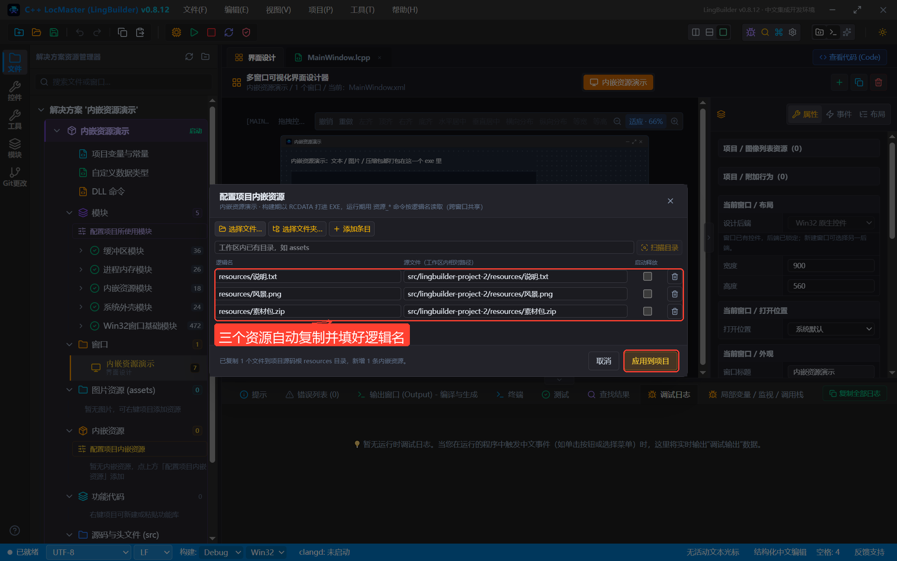

几个实用细节：

- **逻辑名**就是「工作区内相对路径」，读取时大小写和斜杠方向都不敏感（`resources/说明.txt` 和 `RESOURCES\说明.TXT` 等价）；
- 「**添加条目**」可以手工添加一行（适合文件已经在工作区里的情况）；「**扫描目录**」可以批量列出工作区内某个目录；
- 每行末尾有「**启动释放**」勾选框：勾上后 exe 每次启动会自动把该资源释放到 `%TEMP%` 临时目录，供只认磁盘路径的老库使用（本演示不勾，用代码按需释放）；
- 单个文件上限 256MB，整个项目最多 4096 条。

---

## 第 5 步：应用到项目，并保存！

点「**应用到项目**」关闭对话框，资源会出现在解决方案树的「内嵌资源」分组下。

**关键一步：按 `Ctrl+S` 保存项目！** 资源清单保存在项目的窗口设计器模型里，**只有保存项目才会写入 `window-designer.json`**。如果不保存就按 F5，构建出来的 exe 里不会有这些资源（这是最容易踩的坑）。

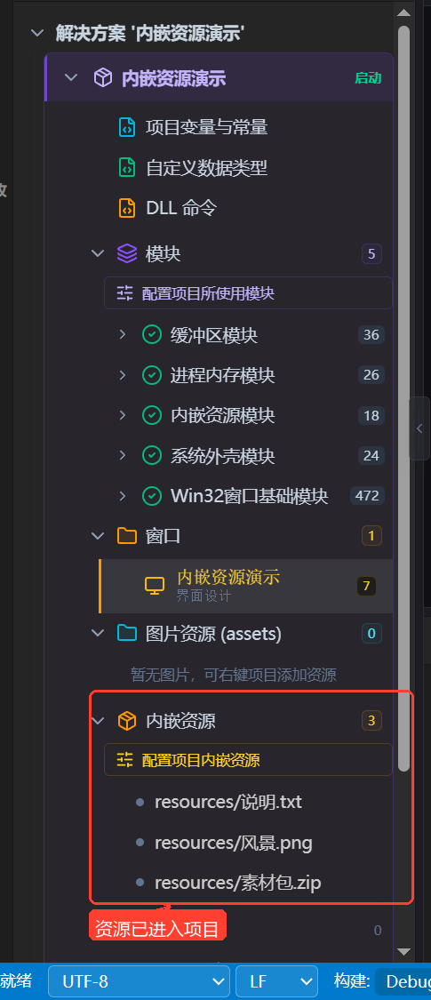

---

## 第 6 步：设计窗口界面

切换到「**界面设计**」页签，为窗口摆好控件（本演示共 7 个控件）：

| 控件 | 名称 | 用途 |
| --- | --- | --- |
| 标签 | `标题标签` | 顶部说明文字 |
| 编辑框（多行、只读） | `资源内容框` | 显示资源文本/清单 |
| 按钮 ×4 | `读文本按钮` / `资源清单按钮` / `释放图片按钮` / `释放压缩包按钮` | 触发各类读取与释放 |
| 标签 | `状态标签` | 显示操作结果 |

在右侧「属性」面板把编辑框勾上「**多行**」「**只读**」，滚动条选「垂直」。

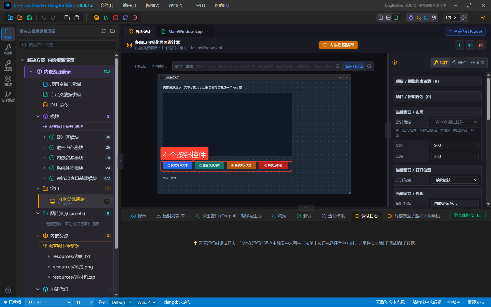

> 控件的「名称」就是代码里引用控件时用的名字（`控件_设置文本(资源内容框, …)`），建议起见名知义的中文名。

---

## 第 7 步：编写代码

切回 `MainWindow.lcpp`（新手模式），输入以下代码：

```lcpp
类 MainWindow
    事件 _MainWindow_创建完毕()
        局部 文本型 开场文本
        开场文本 = 资源_取文本("resources/说明.txt")
        控件_设置文本(资源内容框, 开场文本)
        局部 整数型 文本字节数
        文本字节数 = 资源_取大小("resources/说明.txt")
        控件_设置文本(状态标签, 格式化文本("启动即自动读取：resources/说明.txt 共 {} 字节（来自 exe 内部）", 文本字节数))
    结束

    事件 _读文本按钮_被单击()
        局部 文本型 内容
        内容 = 资源_取文本("resources/说明.txt")
        控件_设置文本(资源内容框, 内容)
        控件_设置文本(状态标签, "已调用 资源_取文本 重新读取 resources/说明.txt")
    结束

    事件 _资源清单按钮_被单击()
        局部 文本型 清单
        清单 = 资源_列表()
        控件_设置文本(资源内容框, 清单)
        局部 整数型 图片字节数
        图片字节数 = 资源_取大小("resources/风景.png")
        局部 整数型 压缩包字节数
        压缩包字节数 = 资源_取大小("resources/素材包.zip")
        控件_设置文本(状态标签, 格式化文本("资源_取大小：图片 {} 字节，压缩包 {} 字节", 图片字节数, 压缩包字节数))
    结束

    事件 _释放图片按钮_被单击()
        局部 文本型 运行目录
        运行目录 = 取运行目录()
        局部 文本型 目标路径
        目标路径 = 运行目录 + "/风景.png"
        局部 文本型 释放结果
        释放结果 = 资源_保存到文件("resources/风景.png", 目标路径)
        控件_设置文本(状态标签, "已用 资源_保存到文件 释放图片到：" + 释放结果)
    结束

    事件 _释放压缩包按钮_被单击()
        局部 文本型 运行目录
        运行目录 = 取运行目录()
        局部 文本型 目标路径
        目标路径 = 运行目录 + "/素材包.zip"
        局部 文本型 释放结果
        释放结果 = 资源_保存到文件("resources/素材包.zip", 目标路径)
        控件_设置文本(状态标签, "已用 资源_保存到文件 释放压缩包到：" + 释放结果)
    结束
结束类
```

代码要点（对应新手模式下的界面）：

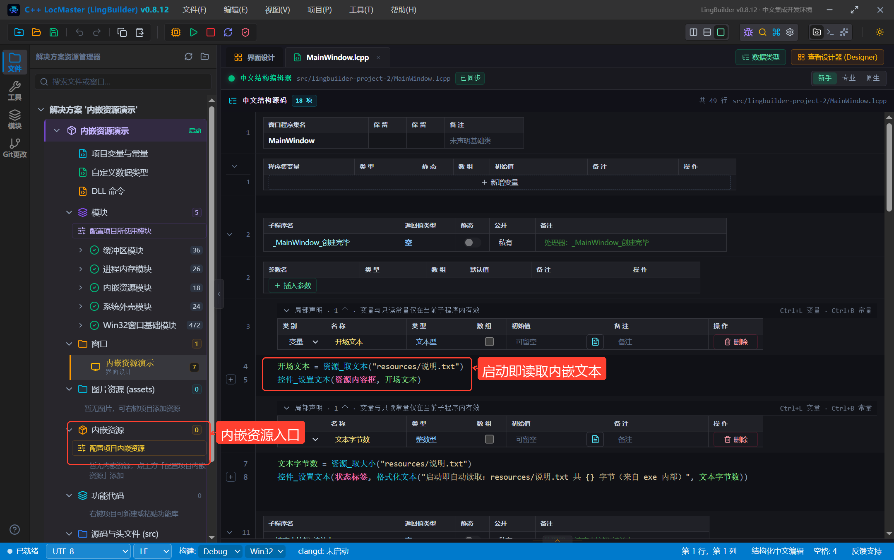

1. **事件绑定**：按钮的「被单击」事件在界面设计的「事件」面板里绑定到 `_按钮名_被单击` 处理器；窗口的「创建完毕」事件绑定 `_MainWindow_创建完毕`，程序一启动就会执行；
2. **读文本**：`资源_取文本("逻辑名")` 按 UTF-8 解码，直接得到文本；
3. **取大小**：`资源_取大小("逻辑名")` 返回字节数，用 `格式化文本` 拼进提示（数字别直接和文本相加）；
4. **列清单**：`资源_列表()` 每行一个逻辑名，放进多行编辑框正好；
5. **释放文件**：`资源_保存到文件(逻辑名, 目标路径)` 覆盖写出一个真实文件。`取运行目录()`（系统外壳模块）返回 exe 所在目录，先存局部变量再拼接，避免类型错误。

### 内嵌资源命令速查（8 条）

| 命令 | 返回 | 说明 |
| --- | --- | --- |
| `资源_取字节集(逻辑名)` | 字节集 | 读成字节集，可给图片控件/网络/内存DLL |
| `资源_取文本(逻辑名)` | 文本型 | 按 UTF-8 解码成文本 |
| `资源_是否存在(逻辑名)` | 逻辑型 | 资源是否可用 |
| `资源_取大小(逻辑名)` | 整数型 | 原始字节数 |
| `资源_列表()` | 文本型 | 全部逻辑名，每行一个 |
| `资源_保存到文件(逻辑名, 路径)` | 文本型 | 写出真实文件，返回路径 |
| `资源_释放到临时目录(逻辑名)` | 文本型 | 释放到 `%TEMP%\lingbuilder-embedded\` |
| `资源_取错误信息()` | 文本型 | 最近一次失败的中文原因 |

---

## 第 8 步：F5 构建并运行

菜单「**项目 → 编译并热运行游戏**」（或直接按 **F5**）。LingBuilder 会：

1. 保存当前代码与界面模型；
2. 生成 Win32 C++ 工程，把三个资源以 RCDATA 编进 rc 脚本；
3. 调用 MSVC 编译，输出 `LingBuilderPreview.exe` 并自动启动。

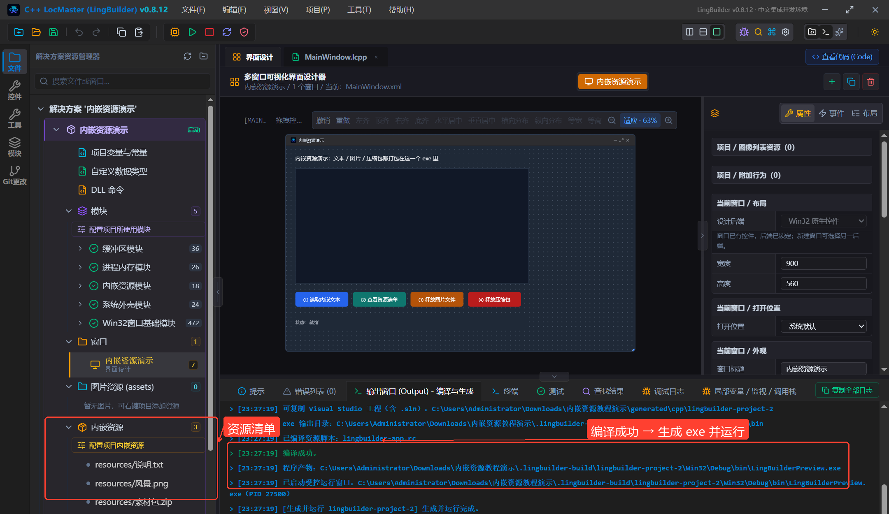

输出窗口看到「**编译成功**」「**程序产物 …\LingBuilderPreview.exe**」「已启动受控运行窗口」即表示成功。

---

## 第 9 步：运行验证

**启动瞬间**，窗口自动读出了内嵌文本——注意此时整个程序只有一个 exe，`说明.txt` 并不在它旁边：

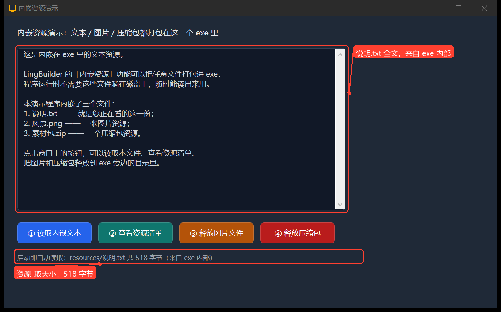

点「**② 查看资源清单**」：`资源_列表()` 列出全部逻辑名，状态栏显示图片 9904 字节、压缩包 299 字节（和源文件一致）：

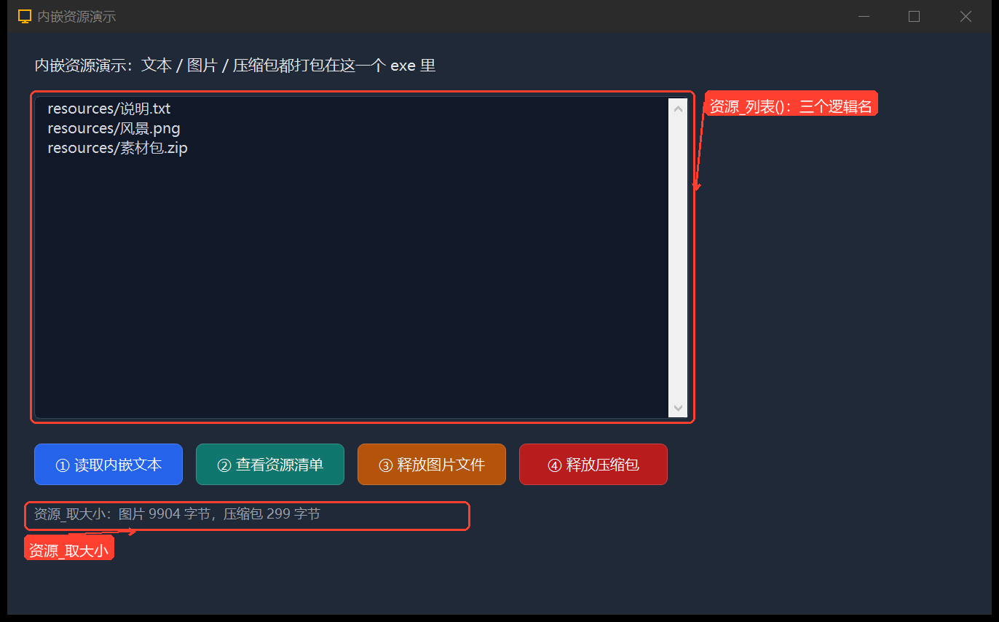

点「**③ 释放图片文件**」「**④ 释放压缩包**」，状态栏给出 `资源_保存到文件` 返回的真实路径。打开该目录（`.lingbuilder-build\lingbuilder-project-2\Win32\Debug\bin`）验证——**两个文件真的被释放出来了**，且与源文件逐字节一致：

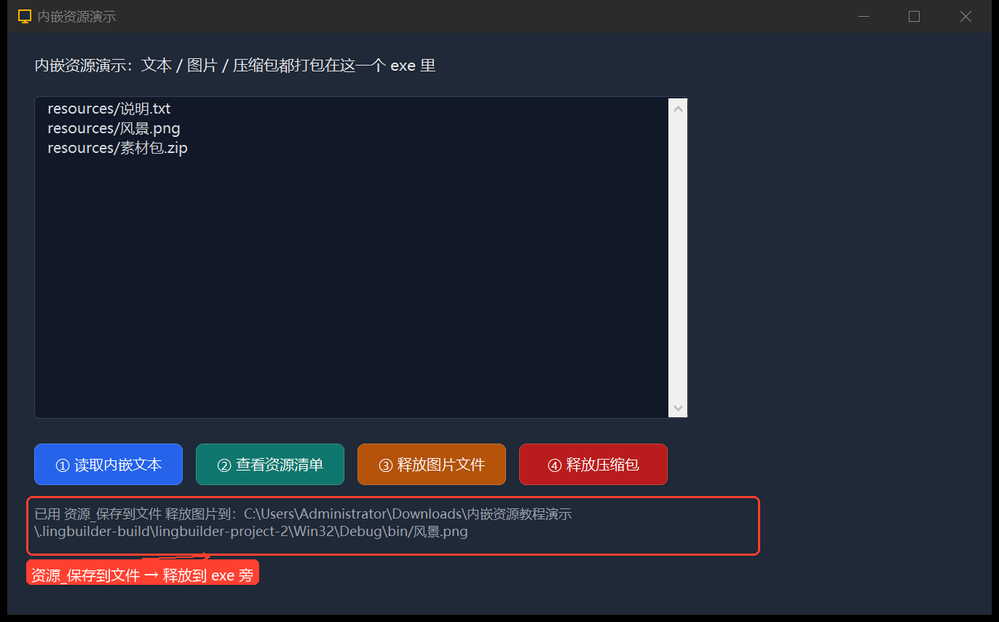

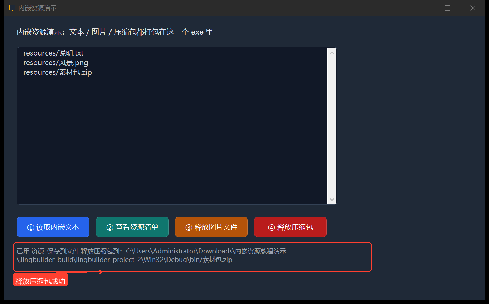

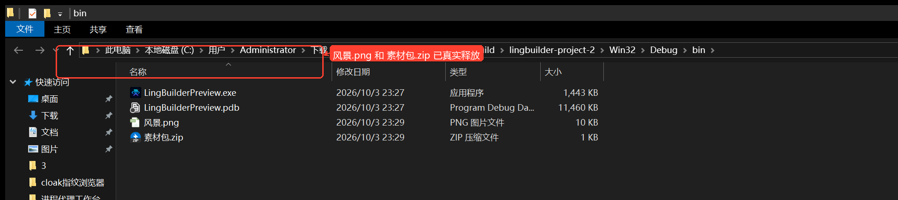

至此，内嵌资源的「打包 → 读取 → 释放」完整闭环就跑通了。把 exe 单独拷到别的电脑上，这些资源依然全部可用。

---

## 常见问题

**Q：运行起来读不到资源、`资源_取大小` 返回 0？**
最常见原因：第 5 步点完「应用到项目」**没有按 Ctrl+S 保存项目**，资源清单没写进 `window-designer.json`，构建出的 exe 里自然没有。保存后重新 F5 即可。可用 `资源_列表()` 自检——exe 里有什么，一列便知。

**Q：读出来的中文是乱码？**
`资源_取文本` 按 UTF-8 解码。请确保文本文件本身是 UTF-8 编码（Windows 记事本另存为时选「UTF-8」），否则先转码再内嵌。

**Q：提示未知命令 `资源_*` / 类型找不到？**
项目没有启用「内嵌资源模块」。按第 3 步一键启用，或在「配置项目所使用模块」里勾选 `lingbuilder.resource.embed`。

**Q：逻辑名写错了会怎样？**
读取返回空值/0，原因存在 `资源_取错误信息()` 里（如「逻辑名未声明」）。逻辑名大小写、`\` / `/` 不敏感，但目录层级必须一致。

**Q：不写代码能不能在启动时自动拿到磁盘文件？**
可以。第 4 步的「启动释放」勾选框，等价于每次启动自动执行 `资源_释放到临时目录`，适合配合只认磁盘路径的第三方 DLL。

**Q：能把资源读给图片控件直接显示吗？**
可以。`资源_取字节集("resources/风景.png")` 得到字节集后，配合图片类命令使用；也可以「启动释放」后把释放路径交给图片控件加载。

---

*教程完 · 环境要求：Windows 桌面版 LingBuilder（示例版本 v0.8.12），真实 MSVC 编译链（F5 首次运行会自动检测并引导安装）。*
