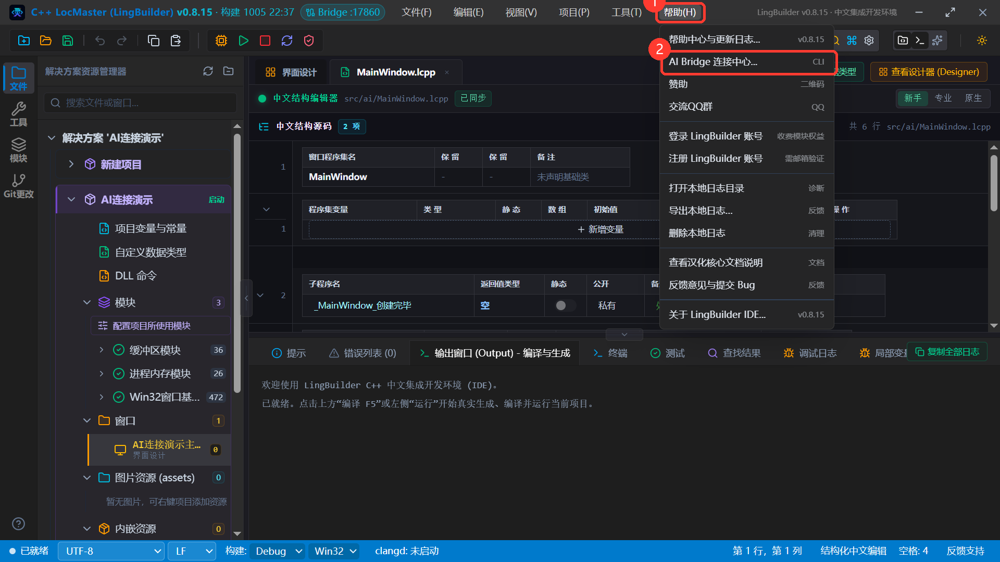
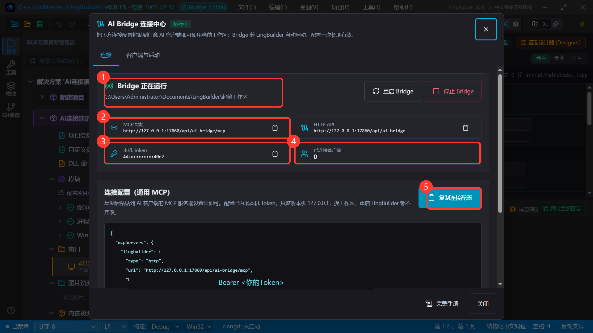
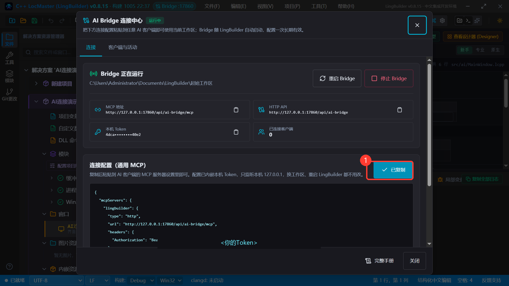
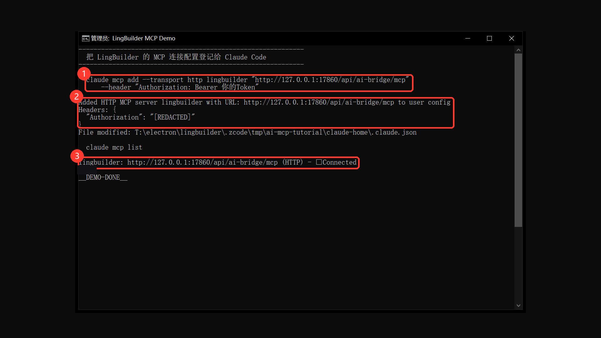
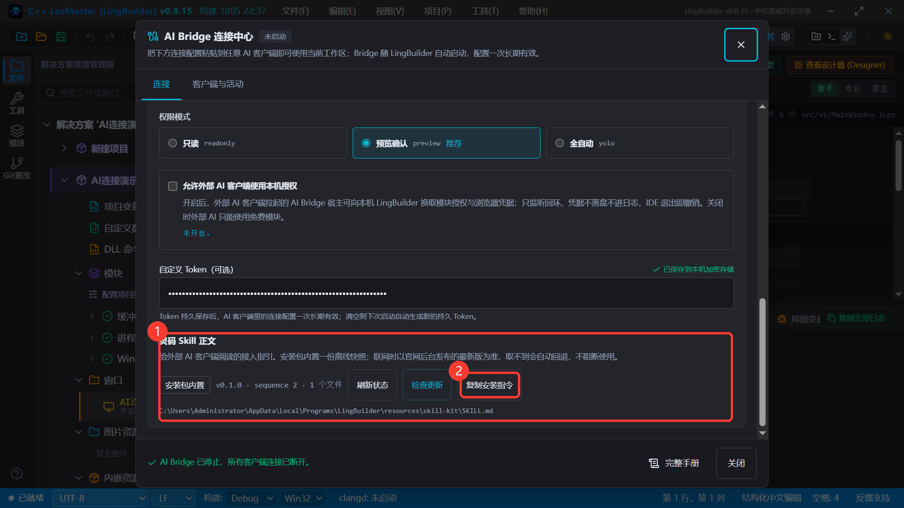
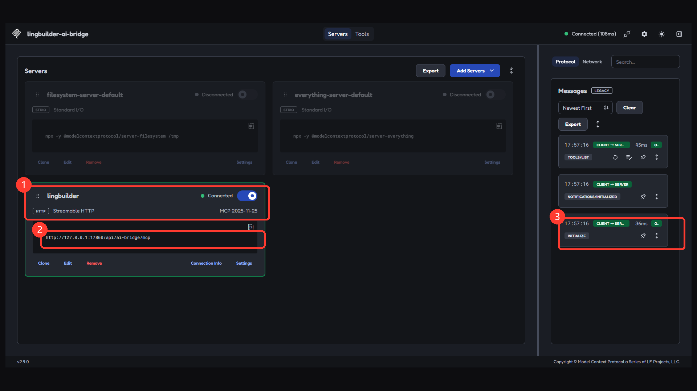
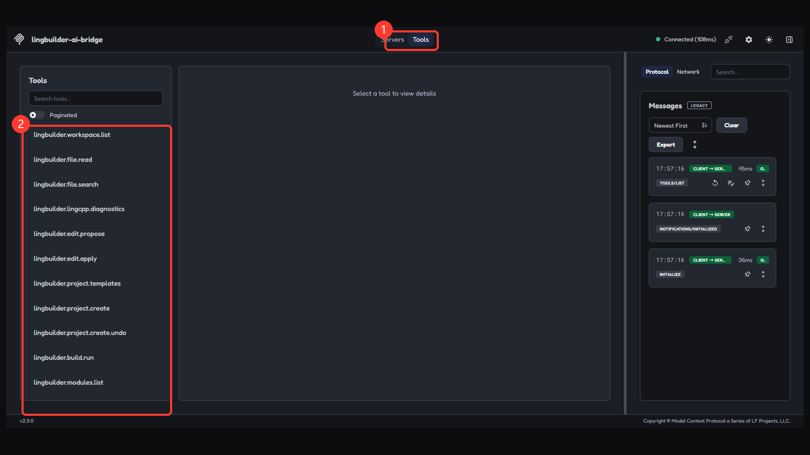
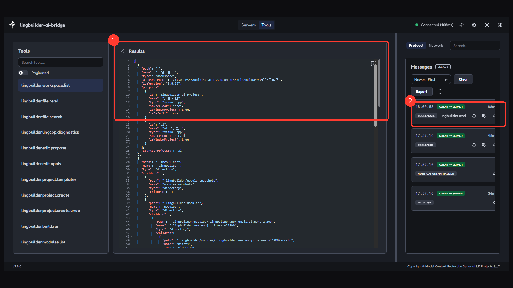
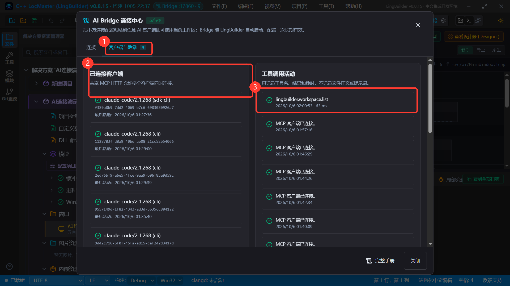
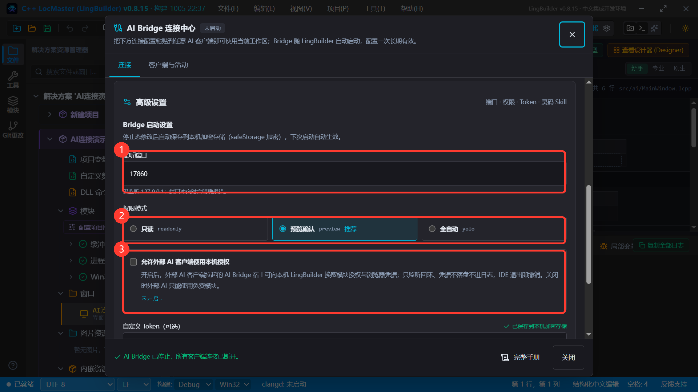

# 外部 AI 连接 MCP 图文教程

> 适用对象：想让 ChatGPT/Codex、Claude Code、Gemini CLI、灵码等外部 AI 工具直接帮你写 LingBuilder 代码的新手
> 演示环境：LingBuilder v0.8.15 · Windows · Claude Code 2.1.268 · MCP Inspector 2.9.0
> 学完你能：把 LingBuilder 的 MCP 连接配置装进任意 AI 客户端 → 验证连通 → 让 AI 真正读你的工作区、改代码、建项目、构建运行

LingBuilder 内置了一个本地服务 **AI Bridge**：它把你的工作区以 **MCP（Model Context Protocol，模型上下文协议）标准**开放出去，外部 AI 客户端连上它之后，就能直接在你的项目里干活——而且**改代码必须先提案、构建运行全部受控、所有操作进审计日志**。

全部 10 张截图都来自真机操作，红框和序号标出了每一步要点哪里。

---

## 第 1 章 这套连接是什么？能干什么？

一句话：**AI 客户端（比如 Claude Code）通过 MCP 连上 LingBuilder，LingBuilder 把工作区能力借给它用。**

```text
外部 AI 客户端（Claude Code / Codex / Gemini CLI / 灵码 / …）
        │  MCP（只监听你电脑的 127.0.0.1，带 Token 鉴权）
        ▼
LingBuilder AI Bridge（随 IDE 自动启动）
        │
        ▼
你的工作区：读文件 · 搜代码 · 提改代码提案 · 新建项目 · 构建运行 · 做模块
```

外部 AI 能用 **23 个中文工具**，常用的有：

| 想让 AI 干的事 | 对应工具 |
|---|---|
| 看看工作区里有什么 | `lingbuilder.workspace.list` |
| 读代码 / 搜代码 | `lingbuilder.file.read` · `lingbuilder.file.search` |
| 改代码（先提案、你确认才落盘） | `lingbuilder.edit.propose` · `lingbuilder.edit.apply` |
| 新建项目、构建、运行 | `lingbuilder.project.create` · `lingbuilder.build.run` · `lingbuilder.run.wait` |
| 检查中文代码诊断 | `lingbuilder.lingcpp.diagnostics` |
| 做一个可分发的模块 | `lingbuilder.module.scaffold` 等 6 件套 |

有三个特点让你可以放心用：

1. **配置一次长期有效**——Bridge 随 LingBuilder 自动启动，Token 持久保存，换工作区、重启 IDE 都不用改客户端配置；
2. **只监听本机**——Bridge 只绑定 `127.0.0.1`，外部电脑连不进来；
3. **写操作有门禁**——默认「预览确认」模式下，AI 改你的文件必须先出提案，经确认才写入。

---

## 第 2 章 准备工作

- 装好 **LingBuilder 桌面版**（本教程演示 v0.8.15）；
- 有一个**支持 MCP 的 AI 客户端**。常见的：Claude Code（命令行）、Codex CLI（ChatGPT）、Gemini CLI、Cursor、灵码等。本教程以 **Claude Code** 做真机演示，其它客户端在第 4 章给出现成配置；
- 打开 LingBuilder，随便进一个工作区（新建或打开一个项目都行，让标题栏出现解决方案名即可）。

---

## 第 3 章 拿到连接配置（复制一段 JSON 就行）

### 3.1 打开 AI Bridge 连接中心

点菜单 **「帮助(H) → AI Bridge 连接中心...」**：



### 3.2 认识连接中心

打开后长这样。正常情况下 **Bridge 已经在自动运行**（随 LingBuilder 启动），你不用点任何启动按钮：



- **① 状态行**：绿色「Bridge 正在运行」+ 当前工作区路径。AI 干活就发生在这个工作区里；
- **② MCP 地址**：`http://127.0.0.1:端口/api/ai-bridge/mcp`，客户端连的就是它；
- **③ 本机 Token**：访问凭证，只显示掩码。它已经**自动内嵌进下面的连接配置**，你不需要手抄；
- **④ 已连接客户端**：当前连了几个 AI 客户端（允许多个同时连）；
- **⑤ 复制连接配置**：一键复制完整配置。

### 3.3 复制

点**「复制连接配置」**，按钮变成「已复制」：



剪贴板里是这么一段 JSON（Token 每台电脑不同，图中已打码）：

```json
{
  "mcpServers": {
    "lingbuilder": {
      "type": "http",
      "url": "http://127.0.0.1:17860/api/ai-bridge/mcp",
      "headers": {
        "Authorization": "Bearer <你的Token>"
      }
    }
  }
}
```

> 🔒 **Token 安全**：这段 Token 等于你本机工作区的钥匙。发求助截图前记得打码（本教程截图已打码）；不要把含 Token 的配置贴到公开网页或群里。

---

## 第 4 章 方式一（推荐）：粘贴到 AI 客户端的设置里

### 4.1 Claude Code（命令行）

**装法 A：一条命令登记（推荐）。** 在终端里执行（MCP 地址和 Token 用你自己复制到的）：

```bash
claude mcp add --transport http --scope user lingbuilder "http://127.0.0.1:17860/api/ai-bridge/mcp" --header "Authorization: Bearer <你的Token>"
```

真机演示（`--header` 太长时命令会自动折行，属正常）：



然后验证连接：

```bash
claude mcp list
```

看到 `lingbuilder: http://127.0.0.1:17860/api/ai-bridge/mcp (HTTP) - ✔ Connected` 就是通了。老版 Windows 控制台的字体显示不出对勾，会渲染成 `□Connected`——**有 Connected 字样就是连接成功**，不是乱码。

**装法 B：项目级文件。** 在你的项目目录新建文本文件 `.mcp.json`，把第 3 章复制的连接配置**原样粘贴**进去、保存即可（Claude Code 会识别项目里的这个文件；首次使用时它会问你是否信任此项目的 MCP 服务器，选允许）。

### 4.2 Codex CLI（ChatGPT）

编辑（没有就新建）`%USERPROFILE%\.codex\config.toml`，加入（保留文件里其它内容）：

```toml
[mcp_servers.lingbuilder]
url = "http://127.0.0.1:17860/api/ai-bridge/mcp"
http_headers = { "Authorization" = "Bearer <你的Token>" }
```

### 4.3 Gemini CLI

编辑 `%USERPROFILE%\.gemini\settings.json`，在 JSON 里加一段 `mcpServers`（已有 `mcpServers` 就并进去）：

```json
{
  "mcpServers": {
    "lingbuilder": {
      "httpUrl": "http://127.0.0.1:17860/api/ai-bridge/mcp",
      "headers": {
        "Authorization": "Bearer <你的Token>"
      }
    }
  }
}
```

### 4.4 Cursor

在项目根新建 `.cursor/mcp.json`（或全局 `%USERPROFILE%\.cursor\mcp.json`）：

```json
{
  "mcpServers": {
    "lingbuilder": {
      "url": "http://127.0.0.1:17860/api/ai-bridge/mcp",
      "headers": {
        "Authorization": "Bearer <你的Token>"
      }
    }
  }
}
```

保存后到 Cursor 设置 → MCP 里确认它已启用。

### 4.5 其它客户端的通用判断法

连接配置是标准的 **Streamable HTTP + 请求头鉴权**。任何支持 MCP 的客户端，只要它的服务器设置里有「URL + 自定义请求头（Headers）」两个字段，照抄第 3 章的 `url` 和 `Authorization` 头即可。

---

## 第 5 章 方式二（最省事）：把配置直接发给 AI，让它自己装

Claude Code、Codex 这类能改本机配置文件的 AI 客户端，你可以**把第 3 章复制的连接配置直接粘贴到对话里**，让它替你完成安装。

把下面这段话连同复制的配置一起发给 AI 客户端：

```text
请把下面这段 MCP 服务器配置安装进你自己的配置里（Streamable HTTP 方式）。
安装完成后重连 MCP，然后调用 lingbuilder.workspace.list 工具，
告诉我当前工作区根路径和里面有哪些项目。

<在这里粘贴第 3 章复制的连接配置 JSON>
```

AI 会自己找到并修改配置文件、重连、然后真实调用一次工具向你汇报——图 07～10 就是这么连上之后的真实效果。

> 🔒 提醒：这样做的实质是「允许这个 AI 客户端把 Token 写进它自己的本机配置」。Token 只在本机回环生效，没有外发风险；但也只发给你信任的本机 AI 客户端，不要贴到网页版聊天里。

---

## 第 6 章 方式三：灵码 Skill 安装路线

如果你用的是**灵码**这类支持 Skill 自安装的 AI 客户端，LingBuilder 准备了专门的接入指引：

打开连接中心 → 展开**「高级设置」**→ 找到**「灵码 Skill 正文」**→ 点**「复制安装指令」**，把复制到的内容发给灵码即可。灵码会按指引自动完成接入：



这条路线走的是 **stdio 托管模式**：不占端口、不需要 Token，AI 客户端自己拉起 LingBuilder 的桥接进程，**工作区 = AI 客户端当时打开的目录**。适合「每个项目目录一个独立工作区」的用法；想「始终连着 IDE 当前工作区」就用第 4/5 章的 HTTP 方式。两条路线可以并存。

---

## 第 7 章 验证连接：看 AI 真实调用一次

装好配置后（以 MCP Inspector 官方调试工具演示，AI 客户端里的效果相同）——连接成功：



- **①** lingbuilder 服务器卡片变绿、开关打开、显示 Connected；
- **②** 卡片里的 URL 就是你的 MCP 地址；
- **③** 右侧消息流出现 `INITIALIZE` 握手记录。

展开工具列表，能看到 **23 个 `lingbuilder.*` 工具**：



真实调用一次 `lingbuilder.workspace.list`：



返回的 JSON 里 `workspaceRoot` 就是 AI 眼中的工作区根路径——**动手前先让 AI 调一次它并复述给你**，确认它连的是你想让它干活的工作区。

回到 LingBuilder 这边，「客户端与活动」页签能看到谁连着、调用过什么工具：



- **②** 已连接客户端：`claude-code/2.1.268` 等条目，多个客户端可同时连接；
- **③** 工具调用活动：只记录工具名、结果和耗时，不记录文件正文和提示词。

---

## 第 8 章 权限模式怎么选

在连接中心展开「高级设置」（Bridge 停止状态下可改，改完自动保存、下次启动生效）：



| 模式 | AI 能读 | AI 能写/构建 | 适合 |
|---|---|---|---|
| **只读** readonly | ✓ | ✗ 全部拒绝 | 让 AI 只看代码、答疑 |
| **预览确认** preview（默认·推荐） | ✓ | 改文件必须先出提案，你确认才写入 | 日常开发 |
| **全自动** yolo | ✓ | 受控工具直接执行（仍不能跑任意命令） | 你充分信任的本机自动化 |

两个相关开关：

- **允许外部 AI 客户端使用本机授权**：收费模块（如 new_emoji 界面模块）默认不对「外部 AI 拉起的桥接进程」开放。勾选后外部 AI 可向本机 IDE 换取你的模块授权；**改完需要重启 AI 客户端（或重连 MCP）才生效**。没购买收费模块就不用开。
- **自定义 Token / 重新生成 Token**：留空即自动生成并永久保存。怀疑 Token 泄露时点「重新生成」，之后把客户端配置里的 Token 换成新的即可。

---

## 第 9 章 常见问题

**Q：客户端报 401 / 连不上？**
按顺序查：① Bridge 是否在运行（连接中心状态行）；② 客户端配置里的端口和 Token 是否与「复制连接配置」一致——**一律以复制到的配置为准**，不要手打；③ 在高级设置里点过「重新生成 Token」的话，客户端里的旧 Token 要同步换新。

**Q：改了监听端口，客户端配置要改吗？**
要。端口写死在连接配置的 `url` 里——改完端口后重新「复制连接配置」并更新客户端。

**Q：AI 连上了，但提示「宿主启动时未取得授权」用不了收费模块？**
见第 8 章「允许外部 AI 客户端使用本机授权」，勾选后**重启 AI 客户端**。这不是让你买模块，是时序问题。

**Q：`claude mcp list` 显示 `□Connected`，对勾呢？**
老版 Windows 控制台字体缺对勾字形。有 Connected 字样即成功；想看对勾可在 Windows Terminal 里运行。

**Q：AI 提了修改，我怎么看到它改了什么？**
预览确认模式下，AI 的修改以提案形式写入 LingBuilder 的 AI 编辑链，在 IDE 里预览差异、点应用才落盘；每一次工具调用在「客户端与活动」页签都有记录。

**Q：安全吗？**
Bridge 只监听 `127.0.0.1`（外部电脑物理上连不进来）；写操作受权限模式门禁；工具调用全部进审计日志；Token 存在本机加密存储。给外部 AI 的能力边界 = 第 1 章那 23 个工具，不是你的整个电脑。

---

## 下一步

- 想看 23 个工具的完整说明：官网文档 [MCP 工具协议](https://lingbuilder.com/guide/ai/mcp)
- 想看 AI 构建运行项目的细节：官网文档 [AI 构建与运行](https://lingbuilder.com/guide/ai/build-run)
- 想让 AI 从零做一个模块：读本目录《模块开发新手图文教程》
