# 模块开发新手图文教程

> 适用对象：第一次做 LingBuilder 模块的新手
> 演示环境：LingBuilder v0.8.12 · Windows · **新手模式**（结构化中文编辑器）
> 学完你能：新建一个模块 → 写一条真正的中文命令 → 在窗口程序里调用它 → 打包成 .lbmod 分发给别人

在本教程里，我们会做一个最小的「问候工具」模块：它只提供一条命令「生成问候语」——传入一个名字，返回一句中文问候。别小看这一条命令，它会带你走完模块开发的**全部环节**：创建、写 C++、改清单、调试运行、打包、分发。全部 19 张截图都来自真机操作，红框和序号标出了每一步要点哪里。

---

## 第 1 章 模块是什么？和功能代码有什么区别？

写项目时，很多代码是「通用工具」：拼接文本、算日期、加解密……你已经有**功能代码（功能库）**可以在项目内复用这些逻辑。那模块是干什么的？

**模块就是把一批功能打包成一个可安装、可分享的「能力包」**：

- 功能库只属于一个项目；**模块可以装到任何工作区的任何项目里**；
- 模块可以打包成 `.lbmod` 文件**发给别人**，别人双击安装就能用；
- 模块内部是真正的 C++ 代码，编译进最终程序，没有性能损失。

一句话：**功能库给自己项目用，模块做出来给大家用。**

---

## 第 2 章 新建一个模块

### 2.1 欢迎页点「新建模块」

打开 LingBuilder，在欢迎页点**「新建模块」**按钮（在「新建项目」旁边）：

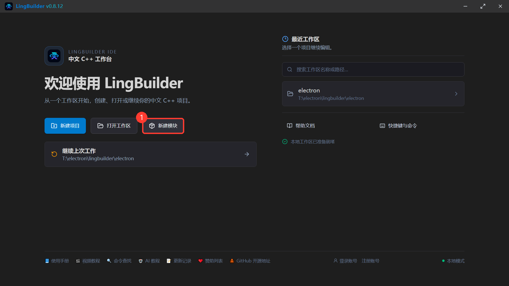

### 2.2 填写模块信息

弹出「新建模块」窗口后，保持**「从模板新建」**页签，填两项必填信息：

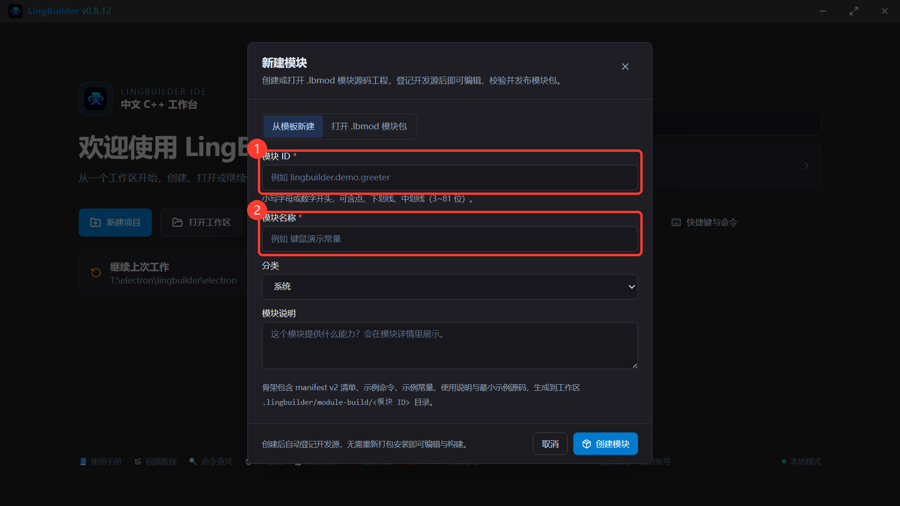

- **① 模块 ID**：模块的英文「身份证号」，全小写，只能含字母、数字、点、下划线、中划线。我们填 `lingbuilder.demo.greeter`（建议都像这样用 `lingbuilder.demo.` 开头，避免和别人的模块撞名）；
- **② 模块名称**：中文显示名，我们填「问候工具」。

再把**分类**保持「系统」，**模块说明**写一句这个模块是干什么的（会显示在模块详情页里），然后点**④「创建模块」**：

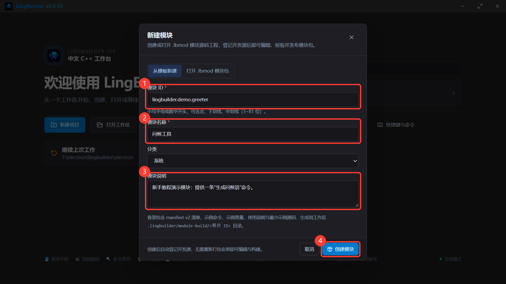

### 2.3 创建成功

出现绿色提示「**模块源码已就绪**」就成功了：

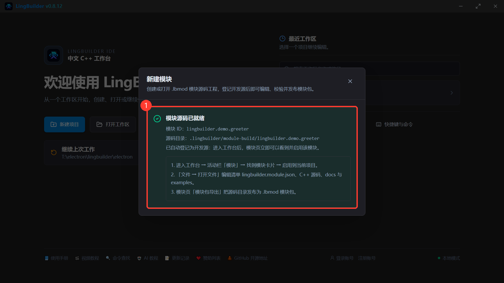

注意提示里的三个关键信息：

1. 模块源码生成在工作区 `.lingbuilder/module-build/lingbuilder.demo.greeter` 目录；
2. 它已**自动登记为开发源**——不需要安装，模块页立刻能看到；
3. 提示面板上的「文件 → 打开文件」菜单目前在新版本里还没有，第 3 章会教你实际可用的打开方法。

---

## 第 3 章 模块骨架里有什么？去哪里改？

### 3.1 骨架文件一览

刚创建的模块目录里有这些文件：

```text
.lingbuilder/module-build/lingbuilder.demo.greeter/
├── lingbuilder.module.json    ← 模块清单：命令、常量、文档、编译配置都登记在这里
├── README.md                  ← 模块说明（随包分发）
├── docs/usage.md              ← 使用说明
├── examples/最小示例.lcpp       ← 示例源码（用户可在模块详情页「示例」里查看）
├── include/module_bridge.h    ← C++ 桥接头文件
└── src/module_bridge.cpp      ← C++ 桥接实现（命令的真身在这里）
```

- `.lingbuilder` 开头的目录是 LingBuilder 的**模块工地**：不在解决方案树里显示，这是正常的。
- 要在 IDE 里**找**这些文件：点菜单 **「编辑(E) → 在文件中查找」**，把「搜索范围」从「当前项目」改成**「整个工作区」**，搜骨架自带的「示例命令」四个字，就能看到模块的全部文件：

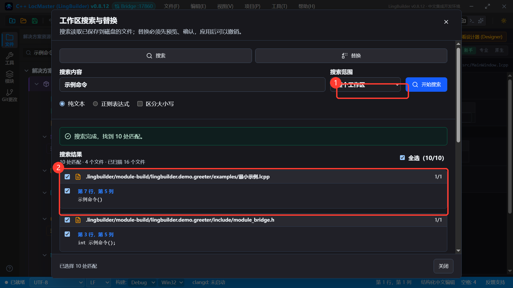

- 要**编辑**这些文件，目前最直接的方式是用外部编辑器（记事本就可以，推荐 VS Code）：在文件管理器里打开工作区的 `.lingbuilder\module-build\lingbuilder.demo.greeter` 目录，双击文件编辑、保存即可。**IDE 会直接消费磁盘上的最新内容**——改完清单或 C++，不用重装模块，下一次补全、诊断、F5 构建就是新的。

> 为什么用外部编辑器？模块源码是「模块工地」里的普通文本文件，任何编辑器都能改；IDE 后续版本会补上内置的模块源码编辑入口，届时本教程会同步更新。

---

## 第 4 章 把示例命令改成「生成问候语」

骨架自带一条占位的「示例命令」。我们现在把它改成一条**有参数、有返回值**的真命令：

- 中文命令名：`生成问候语`
- 参数：`姓名`（文本型）
- 返回：一句问候语（文本型）

一共要改 **2 个 C++ 文件 + 1 个清单文件**。下面给出完整内容，直接**全选替换**即可。

### 4.1 改 C++ 桥接头文件 `include/module_bridge.h`

用记事本打开，全选（Ctrl+A）、粘贴以下内容、保存（Ctrl+S）：

```cpp
#pragma once

#include <string>

// 模块桥接函数声明：清单 bindings 里的 runtimeName 叫什么，这里就声明什么。
std::wstring 生成问候语(const wchar_t* 姓名);
```

> 记住这个对应关系：**清单里的 `runtimeName` = C++ 函数名**。中文函数名是允许的，LingBuilder 生成的调用代码就会按这个名字去调你的函数。
> 参数写 `const wchar_t*`（文本型参数的固定写法），返回 `std::wstring`（文本型返回值的固定写法）。

### 4.2 改 C++ 实现 `src/module_bridge.cpp`

同样全选替换为：

```cpp
#include "module_bridge.h"

// 生成一句问候语：把「姓名」拼进固定的中文模板。
std::wstring 生成问候语(const wchar_t* 姓名)
{
    std::wstring 名字 = (姓名 != nullptr) ? 姓名 : L"";
    if (名字.empty())
    {
        名字 = L"朋友";
    }
    return L"你好，" + 名字 + L"！恭喜你做出了第一个中文模块。";
}
```

### 4.3 改模块清单 `lingbuilder.module.json`

清单是 JSON 格式，改动三处：① `contributes.commands` 把示例命令换成「生成问候语」；② `bindings.commands` 描述这条命令的**运行时绑定**（参数类型、返回类型）；③ `targets` 里**补一个 x64 目标**。

> **③ 是新手最容易踩的坑**：模板默认只有 32 位（win32）编译目标，而 F5 构建常用 64 位——少了 x64 目标，构建会报 `C1083` 找不到头文件。所以这里一次性把双架构都配好。

全选替换为：

```json
{
  "schemaVersion": 2,
  "id": "lingbuilder.demo.greeter",
  "name": "问候工具",
  "version": "1.0.0",
  "category": "系统",
  "description": "新手教程演示模块：提供一条“生成问候语”命令。",
  "author": "LingBuilder Module Author",
  "tags": [
    "模板",
    "cpp-source"
  ],
  "contributes": {
    "commands": [
      {
        "name": "生成问候语",
        "signature": "生成问候语(文本型 姓名)",
        "description": "返回一句面向“姓名”的中文问候语。",
        "insertText": "生成问候语(姓名)",
        "returnType": "文本型"
      }
    ],
    "constants": [
      {
        "name": "示例常量",
        "type": "整数型",
        "value": 1,
        "description": "模块模板示例常量；.lcpp 源码中用 #示例常量 引用。"
      }
    ],
    "docs": [
      {
        "title": "使用说明",
        "path": "docs/usage.md"
      }
    ],
    "examples": [
      {
        "title": "最小示例",
        "path": "examples/最小示例.lcpp"
      }
    ]
  },
  "targets": [
    {
      "id": "windows-msvc-win32",
      "platform": "windows",
      "arch": "win32",
      "toolchain": "msvc",
      "includeDirs": [
        "include"
      ],
      "headers": [
        "include/module_bridge.h"
      ],
      "sources": [
        "src/module_bridge.cpp"
      ]
    },
    {
      "id": "windows-msvc-x64",
      "platform": "windows",
      "arch": "x64",
      "toolchain": "msvc",
      "includeDirs": [
        "include"
      ],
      "headers": [
        "include/module_bridge.h"
      ],
      "sources": [
        "src/module_bridge.cpp"
      ]
    }
  ],
  "bindings": {
    "commands": [
      {
        "command": "生成问候语",
        "runtimeName": "生成问候语",
        "parameters": [
          {
            "name": "姓名",
            "type": "wideString",
            "description": "要问候的人名。"
          }
        ],
        "returnType": "wideString",
        "encoding": "wide",
        "example": "生成问候语(姓名)"
      }
    ]
  }
}
```

三个关键点：

- `contributes.commands` 是给**人**看的（命令名、签名、说明、补全片段），类型用中文（文本型）；
- `bindings.commands` 是给**编译器**看的（C++ 函数名、参数 ABI 类型），类型用英文（wideString = 文本型）；
- 两边的命令名必须一致。

---

## 第 5 章 建一个测试项目，启用模块

### 5.1 模块页里找到「问候工具」

回到工作台，点左侧活动栏的**「模块」**图标，在模块列表里找到**「问候工具」**（带金色「开发源」标记，表示它直接消费你的源码目录）：

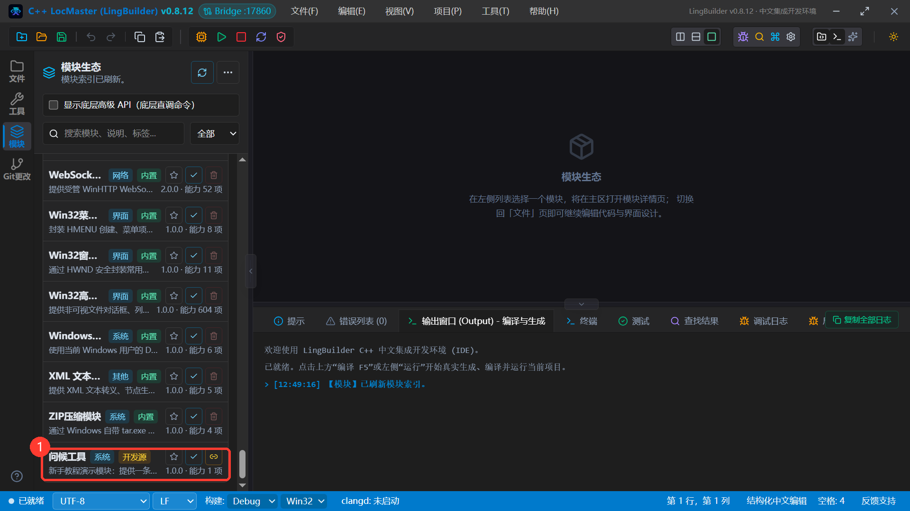

点卡片打开模块详情，点**「启用」**。启用成功后按钮会变成红色的**「停用」**，右下角出现「当前项目已引用」，输出面板也会记录一条「【模块】启用 问候工具。」：

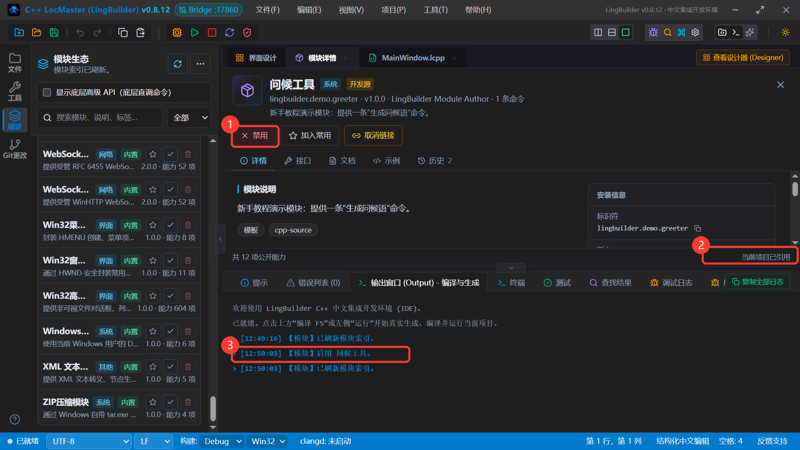

> 注意：模块是**按项目**启用的。启用前先确认当前项目是你要用它的那个项目（下一节我们就去建这个项目）。

### 5.2 新建测试项目

点菜单「文件(F) → 新建项目」，类型选 **Windows 界面设计**，项目名称填「问候模块演示」，点「创建项目」：

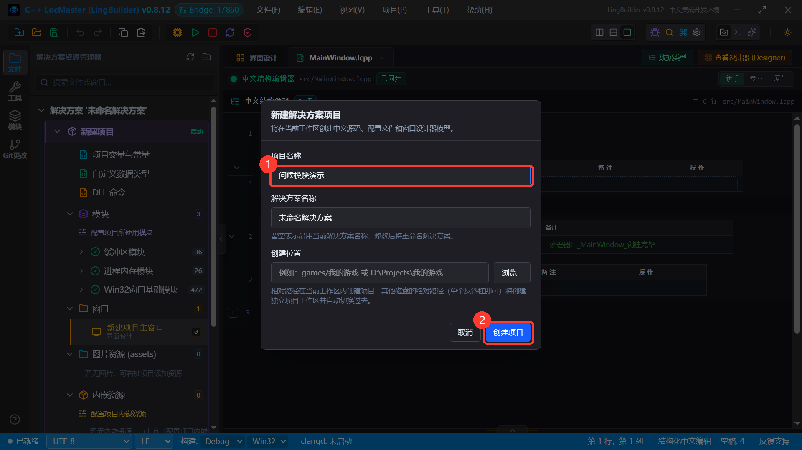

创建后记得回模块页确认「问候工具」在这个新项目上也是启用状态（新项目要单独启用）。

---

## 第 6 章 新手模式写调用代码

双击解决方案树里的 `MainWindow.lcpp`，中间就是**新手模式结构化编辑器**。找到自动生成的「_MainWindow_创建完毕」事件块——窗口启动时就会执行这里的代码。

把事件块里的默认 `调试输出(...)` 行选中删掉，输入「生成」两个字——**模块命令的补全直接弹出来了**，列表里能看到「生成问候语」，还标着来源「问候工具」和完整签名：

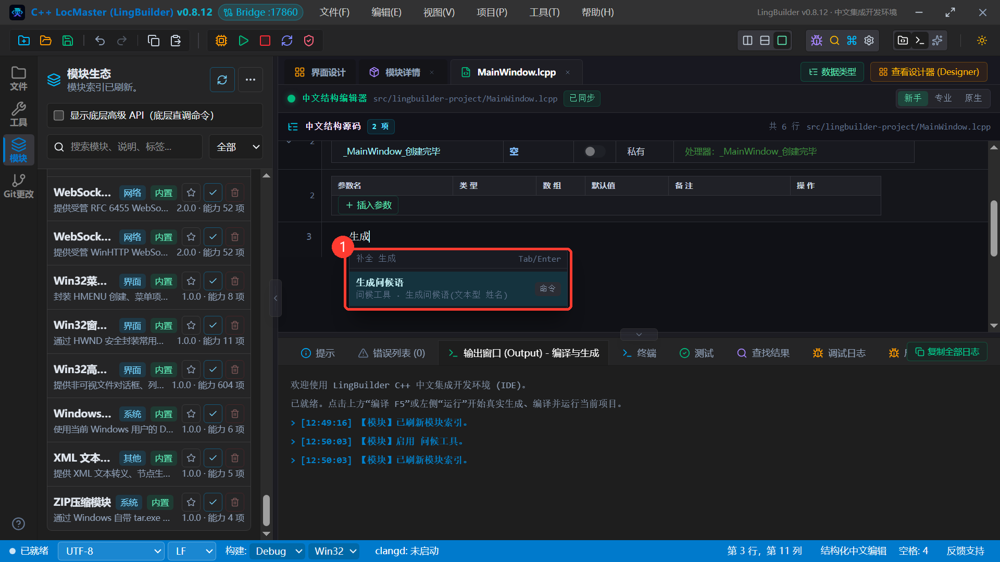

按 Tab 或回车上屏，然后把这一行整理成完整的调用（也可直接整行输入）：

```lcpp
信息框(生成问候语("lingbuilder"), 64, "我的第一个模块")
```

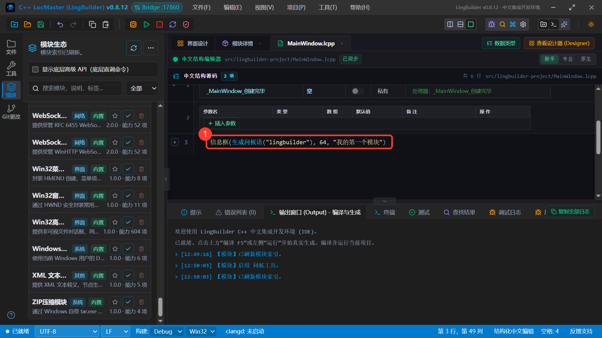

这一行的意思：窗口创建完毕时，调用我们模块的「生成问候语」命令，把返回的问候语用信息框弹出来。`64` 是信息框的图标样式，「我的第一个模块」是弹窗标题。

---

## 第 7 章 按 F5，看真机效果

点工具栏的**「运行 F5」**（或直接按 F5 键）。IDE 会自动保存、生成 C++、编译、运行。输出窗口出现「**编译成功。**」和「已启动受控运行窗口」就说明构建通过了：

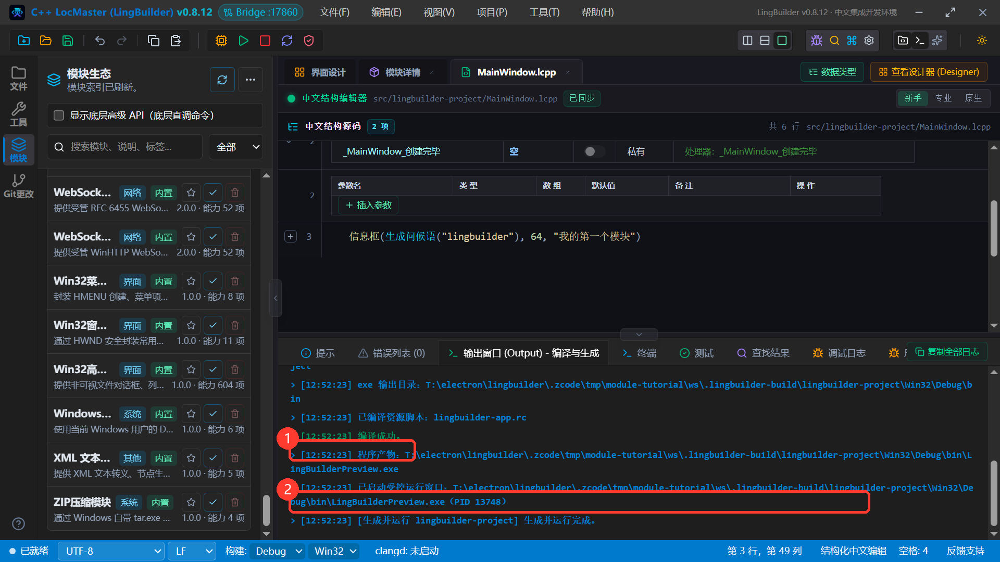

程序跑起来是一个朴素的空窗口（我们没画界面）：

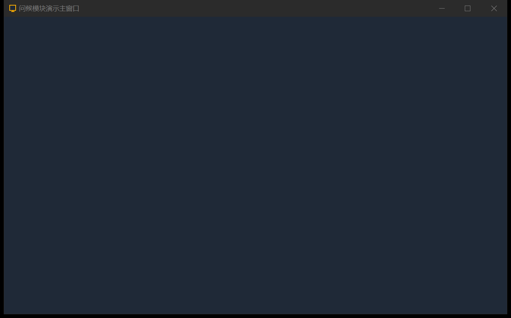

同时弹出了消息框——**内容正是我们 C++ 代码拼出来的那句话**：

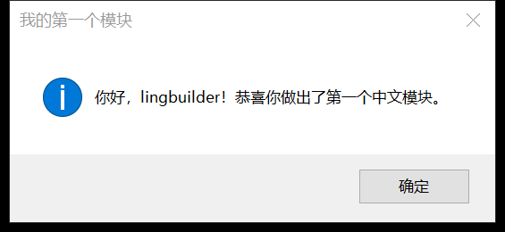

窗口和弹窗同框再看一眼，这一刻，你写的中文命令已经真实跑在 exe 里了：

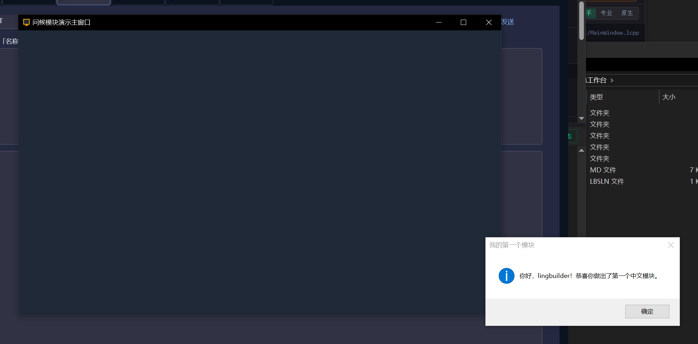

试着把调用改成 `生成问候语("")`（空名字）再按 F5，会弹「你好，朋友！……」——这正是我们在 C++ 里写的兜底逻辑。

---

## 第 8 章 打包成 .lbmod 模块包

模块在你机器上能跑只是第一步，接下来把它打包成可分发的 `.lbmod` 文件。

点活动栏「模块」图标打开模块页，点右上角**「…」→「模块包制作」**。填两项：

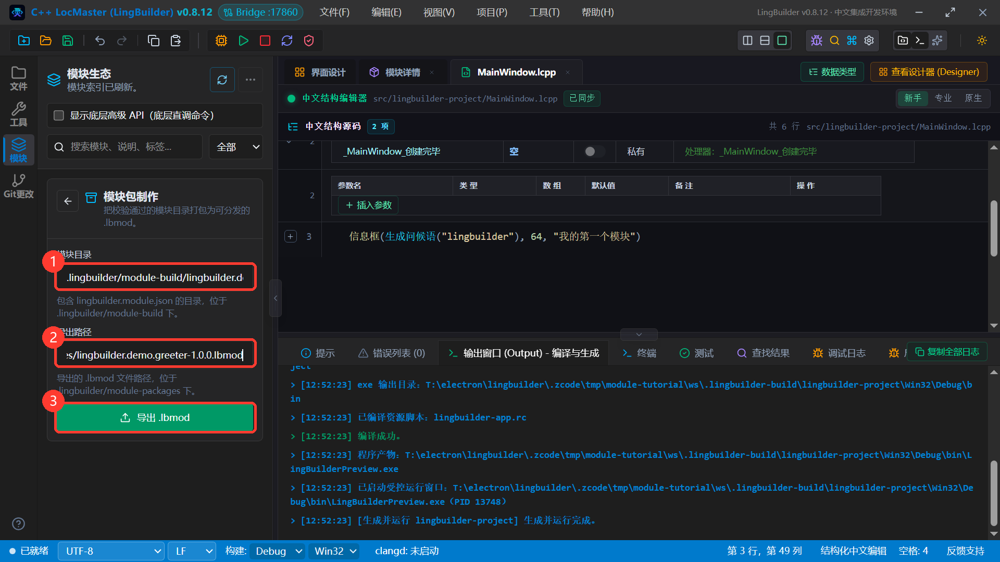

- **① 模块目录**：`.lingbuilder/module-build/lingbuilder.demo.greeter`（你的模块源码目录）；
- **② 导出路径**：`.lingbuilder/module-packages/lingbuilder.demo.greeter-1.0.0.lbmod`（打包产物放哪）。

点**③「导出 .lbmod」**，输出面板提示「【模块包】已导出 …」就成功了：

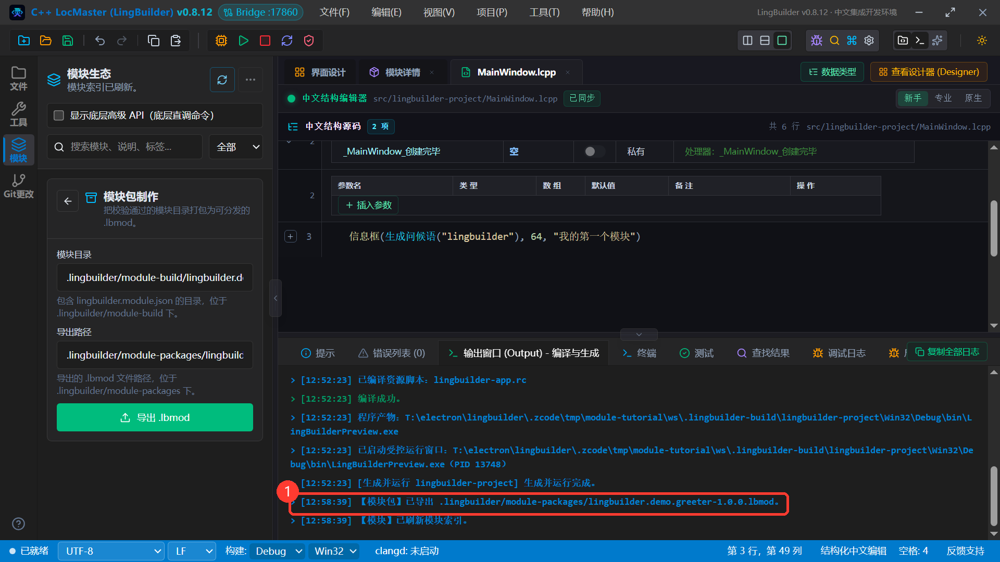

---

## 第 9 章 把模块发给别人

把上一步生成的 `.lbmod` 文件发给别人（微信、网盘都行）。对方拿到后，在欢迎页点**「新建模块」→ 切到「打开 .lbmod 模块包」页签**，填入 `.lbmod` 文件的完整路径，点「打开模块包」：

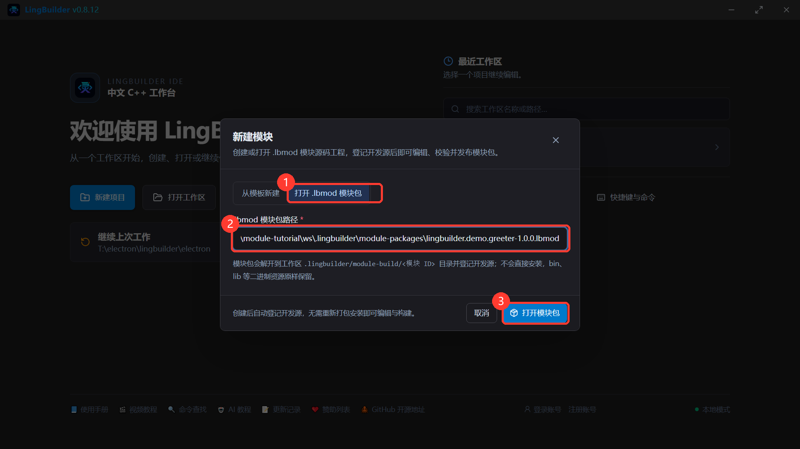

提示「模块源码已就绪」，模块就装到对方的工作区了（同样是登记为开发源，能看能改能启用）：


对方进工作台后，点开模块详情的「接口」页，就能看到这条命令的完整公开信息——和你在自己机器上看到的一模一样：

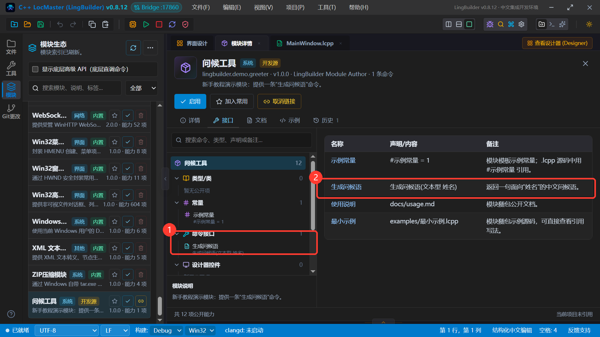

---

## 常见问题

**Q：F5 报 C1083 找不到 module_bridge.h？**
清单 `targets` 里缺 x64 目标，按第 4.3 节把双架构配置补齐。

**Q：改了 C++ 或清单，怎么不生效？**
确认文件已保存到磁盘；开发源模式直接消费磁盘内容，无需重装。如果开着旧的编辑器页签，注意别被旧缓冲区覆盖回去了。

**Q：想加第二条命令？**
三步：C++ 里加函数（.h 声明 + .cpp 实现）、清单 `contributes.commands` 加一条、`bindings.commands` 加一条。命名对应关系和第 4 章完全一样。

**Q：怎么给命令加整数、小数参数？**
binding 里 `int` 对应整数型、`double` 对应小数型、`bool` 对应逻辑型；C++ 形参直接写 `int`/`double`/`bool`。更多类型见《模块开发手册》（docs/模块开发手册.md）。

---

## 下一步

- 给模块补一份像样的 `docs/usage.md` 和 `examples/`，模块详情页里用户就能直接看到；
- 需要界面能力的模块（自绘控件、浏览器内核等）可以继续阅读 `docs/模块开发手册.md`；
- 制作好的 `.lbmod` 可以在「模块页 → … → 市场」生成市场索引，分发给更多用户。

教程到此，你已经完成了从零到分发的完整闭环。祝写模块愉快！
