# LingBuilder 自定义数据类型图文教程

> 适用版本：LingBuilder v0.8.12 及以上（Windows）
> 全部截图与运行结果均来自真实操作，每一步都可以照着做。

「自定义数据类型」就是把几个相关的数据**打包成一个整体**。比如一个学生有姓名、年龄、成绩三项信息——与其用三个零散的变量，不如定义一个「学生信息」类型，一个变量就能装下整个学生。它和 C 语言的 `struct`（结构体）、易语言的自定义数据类型是同一个概念：**LingBuilder 会把你定义的类型原样生成成标准 C++ struct，可以用于局部变量、程序集变量、全局变量、子程序参数、返回值和数组**。

学完本教程你将掌握：

1. 在数据类型编辑器里新建一个自定义类型并添加字段；
2. 在代码里声明该类型的变量，给字段赋值、读取字段；
3. 按 F5 真实编译运行，用信息框看到运行结果；
4. （进阶）把类型装进数组、把整个「学生」传给子程序处理。

---

## 第 1 步：新建一个项目

打开 LingBuilder，在欢迎页点击**「新建项目」**。

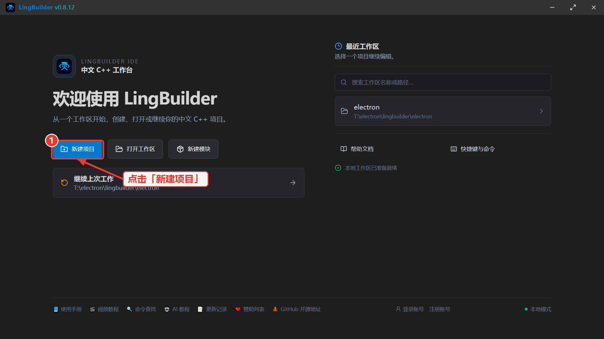

在项目类型选择窗口中，选择**「Windows 界面设计」**（本教程用一个最普通的窗口项目做演示）。

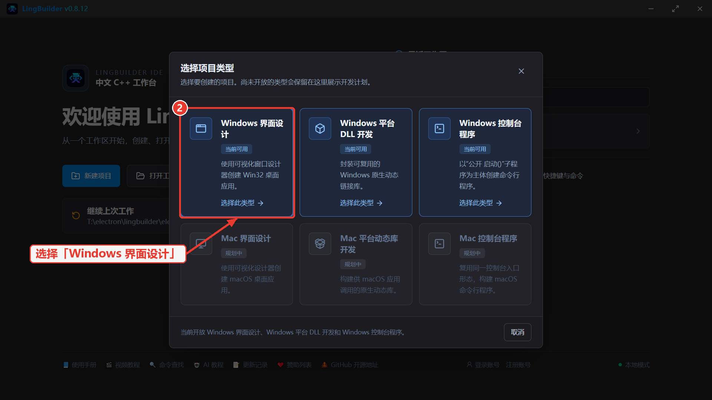

把**项目名称**改成「学生成绩演示」（解决方案名称会自动跟着变），然后点击**「创建项目」**。创建位置可以不填，项目会建在当前工作区里。

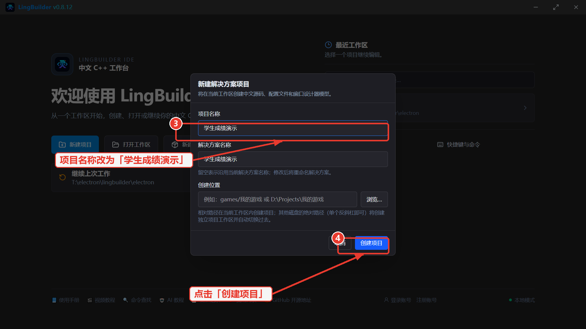

创建完成后会自动进入工作台：左侧是**解决方案资源管理器**，中间已经打开了 `MainWindow.lcpp` 源码的结构化编辑视图。

## 第 2 步：打开「自定义数据类型」编辑器

在左侧解决方案树里，展开项目「学生成绩演示」，点击其中的**「自定义数据类型」**节点。

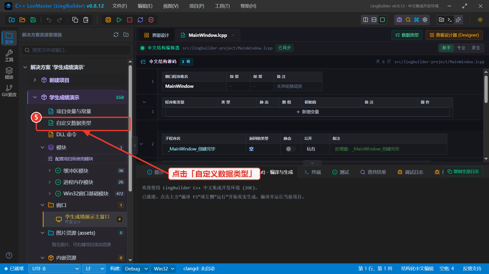

主区会打开**项目自定义数据类型**编辑器。顶部一行字说明了它的能力：值类型会生成标准 C++ struct，可用于**局部、程序集、全局、参数、返回值和数组**。

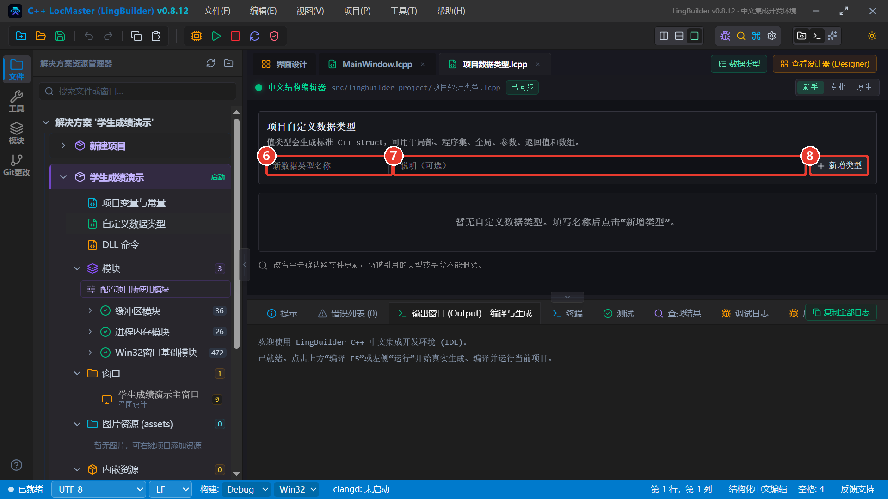

图中三个位置从左到右分别是：**⑥ 新数据类型名称**输入框、**⑦ 说明（可选）**输入框、**⑧ 「新增类型」按钮**。

## 第 3 步：新增「学生信息」类型

在 ⑥ 号输入框输入类型名「学生信息」，在 ⑦ 号输入框填写说明（比如「一个学生的基本资料」，方便以后回头查看），然后点击 ⑧ 号**「新增类型」**按钮。

下方会出现这个类型的**类型卡片**：卡片头部显示类型名称、说明，右侧有「添加字段」「删除类型」等按钮。

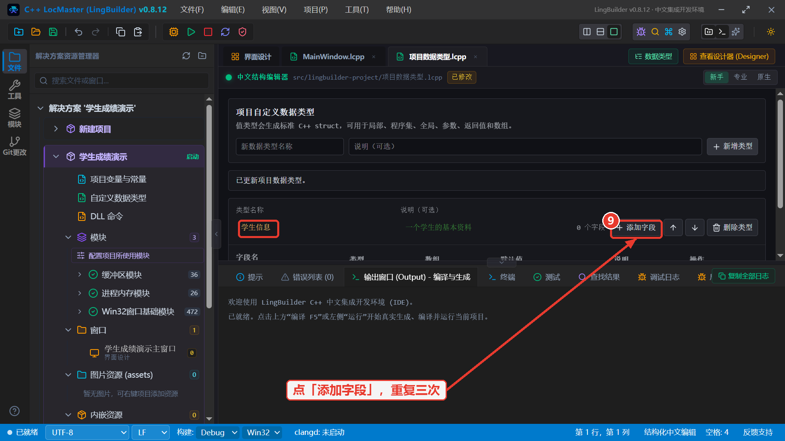

## 第 4 步：添加三个字段

点击卡片头部的**「添加字段」**按钮，编辑器会自动插入一行新字段（默认名「字段1」、类型「文本型」）并让名称处于全选状态——**直接输入「姓名」就完成了改名**。

再点两次「添加字段」，把第二行改名为「年龄」、第三行改名为「成绩」。

每个字段的**类型**通过一排下拉框修改。点击「年龄」这一行的类型下拉框，会弹出可选类型列表（文本型、整数型、长整数型、逻辑型、小数型、字节型……），选择**「整数型」**：

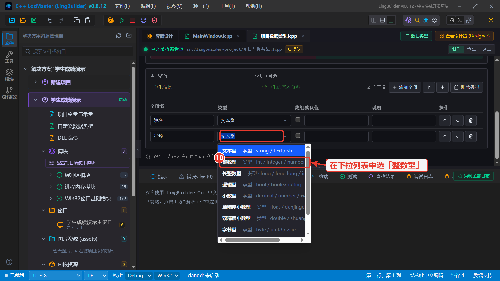

同样把「成绩」的类型改成**「小数型」**。「姓名」保持默认的「文本型」即可。完成后，类型卡片应该是这个样子：

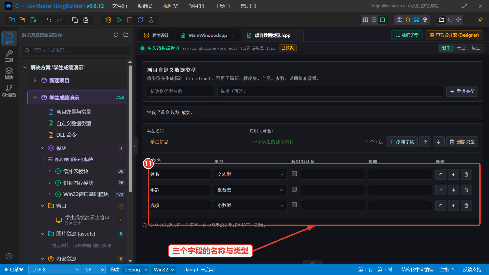

字段表格放大看，每一行就是「字段名 + 类型 + 是否数组 + 默认值 + 说明」：

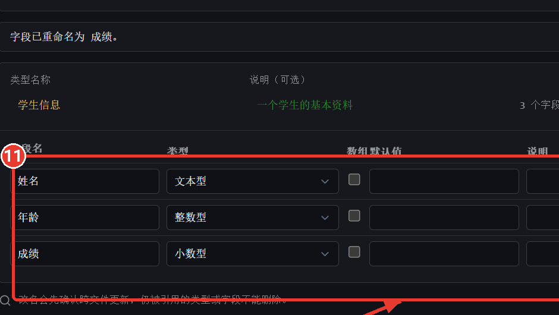

| 字段名 | 类型 | 说明 |
| --- | --- | --- |
| 姓名 | 文本型 | 学生的名字 |
| 年龄 | 整数型 | 多少岁 |
| 成绩 | 小数型 | 考试分数 |

到这里，「学生信息」这个自定义数据类型就定义好了。它本质上是这样一个声明（编辑器会自动帮你维护，无需手写）：

```lcpp
// 一个学生的基本资料
数据类型 学生信息
    文本型 姓名
    整数型 年龄
    小数型 成绩
结束数据类型
```

## 第 5 步：声明一个「学生信息」变量

点击编辑器标签页切回 `MainWindow.lcpp`，在子程序 `_MainWindow_创建完毕` 内声明局部变量（在代码里写声明行即可，新手视图会自动把它整理进局部声明表）：

```lcpp
局部 学生信息 学生1
```

写完后的新手视图：**局部声明**表里出现了变量「学生1」，类型一栏显示的正是刚定义的「学生信息」。

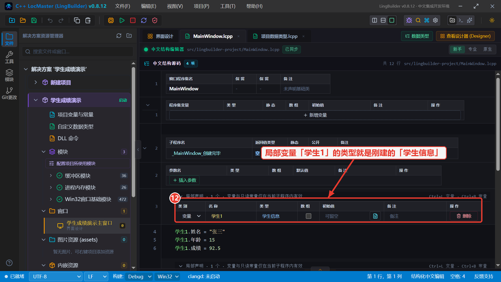

局部声明表放大：「变量 | 学生1 | 学生信息」——类型列里能直接选到项目里定义的自定义类型。

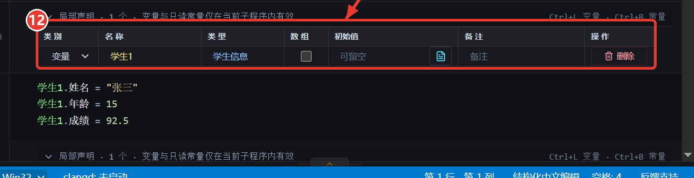

这一行代码等价于 C++ 的 `学生信息 学生1{};`——你已经用一个变量装下了整个学生。

## 第 6 步：给字段赋值

用「变量.字段名」的形式给每个字段赋值：

```lcpp
学生1.姓名 = "张三"
学生1.年龄 = 15
学生1.成绩 = 92.5
```

## 第 7 步：拼接文本并弹窗显示

用内置命令「格式化文本」把字段值拼成一句话（`{}` 是占位符，会按顺序替换成后面的参数；参数直接传数字也没问题），再用「信息框」弹窗显示：

```lcpp
局部 文本型 简介
简介 = 格式化文本("姓名：{}　年龄：{}　成绩：{}", 学生1.姓名, 学生1.年龄, 学生1.成绩)
信息框(简介, 64, "学生成绩演示")
```

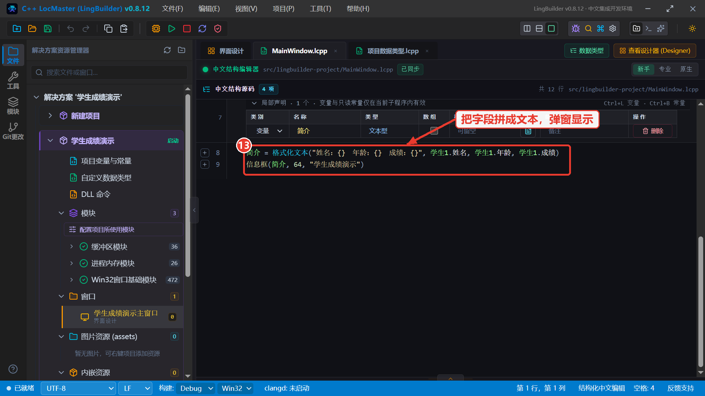

## 第 8 步：按 F5 真实编译运行

点击工具栏的**「运行 F5」**按钮（绿色三角）。LingBuilder 会把中文源码生成真实 C++ 代码、调用编译器编译、然后启动程序。输出窗口会显示全过程：

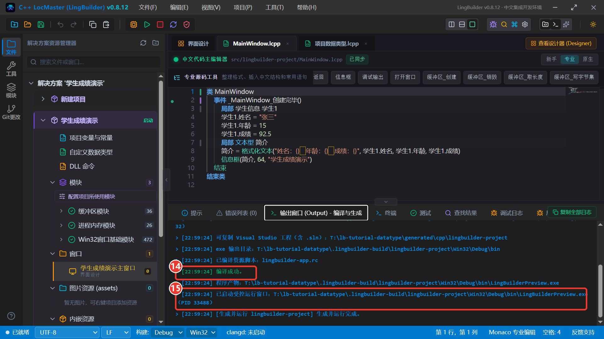

**⑭ 编译成功**，**⑮ 已启动受控运行窗口**——运行的就是真实 exe。

程序启动后窗口创建完毕事件被执行，弹出信息框：

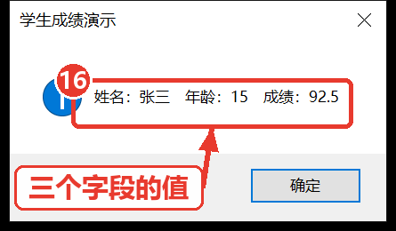

**⑯ 三个字段的值**全部正确显示：姓名：张三，年龄：15，成绩：92.5。恭喜！你已经完成了一次「定义类型 → 使用类型 → 编译运行」的完整闭环。

---

## 进阶 1：把学生装进数组

想管理多个学生？给类型配一个数组即可。数组相关命令由**「数组操作模块」**提供（注意：数组下标从 **0** 开始）。先启用它：点击左侧活动栏的「模块」图标，在搜索框输入「数组操作」，打开**数组操作模块**详情页，点击**⑰「启用」**。

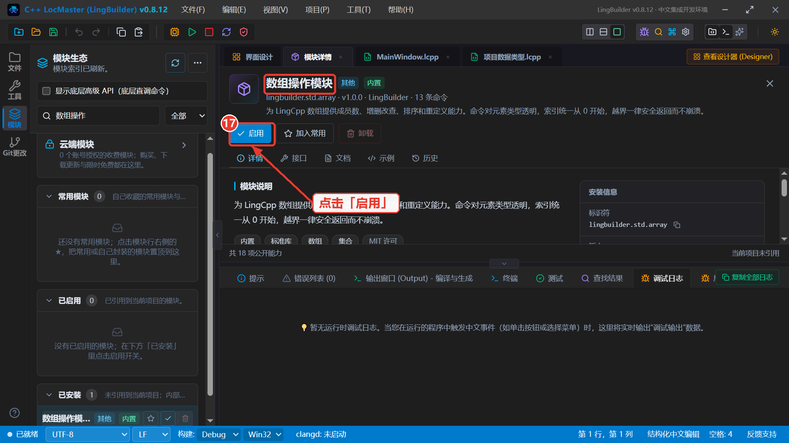

## 进阶 2：类型数组 + 子程序传参

下面这段代码先创建两个学生，用 `数组_加入成员` 装进数组「名单」，再把 `名单[0]` 整个传给子程序「显示学生」——子程序的参数类型直接写「学生信息」，处理后用 `返回()` 把拼好的文本送回来：

```lcpp
类 MainWindow
    事件 _MainWindow_创建完毕()
        局部 学生信息 学生1
        学生1.姓名 = "张三"
        学生1.年龄 = 15
        学生1.成绩 = 92.5
        局部 学生信息 学生2
        学生2.姓名 = "李四"
        学生2.年龄 = 16
        学生2.成绩 = 88
        局部 学生信息 名单[]
        数组_加入成员(名单, 学生1)
        数组_加入成员(名单, 学生2)
        局部 文本型 摘要
        摘要 = 显示学生(名单[0])
        信息框(摘要, 64, "传参演示")
    结束

    文本型 显示学生(学生信息 某学生)
        返回(格式化文本("{}　{} 岁　成绩 {}", 某学生.姓名, 某学生.年龄, 某学生.成绩))
    结束
结束类
```

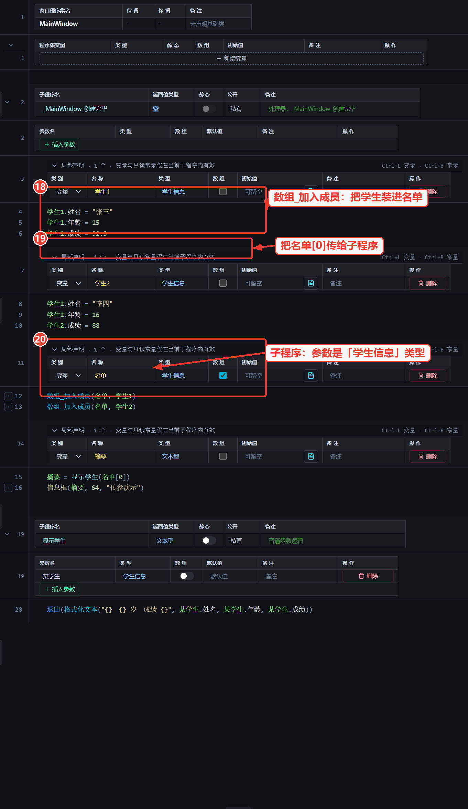

**⑱** `数组_加入成员` 把学生追加进数组；**⑲** `名单[0]` 取出第一个学生传给子程序；**⑳** 子程序的参数写「学生信息 某学生」，整个学生作为一条记录被传入。

再次按 F5 运行：

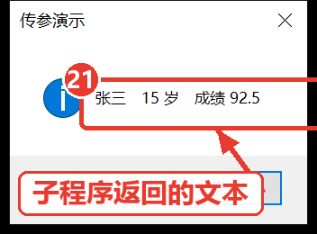

**㉑** 信息框显示「张三　15 岁　成绩 92.5」——这个文本是子程序处理**传入的学生记录**后 `返回()` 回来的。

---

## 语法速查

| 写法 | 含义 |
| --- | --- |
| `数据类型 名称` … `结束数据类型` | 定义一个自定义数据类型 |
| `文本型 姓名` | 在类型里添加一个字段（类型 + 字段名） |
| `整数型 成绩[]` | 字段/变量声明为数组（方括号） |
| `局部 学生信息 学生1` | 声明一个该类型的局部变量 |
| `全局 学生信息 校花` | 声明为程序集/全局变量（程序集变量、全局同理） |
| `学生1.年龄 = 15` | 给字段赋值；读取同理 |
| `文本型 显示学生(学生信息 某学生)` | 子程序接收自定义类型参数 |
| `返回(表达式)` | 返回处理结果 |
| `数组_加入成员(名单, 学生1)` | 追加一个元素到数组（需启用数组操作模块） |

## 常见问题

**Q：字段可以用哪些类型？**
文本型、整数型、长整数型、逻辑型、小数型、单精度小数型、双精度小数型、字节型等基础类型都可以，也支持勾选「数组」把字段做成数组，还能填默认值。

**Q：改了类型名或字段名，代码里用到的地方怎么办？**
编辑器会弹出「跨文件 Diff」预览，确认后自动把所有引用一起改名，不会漏。

**Q：自定义类型和直接用三个变量比，好处是什么？**
一是**好管理**：一个学生一个变量，传参、装数组、存文件都是整体操作；二是**和 C++ 一致**：它就是标准 struct，导出 Visual Studio 工程后代码完全可读、可继续开发。

**Q：哪里能看到我已经定义了哪些类型？**
解决方案树的「自定义数据类型」节点点开就是本项目的全部类型；代码里输入类型名时，编辑器补全列表也会给出项目里的自定义类型。
