# CDP 浏览器自动化工具（lingbuilder.cdp.client 全命令交互示例）

**一句话总结：把你的 Edge/Chrome 变成一台可以亲手操控的自动化浏览器。** 打开网页自动点击、填表、抓取内容；按规则拦截和改写网络请求、模拟服务器响应；整页/元素截图、把画面串流成帧；采集性能指标、CPU/覆盖率/堆内存分析；暂停页面看调用栈和变量；把人工操作录制成脚本，随时确定性回放。

这些能力来自 Chrome DevTools Protocol（CDP），共 **161 条命令**，在 14 个页签里全部做成了看得见摸得着的按钮：填参数、点按钮、结果实时回填「最近结果」框，状态（当前连接/当前页面/当前元素/最新拦截/最新任务）在操作间保持。整个工具是一个**单文件 exe**，绿色免安装，双击即用——不写一行代码就能完成上面所有事。

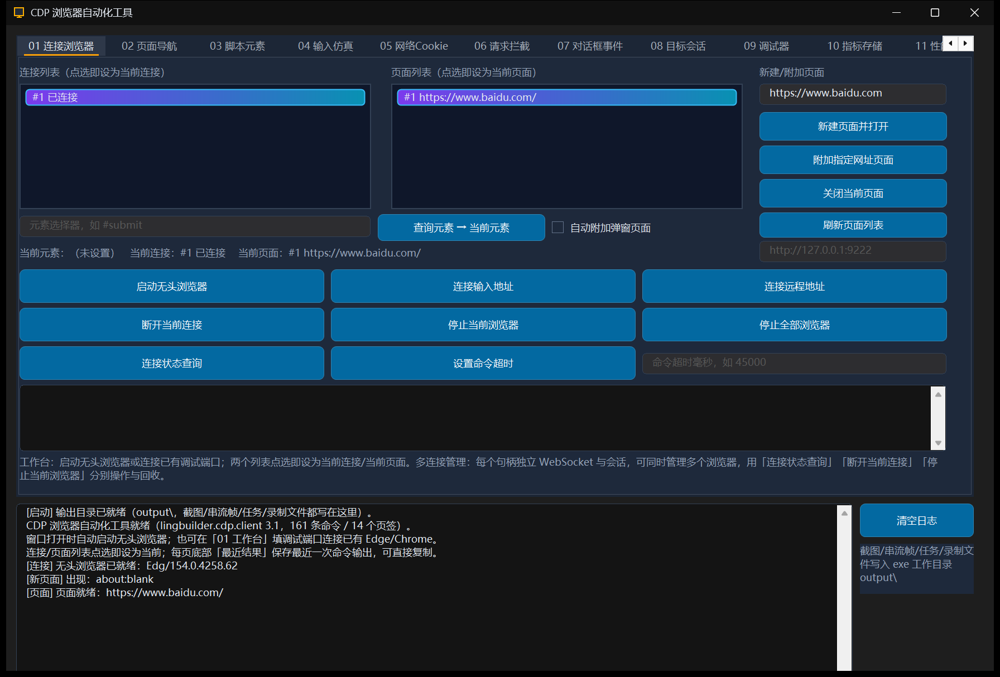

## 快速开始

1. 双击 `cdp-client-showcase.exe`（或 IDE 里 F5）。窗口打开后自动启动一个无头 Edge/Chrome 并完成连接，「连接列表」出现条目即就绪。
2. 在 01 工作台的「新建/附加页面」栏填网址（如 `https://www.baidu.com`），点「新建页面并打开」；页面出现在「页面列表」并被设为当前页面。
3. 之后每个页签的按钮都作用于「当前页面/当前连接」：填参数 → 点按钮 → 日志与「最近结果」框回填结果。

> 截图、串流帧、性能任务输出、录制文件统一写入 exe 工作目录 `output\` 下（自动创建）。

## 页签说明

| 页签 | 能做什么 |
| --- | --- |
| 01 工作台 | 启动无头浏览器 / 连接已有调试端口（含远程）；连接与页面两个列表**点选即设为当前**；连接状态查询、命令超时、断开/停止/批量回收。多连接并存：每个句柄独立 WebSocket，可同时管理多个浏览器。 |
| 02 页面与导航 | 打开网址、刷新/后退/前进/停止加载、等待加载事件（0=load 1=DOMContentLoaded 2=networkIdle 3=networkAlmostIdle）、取网址/标题/HTML、窗口边界读写、页面截图（可整页）、打印 PDF、激活/关闭页面。 |
| 03 脚本与元素 | 执行 JavaScript（自动等待 Promise）、查询元素设为「当前元素」、点击/输入文本/取文本/取属性/取数量、设置上传文件、元素截图、调用函数（元素作实参）、Overlay 高亮。 |
| 04 输入仿真 | 鼠标移动/单击/按下/释放/滚轮/拖拽（坐标为视口 CSS 像素）、按键/组合键/插入文本；视口、UserAgent、地理位置、时区、语言、暗色模式、CPU 节流、触摸仿真与重置（开关类每点一次翻转）。 |
| 05 网络与 Cookie | 绑定网络/下载事件后触发页面流量即可在日志看到请求；按请求编号取响应体；Cookie 置/取/删（网址需含协议与路径）；清空缓存/Cookie、离线模拟、限速、禁用缓存。 |
| 06 请求拦截 | 按 URL 通配模式（如 `*://api.example.com/*`）开启 Fetch 拦截；被拦截请求自动记为「最新拦截」，用继续/改写（新网址+头 JSON）/模拟响应（状态码+头+体）/终止（Failed/Aborted/TimedOut 等 CDP 枚举）裁决；应答认证用于代理 401。 |
| 07 对话框与监听 | 绑定 alert/confirm/prompt/beforeunload；勾选「自动应答开关」后按设置自动应答（对话框打开时页面阻塞，需尽快应答；未绑定运行时自动拒绝兜底）；控制台/页面异常/页面/连接事件监听。 |
| 08 目标与绑定 | 自动附加（OOPIF/Worker 以独立会话出现）、目标事件、枚举目标 JSON、附加目标（已自动附加的目标同步返回会话句柄）、会话内执行脚本、分离、帧枚举；Runtime binding 双向通信（页面调 `window.名称(...)` 回到日志）。 |
| 09 调试器 | 启用/绑定/暂停；暂停事件自动记录帧 0；帧内执行脚本、取作用域变量、单步（0 越过/1 进入/2 跳出）、恢复、按 URL+行列+条件设断点/移除。提示：pause 在页面有 JS 活动时才触发，可先执行一段 `setInterval` 脚本。 |
| 10 指标与存储 | Performance 指标（JSON）；来源存储用量与清理（exact origin + 存储类型，破坏性操作需勾选「已确认清理」）。 |
| 11 性能任务 | 堆快照（.heapsnapshot，等自然完成）、Tracing（浏览器级单例，同时只能一个）、CPU 分析、精确覆盖率；输出文件 = 目录前缀 + 固定名（heap.heapsnapshot / trace.json / cpu-profile.json / coverage.json）；停止任务落盘，状态/进度/路径可查。 |
| 12 画面串流 | Page.startScreencast 帧落盘（`串流帧_NNNNNN.jpg/png`）；参数 JSON：格式 jpeg/png、质量 0-100、最大宽高、每N帧 1-60；可设自动停帧数。 |
| 13 录制回放 | 录制期间模块命令自动采集为结构化步骤（敏感值打码），`CDP_记录步骤` 补充自定义步骤（步骤 JSON 不能为空）；停止落盘 → 加载 → 对当前页面确定性回放（导航等加载、选择器重定位、失败即中止）。 |
| 14 证书安全 | 证书错误接管（exact origin 白名单 + 有效秒数 1-600，逐次裁决，无通配符）；裁决句柄一次性使用；安全状态事件只读。 |

## 各页签实机截图（修复页签头遮挡后的真机实拍）

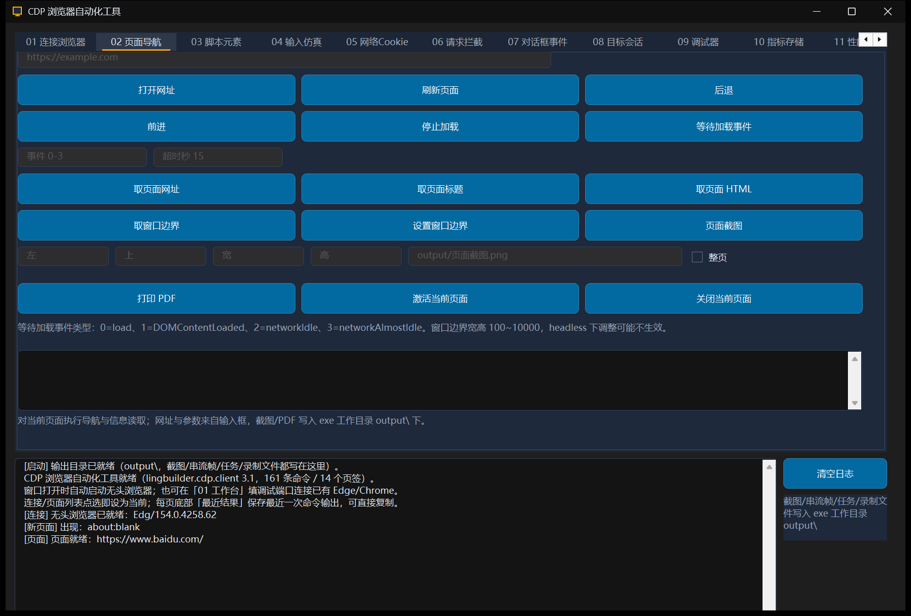

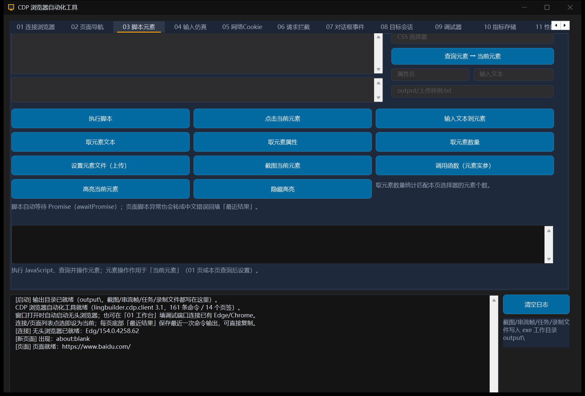

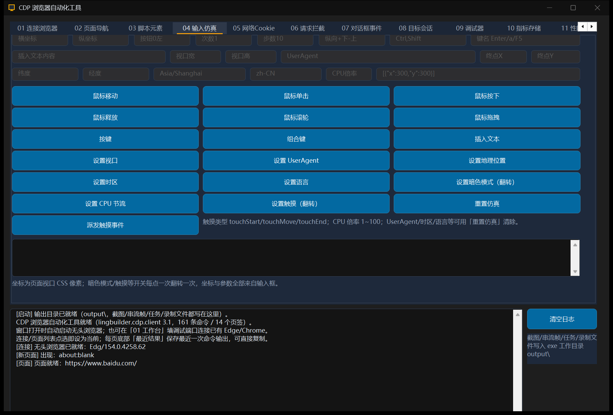

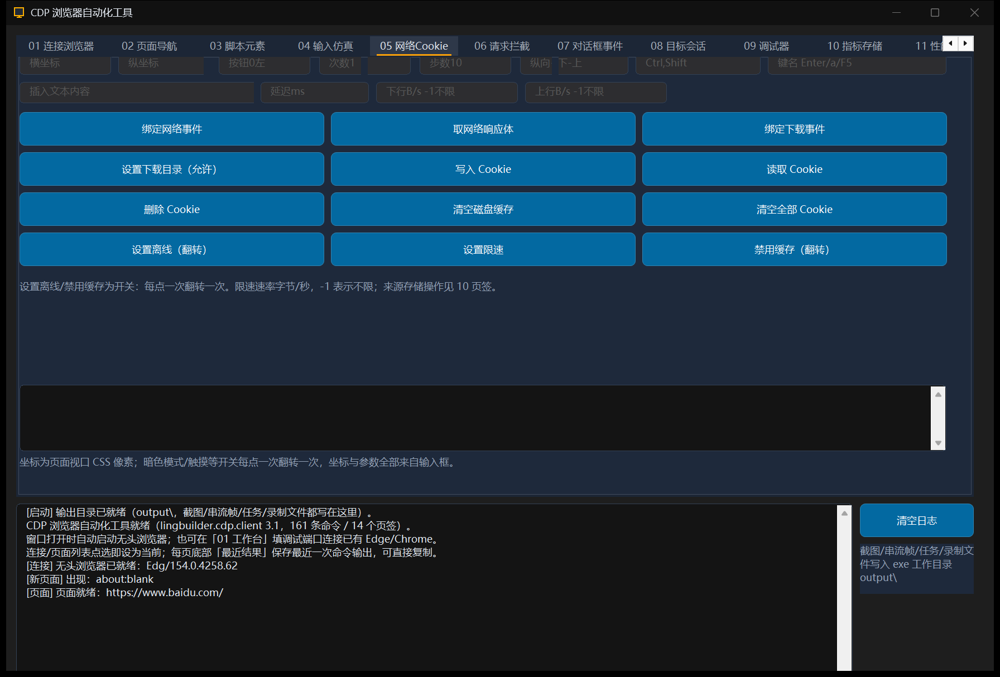

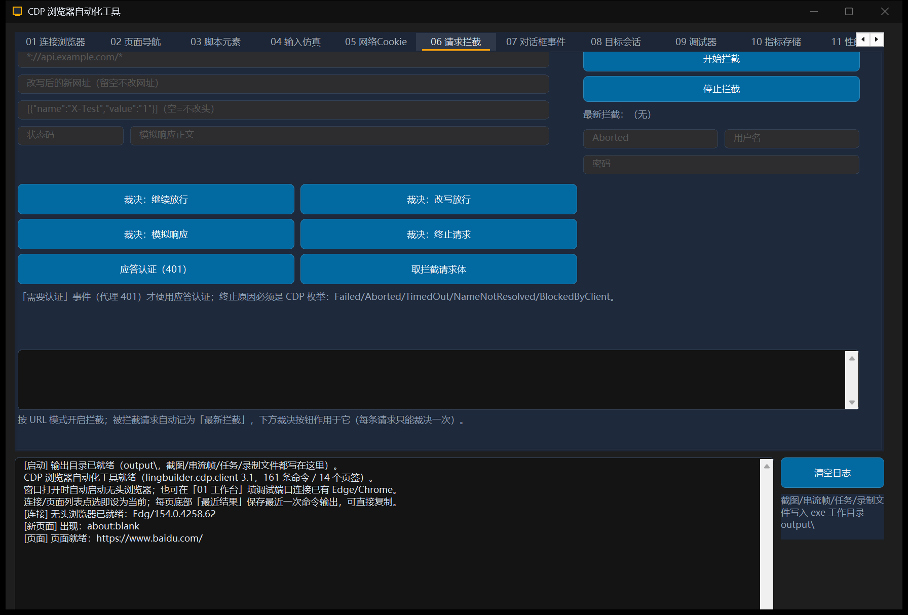

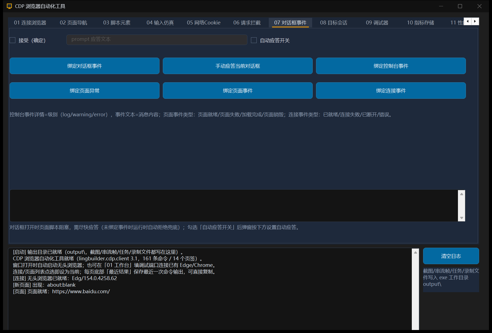

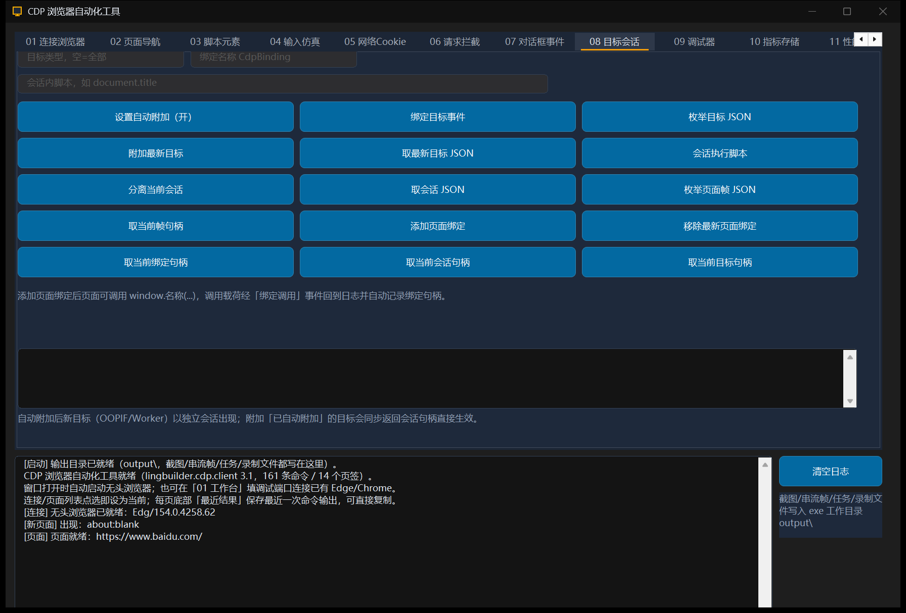

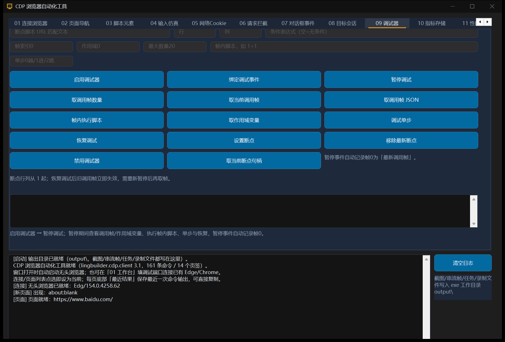

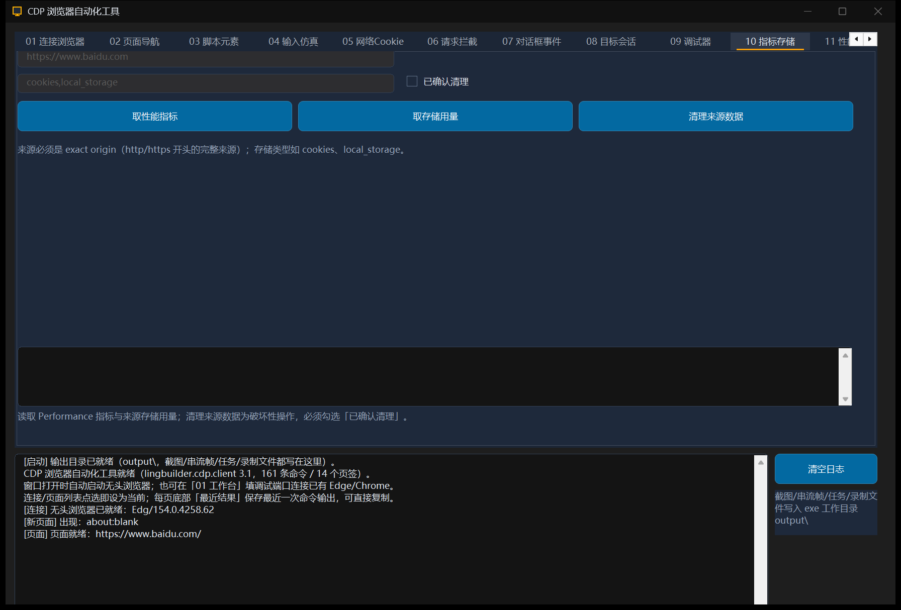

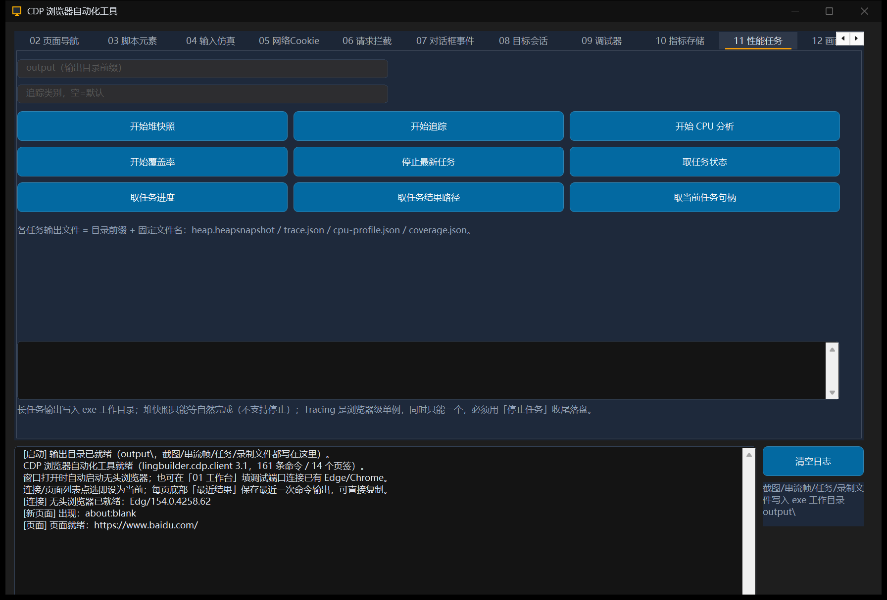

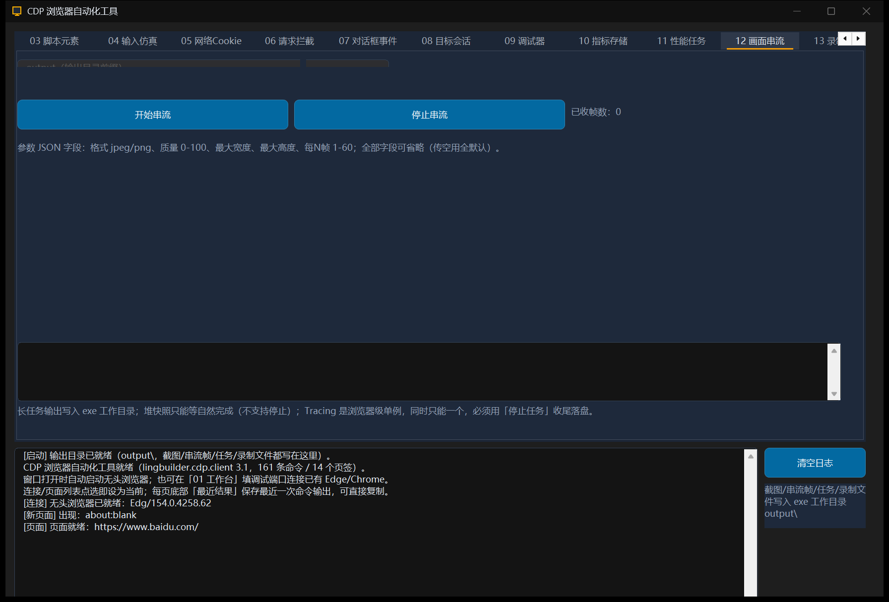

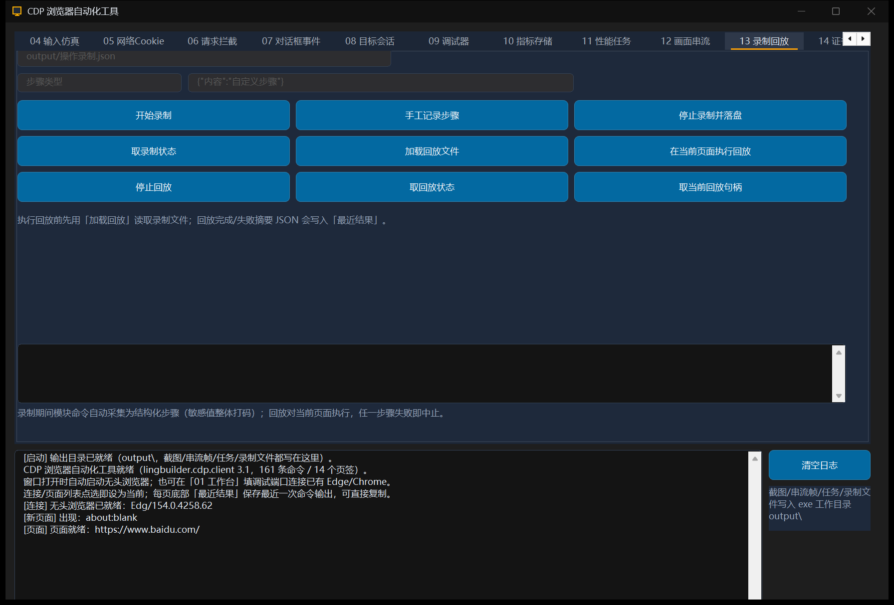

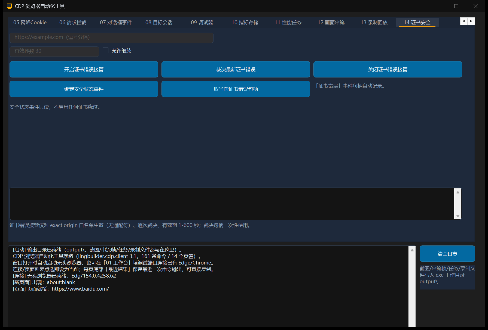

## 已知边界（实测记录）

- Debugger.pause 只在页面有 JS 活动时触发暂停；空闲页面可先执行 `setInterval(function(){},200)`。
- `about:blank` 上「新建页面」会在 60 秒后报加载超时（对已是 about:blank 的 target 再导航是 no-op、没有 load 事件），属 CDP 语义，不是工具缺陷；要开空白页请直接填任意真实网址。

> 2026-10-08 修复并移出本节（模块运行时 `cdpClientRuntime.ts`）：① 连接级 Cookie/存储族七条命令（置/取/删 Cookie、取存储用量、清理来源数据、清空磁盘缓存、清空全部 Cookie）已路由到最近活动页面会话——真机实测 Edge 154 上 `Network.setCookie/getCookies/deleteCookies/clearBrowserCache/clearBrowserCookies` 与 `Storage.getUsageAndQuota/clearDataForOrigin` 全部只在 page session 上存在，browser-level 一律报 `wasn't found`/`Internal error`；② 开启证书错误接管已补 `Security.enable` 前置（此前报 `Security domain not enabled`）；③ 失败类页面事件的中文原因已同步进 `CDP_取当前错误()` 读取口（此前只进事件详情、`取当前错误` 恒空）。Target/Browser/Security/Fetch 域的 browser-level 调用真机验证正常，未受影响。

## 功能库代码结构

窗口源码只保留事件处理器与调度（约 800 行），逻辑全部下沉在 `src/功能库/` 的六个功能库（一文件一库，`库名.功能(...)` 限定调用）：

| 功能库 | 职责 |
| --- | --- |
| `参数工具库.lcpp` | 纯逻辑：去空白、空串默认值、整数/小数/逻辑解析、截断、JSON 字段提取、任务输出路径组装、output 目录准备（@ 内嵌 C++）。 |
| `结果格式化库.lcpp` | 日志写入、14 个页签「最近结果」写入、命令完成/失败的统一落点、连接/页面/任务摘要行、各监听类事件的快照整理（网络/下载/对话框/控制台/拦截/任务/串流帧）。 |
| `工作台状态库.lcpp` | 当前连接/页面/元素等状态读写、两个列表框与句柄平行数组同步、`要求连接/页面/元素/会话/调用帧/断点/任务/回放` 前置守卫（带中文提示）。 |
| `页签操作库.lcpp` | 01-07 页签同步命令的操作落点（守卫→读参数→调命令→写日志/结果）。 |
| `高级操作库.lcpp` | 08-14 页签同步命令的操作落点，以及任务/串流/录制的启动准备与登记。 |
| `参数准备库.lcpp` | 异步命令前置准备（守卫+读输入框+校验+写入 `操作参数一~四/操作整数一/二` 暂存全局）与绑定类动作的统一反馈；**带 `&处理器` 的异步命令调用点全部留在窗口主文件**（功能库红线）。 |

语言红线备忘（写同类工具时适用）：

- `CDP_启动浏览器` / `CDP_连接` / `CDP_连接远程` 必须**赋值形态**调用（`浏览器 = CDP_启动浏览器(...)`）；纯语句丢弃返回值会让连接半死（命令发得出去、事件收不回来）。本工具实测踩中，已在创建完毕/按钮两处修正。
- `局部 X = 命令(...)` 会被生成器提升到函数开头，绕过行序守卫——先守卫、后 `局部 声明 + 赋值`（`CDP_新建页面` 等）。
- 事件快照命令（`CDP_取当前事件类型` 等）共享返回缓冲：一条语句只嵌一个快照调用。

## 分发说明

- 发 **Release 单 exe**（`x64/Release/bin/cdp-client-showcase.exe`，约 1.3MB）：CDP 运行时、JSON、WebSocket 全部静态编入，无模块 DLL；`output\` 自动创建。Debug CRT 版不可分发。
- 目标机器需要：Windows 10+、本机安装 Edge 或 Chrome（工具自动查找 msedge/chrome）、VC++ 运行库（vc_redist；如需真零依赖可改 `/MT` 重编）。
- 首次运行 SmartScreen 可能拦截，点「仍要运行」。
- 源码级使用：仓库内 `examples/cdp-client-showcase/` 自带 `cdp-client-showcase.lbsln`，IDE「打开解决方案」直接进入（项目/源码/设计器/模块/功能代码节点齐全）；该目录 `.lingbuilder/` 含独立 solution.json 与模块清单，文件夹级打开与仓库工作区两种方式均可。
- 启用模块：`lingbuilder.win32.basic`、`lingbuilder.win32.common-controls`、`lingbuilder.cdp.client`、`lingbuilder.std.array`、`lingbuilder.std.text`。
